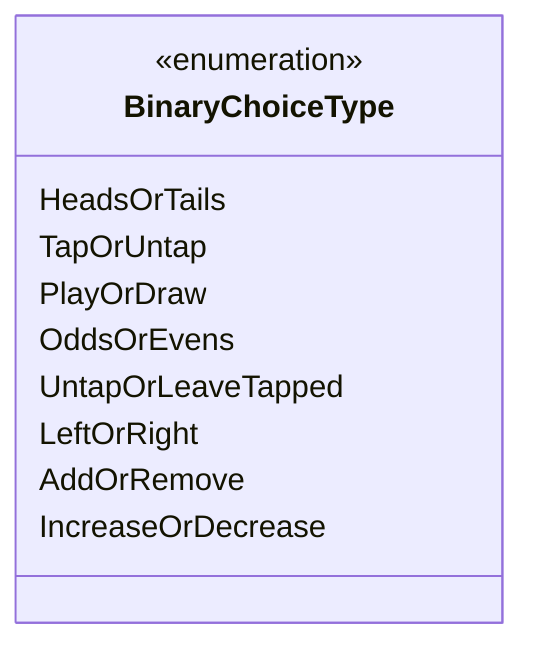

---
aliases:
  - BinaryChoiceType
tags:
  - java/enum
  - module/forge-game
  - pkg/forge/game/player
fqn: forge.game.player.PlayerController.BinaryChoiceType
package: forge.game.player
module: forge-game
kind: Enum
---

# BinaryChoiceType

**Package:** `forge.game.player`   **Module:** `forge-game`   **Kind:** Enum



## Design Description

BinaryChoiceType is a nested enumeration within `PlayerController` that enumerates the fixed set of two-outcome decisions the engine can present to a player—coin flips (HeadsOrTails), tap/untap states, play-or-draw mulligan choices, odds-or-evens, directional picks (LeftOrRight), and counter or value adjustments (AddOrRemove, IncreaseOrDecrease). It serves as a type-safe discriminator passed into `PlayerController`'s binary-choice methods, letting a single decision-routing API distinguish among these scenarios rather than relying on booleans or ad-hoc flags.

By living inside the abstract `PlayerController`, the enum stays tightly coupled to the controller contract that both human and AI player implementations fulfill, ensuring every controller resolves the same well-defined choice categories uniformly. Its self-documenting constant names (with the explanatory "coin" comment on HeadsOrTails) reflect a design intent to keep game-rule branching readable and centralized.

## Source
`forge-game/src/main/java/forge/game/player/PlayerController.java` — declaration excerpt

```java
    public enum BinaryChoiceType {
        HeadsOrTails, // coin
        TapOrUntap,
        PlayOrDraw,
        OddsOrEvens,
        UntapOrLeaveTapped,
        LeftOrRight,
        AddOrRemove,
        IncreaseOrDecrease
    }
```

## Python
`forge/game/player/PlayerController/BinaryChoiceType.py`

```python
from enum import Enum, auto


class BinaryChoiceType(Enum):
    HeadsOrTails = auto()  # coin
    TapOrUntap = auto()
    PlayOrDraw = auto()
    OddsOrEvens = auto()
    UntapOrLeaveTapped = auto()
    LeftOrRight = auto()
    AddOrRemove = auto()
    IncreaseOrDecrease = auto()
```
