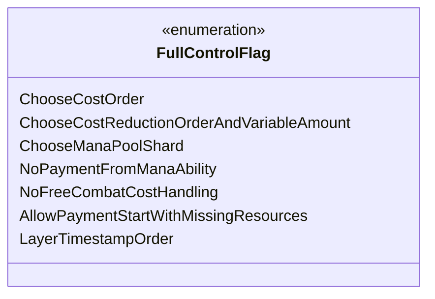

---
aliases:
  - FullControlFlag
tags:
  - java/enum
  - module/forge-game
  - pkg/forge/game/player
fqn: forge.game.player.PlayerController.FullControlFlag
package: forge.game.player
module: forge-game
kind: Enum
---

# FullControlFlag

**Package:** `forge.game.player`   **Module:** `forge-game`   **Kind:** Enum



## Design Description

ChooseCostOrder, ChooseCostReductionOrderAndVariableAmount, ChooseManaPoolShard, NoPaymentFromManaAbility, NoFreeCombatCostHandling, AllowPaymentStartWithMissingResources, and LayerTimestampOrder are the seven flags this enum defines. FullControlFlag is a member enumeration of `PlayerController`, the abstraction through which the game engine requests decisions from a controlling player (human or AI). Each constant names a discrete point in cost payment, mana handling, or layer-timestamp ordering where the engine would normally decide automatically but, under "full control," defers to the player instead. Held as a set on the controller, these flags act as fine-grained toggles that opt individual sub-decisions into manual handling — for example, ordering cost reductions, selecting a specific mana-pool shard, or suppressing free combat-cost handling. The inline comments (a pending UI option for shard selection, StaticEffect/token ordering for LayerTimestampOrder) reveal flags wired into engine logic ahead of full user-facing exposure, keeping advanced rules control extensible.

## Source
`forge-game/src/main/java/forge/game/player/PlayerController.java` — declaration excerpt

```java
    public enum FullControlFlag {
        ChooseCostOrder,
        ChooseCostReductionOrderAndVariableAmount,
        ChooseManaPoolShard, // select shard with special properties //TODO: UI option to enable this one
        NoPaymentFromManaAbility,
        NoFreeCombatCostHandling,
        AllowPaymentStartWithMissingResources,
        LayerTimestampOrder // for StaticEffect$, tokens later etc.
    }
```

## Python
`forge/game/player/PlayerController/FullControlFlag.py`

```python
from enum import Enum, auto


class FullControlFlag(Enum):
    ChooseCostOrder = auto()
    ChooseCostReductionOrderAndVariableAmount = auto()
    ChooseManaPoolShard = auto()  # select shard with special properties #TODO: UI option to enable this one
    NoPaymentFromManaAbility = auto()
    NoFreeCombatCostHandling = auto()
    AllowPaymentStartWithMissingResources = auto()
    LayerTimestampOrder = auto()  # for StaticEffect$, tokens later etc.
```
