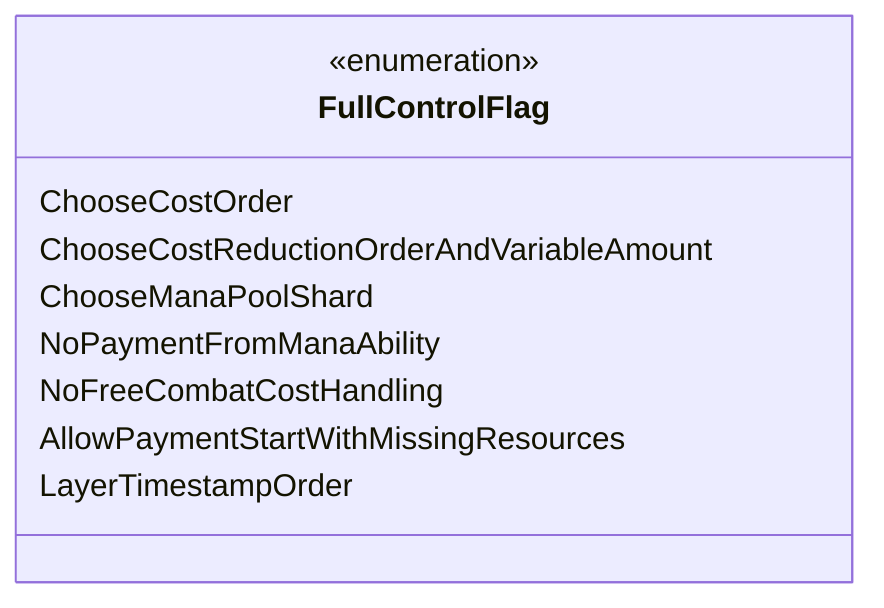

---
aliases:
  - FullControlFlag
tags:
  - java/enum
  - module/forge-game
  - pkg/forge/game/player
fqn: forge.game.player.PlayerController.FullControlFlag
package: forge.game.player
module: forge-game
kind: Enum
---

# FullControlFlag

**Package:** `forge.game.player` &nbsp; **Module:** `forge-game` &nbsp; **Kind:** Enum



## Source
`forge-game/src/main/java/forge/game/player/PlayerController.java` — declaration excerpt

```java
    public enum FullControlFlag {
        ChooseCostOrder,
        ChooseCostReductionOrderAndVariableAmount,
        ChooseManaPoolShard, // select shard with special properties //TODO: UI option to enable this one
        NoPaymentFromManaAbility,
        NoFreeCombatCostHandling,
        AllowPaymentStartWithMissingResources,
        LayerTimestampOrder // for StaticEffect$, tokens later etc.
    }
```
