---
aliases:
  - PlayerController
tags:
  - java/class
  - module/forge-game
  - pkg/forge/game/player
fqn: forge.game.player.PlayerController
package: forge.game.player
module: forge-game
kind: Class
---

# PlayerController

**Package:** `forge.game.player`   **Module:** `forge-game`   **Kind:** Class



```mermaid
classDiagram
    class PlayerController {
        -Set~FullControlFlag~ fullControls
        #GameView gameView
        #Player player
        #LobbyPlayer lobbyPlayer
        +isAI() boolean
        +getGame() Game
        +getMatch() Match
        +getPlayer() Player
        +getLobbyPlayer() LobbyPlayer
        +tempShowCards(Iterable~Card~ cards) void
        +endTempShowCards() void
        +getAbilityToPlay(Card hostCard, List~SpellAbility~ abilities) SpellAbility
        +getAbilityToPlay(Card hostCard, List~SpellAbility~ abilities, ITriggerEvent triggerEvent) SpellAbility
        +playSpellAbilityNoStack(SpellAbility effectSA, boolean mayChoseNewTargets) void
        +orderSimultaneousSa(List~SpellAbility~ activePlayerSAs) List~SpellAbility~
        +orderAndPlaySimultaneousSa(List~SpellAbility~ activePlayerSAs) void
        +playTrigger(Card host, WrappedAbility wrapperAbility, boolean isMandatory) boolean
        +playSaFromPlayEffect(SpellAbility tgtSA) boolean
        +sideboard(Deck deck, GameType gameType, String message) List~PaperCard~
        +chooseCardsYouWonToAddToDeck(List~PaperCard~ losses) List~PaperCard~
        +assignCombatDamage(Card attacker, CardCollectionView blockers, CardCollectionView remaining, int damageDealt, GameEntity defender, boolean overrideOrder) Map~Card,Integer~
        +divideShield(Card effectSource, Map~GameEntity,Integer~ affected, int shieldAmount) Map~GameEntity,Integer~
        +specifyManaCombo(SpellAbility sa, ColorSet colorSet, int manaAmount, boolean different) Map~Byte,Integer~
        +choosePermanentsToSacrifice(SpellAbility sa, int min, int max, CardCollectionView validTargets, String message) CardCollectionView
        +choosePermanentsToDestroy(SpellAbility sa, int min, int max, CardCollectionView validTargets, String message) CardCollectionView
        +announceRequirements(SpellAbility ability, int min, int max, String announce) Integer
        +chooseNewTargetsFor(SpellAbility ability, Predicate~GameObject~ filter, boolean optional) TargetChoices
        +chooseTargetsFor(SpellAbility currentAbility) boolean
        +chooseTarget(SpellAbility sa, List~Pair~ allTargets) Pair~SpellAbilityStackInstance,GameObject~
        +helpPayForAssistSpell(ManaCostBeingPaid cost, SpellAbility sa, int max, int requested) boolean
        +choosePlayerToAssistPayment(FCollectionView~Player~ optionList, SpellAbility sa, String title, int max) Player
        +chooseCardsForEffect(CardCollectionView sourceList, SpellAbility sa, String title, int min, int max, boolean isOptional, Map~String,Object~ params) CardCollectionView
        +chooseCardsForEffectMultiple(Map~String,CardCollection~ validMap, SpellAbility sa, String title, boolean isOptional) CardCollection
        +chooseSingleEntityForEffect(FCollectionView~T~ optionList, SpellAbility sa, String title, Map~String,Object~ params) T
        +chooseSingleEntityForEffect(FCollectionView~T~ optionList, SpellAbility sa, String title, boolean isOptional, Map~String,Object~ params) T
        +chooseSingleEntityForEffect(FCollectionView~T~ optionList, DelayedReveal delayedReveal, SpellAbility sa, String title, boolean isOptional, Player relatedPlayer, Map~String,Object~ params) T
        +chooseEntitiesForEffect(FCollectionView~T~ optionList, int min, int max, DelayedReveal delayedReveal, SpellAbility sa, String title, Player relatedPlayer, Map~String,Object~ params) List~T~
        +chooseSpellAbilitiesForEffect(List~SpellAbility~ spells, SpellAbility sa, String title, int num, Map~String,Object~ params) List~SpellAbility~
        +chooseSingleSpellForEffect(List~SpellAbility~ spells, SpellAbility sa, String title, Map~String,Object~ params) SpellAbility
        +confirmAction(SpellAbility sa, PlayerActionConfirmMode mode, String message, Map~String,Object~ params) boolean
        +confirmAction(SpellAbility sa, PlayerActionConfirmMode mode, String message, Card cardToShow, Map~String,Object~ params) boolean
        +confirmAction(SpellAbility sa, PlayerActionConfirmMode mode, String message, List~String~ options, Card cardToShow, Map~String,Object~ params) boolean
        +confirmBidAction(SpellAbility sa, PlayerActionConfirmMode bidlife, String string, int bid, Player winner) boolean
        +confirmReplacementEffect(ReplacementEffect replacementEffect, SpellAbility effectSA, GameEntity affected, String question) boolean
        +confirmStaticApplication(Card hostCard, PlayerActionConfirmMode mode, String message, String logic) boolean
        +confirmTrigger(WrappedAbility sa) boolean
        +exertAttackers(List~Card~ attackers) List~Card~
        +enlistAttackers(List~Card~ attackers) List~Card~
        +declareAttackers(Player attacker, Combat combat) void
        +declareBlockers(Player defender, Combat combat) void
        +orderBlockers(Card attacker, CardCollection blockers) CardCollection
        +orderBlocker(Card attacker, Card blocker, CardCollection oldBlockers) CardCollection
        +orderAttackers(Card blocker, CardCollection attackers) CardCollection
        +reveal(CardCollectionView cards, ZoneType zone, Player owner) void
        +reveal(CardCollectionView cards, ZoneType zone, Player owner, String messagePrefix) void
        +reveal(CardCollectionView cards, ZoneType zone, Player owner, String messagePrefix, boolean addMsgSuffix) void
        +reveal(List~CardView~ cards, ZoneType zone, PlayerView owner, String messagePrefix) void
        +reveal(DelayedReveal delayedReveal) void
        +reveal(List~CardView~ cards, ZoneType zone, PlayerView owner, String messagePrefix, boolean addMsgSuffix) void
        +notifyOfValue(SpellAbility saSource, GameObject realtedTarget, String value) void
        +arrangeForScry(CardCollection topN) ImmutablePair~CardCollection,CardCollection~
        +arrangeForSurveil(CardCollection topN) ImmutablePair~CardCollection,CardCollection~
        +willPutCardOnTop(Card c) boolean
        +orderMoveToZoneList(CardCollectionView cards, ZoneType destinationZone, SpellAbility source) CardCollectionView
        +chooseCardsToDiscardFrom(Player playerDiscard, SpellAbility sa, CardCollection validCards, int min, int max) CardCollectionView
        +chooseCardsToDiscardFrom(Player playerDiscard, SpellAbility sa, CardCollection validCards, int min, int max, CardCollectionView visibleToChooser) CardCollectionView
        +chooseCardsToDiscardUnlessType(int min, CardCollectionView hand, String[] unlessTypes, SpellAbility sa) CardCollectionView
        +chooseCardsToDiscardToMaximumHandSize(int numDiscard) CardCollection
        +chooseCardsToDelve(int genericAmount, CardCollection grave) CardCollectionView
        +chooseCardsForConvokeOrImprovise(SpellAbility sa, ManaCost manaCost, CardCollectionView untappedCards, boolean artifacts, boolean creatures, Integer maxReduction) Map~Card,ManaCostShard~
        +chooseCardsForSplice(SpellAbility sa, List~Card~ cards) List~Card~
        +chooseCardsToRevealFromHand(int min, int max, CardCollectionView valid) CardCollectionView
        +chooseSaToActivateFromOpeningHand(List~SpellAbility~ usableFromOpeningHand) List~SpellAbility~
        +chooseStartingPlayer(boolean isFirstGame) Player
        +chooseStartingHand(List~PlayerZone~ zones) PlayerZone
        +chooseManaFromPool(List~Mana~ manaChoices) Mana
        +chooseSomeType(String kindOfType, SpellAbility sa, Collection~String~ validTypes, boolean isOptional) String
        +chooseSomeType(String kindOfType, SpellAbility sa, Collection~String~ validTypes) String
        +chooseSector(Card assignee, String ai, List~String~ sectors) String
        +chooseSector(Card assignee, String ai) String
        +chooseContraptionsToCrank(List~Card~ contraptions) List~Card~
        +chooseSprocket(Card assignee, List~Integer~ sprockets) int
        +chooseSprocket(Card assignee) int
        +choosePDRollToIgnore(List~PlanarDice~ rolls) PlanarDice
        +chooseRollToIgnore(List~Integer~ rolls) Integer
        +chooseDiceToReroll(List~Integer~ rolls) List~Integer~
        +chooseRollToModify(List~Integer~ rolls) Integer
        +chooseRollToSwap(List~RollDiceEffect.DieRollResult~ rolls) RollDiceEffect.DieRollResult
        +chooseRollSwapValue(List~String~ swapChoices, Integer currentResult, int power, int toughness) String
        +vote(SpellAbility sa, String prompt, List~Object~ options, ListMultimap~Object,Player~ votes, Player forPlayer, boolean optional) Object
        +mulliganKeepHand(Player player, int cardsToReturn) boolean
        +tuckCardsViaMulligan(CardCollectionView hand, int cardsToReturn) CardCollectionView
        +chooseSpellAbilityToPlay() List~SpellAbility~
        +playChosenSpellAbility(SpellAbility sa) boolean
        +chooseModeForAbility(SpellAbility sa, List~AbilitySub~ possible, int min, int num, boolean allowRepeat) List~AbilitySub~
        +chooseNumberForCostReduction(SpellAbility sa, int min, int max) int
        +chooseNumberForKeywordCost(SpellAbility sa, Cost cost, KeywordInterface keyword, String prompt, int max) int
        +addKeywordCost(SpellAbility sa, Cost cost, KeywordInterface keyword, String prompt) boolean
        +chooseNumber(SpellAbility sa, String title, int min, int max) int
        +chooseNumber(SpellAbility sa, String title, List~Integer~ values, Player relatedPlayer) int
        +chooseNumber(SpellAbility sa, String string, int min, int max, Map~String,Object~ params) int
        +chooseBinary(SpellAbility sa, String question, BinaryChoiceType kindOfChoice) boolean
        +chooseBinary(SpellAbility sa, String question, BinaryChoiceType kindOfChoice, Boolean defaultChoice) boolean
        +chooseBinary(SpellAbility sa, String question, BinaryChoiceType kindOfChoice, Map~String,Object~ params) boolean
        +chooseFlipResult(SpellAbility sa, Player flipper, boolean call) boolean
        +chooseColor(String message, SpellAbility sa, ColorSet colors) byte
        +chooseColorAllowColorless(String message, Card c, ColorSet colors) byte
        +chooseColors(String message, SpellAbility sa, int min, int max, ColorSet options) ColorSet
        +chooseSingleCardFace(SpellAbility sa, String message, Predicate~ICardFace~ cpp, String name) ICardFace
        +chooseSingleCardFace(SpellAbility sa, List~ICardFace~ faces, String message) ICardFace
        +chooseSingleCardState(SpellAbility sa, List~CardState~ states, String message, Map~String,Object~ params) CardState
        +chooseCardsPile(SpellAbility sa, CardCollectionView pile1, CardCollectionView pile2, String faceUp) boolean
        +chooseCounterType(List~CounterType~ options, SpellAbility sa, String prompt, Map~String,Object~ params) CounterType
        +chooseKeywordForPump(List~String~ options, SpellAbility sa, String prompt, Card tgtCard) String
        +confirmPayment(CostPart costPart, String string, SpellAbility sa) boolean
        +chooseSingleReplacementEffect(List~ReplacementEffect~ possibleReplacers) ReplacementEffect
        +chooseSingleStaticAbility(List~StaticAbility~ possibleReplacers) StaticAbility
        +chooseProtectionType(SpellAbility sa, List~String~ choices) String
        +revealAnte(String message, Multimap~Player,PaperCard~ removedAnteCards) void
        +revealAISkipCards(String message, Map~Player,Map~ deckCards) void
        +revealUnsupported(Map~Player,List~ unsupported) void
        +cheatShuffle(CardCollectionView list) CardCollectionView
        +complainCardsCantPlayWell(Deck myDeck) Map~DeckSection,List~
        +resetAtEndOfTurn() void
        +chooseOptionalCosts(SpellAbility choosen, List~OptionalCostValue~ optionalCostValues) List~OptionalCostValue~
        +orderCosts(List~CostPart~ costs) List~CostPart~
        +payCostToPreventEffect(Cost cost, SpellAbility sa, boolean alreadyPaid, FCollectionView~Player~ allPayers) boolean
        +payCostDuringRoll(Cost cost, SpellAbility sa) boolean
        +payCombatCost(Card card, Cost cost, SpellAbility sa, String prompt) boolean
        +payManaCost(CostPartMana costPartMana, SpellAbility sa, String prompt, ManaConversionMatrix matrix, boolean effect) boolean
        +payManaCost(ManaCost toPay, CostPartMana costPartMana, SpellAbility sa, String prompt, ManaConversionMatrix matrix, boolean effect) boolean
        +applyManaToCost(ManaCostBeingPaid toPay, SpellAbility ability, String prompt, ManaConversionMatrix matrix, boolean effect) boolean
        +chooseCardsForCost(CardCollectionView optionList, SpellAbility sa, CostPartWithList cpl, int amount, boolean isOptional, String prompt) CardCollectionView
        +getCostDecisionMaker(Player player, SpellAbility ability, boolean effect) CostDecisionMakerBase
        +getCostDecisionMaker(Player player, SpellAbility ability, boolean effect, String prompt) CostDecisionMakerBase
        +chooseCardName(SpellAbility sa, Predicate~ICardFace~ cpp, String valid, String message) String
        +chooseCardName(SpellAbility sa, List~ICardFace~ faces, String message) String
        +chooseSingleCardForZoneChange(ZoneType destination, List~ZoneType~ origin, SpellAbility sa, CardCollection fetchList, DelayedReveal delayedReveal, String selectPrompt, boolean isOptional, Player decider) Card
        +chooseCardsForZoneChange(ZoneType destination, List~ZoneType~ origin, SpellAbility sa, CardCollection fetchList, int min, int max, DelayedReveal delayedReveal, String selectPrompt, Player decider) List~Card~
        +getFullControl() Set~FullControlFlag~
        +isFullControl(FullControlFlag f) boolean
        +autoPassCancel() void
        +awaitNextInput() void
        +cancelAwaitNextInput() void
        +isGuiPlayer() boolean
        +canPlayUnlimitedLands() boolean
        +getAnteResult() AnteResult
        +isOrderedZone() boolean
        +PlayerController(Game game0, Player p, LobbyPlayer lp)
    }
    PlayerController ..> AbilitySub : uses
    PlayerController ..> AnteResult : uses
    PlayerController ..> BinaryChoiceType : uses
    PlayerController ..> Card : uses
    PlayerController ..> CardCollection : uses
    PlayerController ..> CardCollectionView : uses
    PlayerController ..> CardState : uses
    PlayerController ..> CardView : uses
    PlayerController ..> ColorSet : uses
    PlayerController ..> Combat : uses
    PlayerController ..> Cost : uses
    PlayerController ..> CostDecisionMakerBase : uses
    PlayerController ..> CostPart : uses
    PlayerController ..> CostPartMana : uses
    PlayerController ..> CostPartWithList : uses
    PlayerController ..> CounterType : uses
    PlayerController ..> Deck : uses
    PlayerController ..> DeckSection : uses
    PlayerController ..> DelayedReveal : uses
    PlayerController ..> DieRollResult : uses
    PlayerController ..> FCollectionView : uses
    PlayerController ..> FullControlFlag : uses
    PlayerController ..> Game : uses
    PlayerController ..> GameEntity : uses
    PlayerController ..> GameObject : uses
    PlayerController ..> GameType : uses
    PlayerController ..> GameView : uses
    PlayerController ..> ICardFace : uses
    PlayerController ..> ITriggerEvent : uses
    PlayerController ..> KeywordInterface : uses
    PlayerController ..> LobbyPlayer : uses
    PlayerController ..> Mana : uses
    PlayerController ..> ManaConversionMatrix : uses
    PlayerController ..> ManaCost : uses
    PlayerController ..> ManaCostBeingPaid : uses
    PlayerController ..> ManaCostShard : uses
    PlayerController ..> Match : uses
    PlayerController ..> OptionalCostValue : uses
    PlayerController ..> PaperCard : uses
    PlayerController ..> PlanarDice : uses
    PlayerController ..> Player : uses
    PlayerController ..> PlayerActionConfirmMode : uses
    PlayerController ..> PlayerView : uses
    PlayerController ..> PlayerZone : uses
    PlayerController ..> ReplacementEffect : uses
    PlayerController ..> RollDiceEffect : uses
    PlayerController ..> SpellAbility : uses
    PlayerController ..> SpellAbilityStackInstance : uses
    PlayerController ..> StaticAbility : uses
    PlayerController ..> TargetChoices : uses
    PlayerController ..> WrappedAbility : uses
    PlayerController ..> ZoneType : uses
```

## Relationships
**Uses:**
- [[forge.LobbyPlayer|LobbyPlayer]]
- [[forge.card.ColorSet|ColorSet]]
- [[forge.card.ICardFace|ICardFace]]
- [[forge.card.mana.ManaCost|ManaCost]]
- [[forge.card.mana.ManaCostShard|ManaCostShard]]
- [[forge.deck.Deck|Deck]]
- [[forge.deck.DeckSection|DeckSection]]
- [[forge.game.Game|Game]]
- [[forge.game.GameEntity|GameEntity]]
- [[forge.game.GameObject|GameObject]]
- [[forge.game.GameOutcome.AnteResult|AnteResult]]
- [[forge.game.GameType|GameType]]
- [[forge.game.GameView|GameView]]
- [[forge.game.Match|Match]]
- [[forge.game.PlanarDice|PlanarDice]]
- [[forge.game.ability.effects.RollDiceEffect|RollDiceEffect]]
- [[forge.game.ability.effects.RollDiceEffect.DieRollResult|DieRollResult]]
- [[forge.game.card.Card|Card]]
- [[forge.game.card.CardCollection|CardCollection]]
- [[forge.game.card.CardCollectionView|CardCollectionView]]
- [[forge.game.card.CardState|CardState]]
- [[forge.game.card.CardView|CardView]]
- [[forge.game.card.CounterType|CounterType]]
- [[forge.game.combat.Combat|Combat]]
- [[forge.game.cost.Cost|Cost]]
- [[forge.game.cost.CostDecisionMakerBase|CostDecisionMakerBase]]
- [[forge.game.cost.CostPart|CostPart]]
- [[forge.game.cost.CostPartMana|CostPartMana]]
- [[forge.game.cost.CostPartWithList|CostPartWithList]]
- [[forge.game.keyword.KeywordInterface|KeywordInterface]]
- [[forge.game.mana.Mana|Mana]]
- [[forge.game.mana.ManaConversionMatrix|ManaConversionMatrix]]
- [[forge.game.mana.ManaCostBeingPaid|ManaCostBeingPaid]]
- [[forge.game.player.DelayedReveal|DelayedReveal]]
- [[forge.game.player.Player|Player]]
- [[forge.game.player.PlayerActionConfirmMode|PlayerActionConfirmMode]]
- [[forge.game.player.PlayerController.BinaryChoiceType|BinaryChoiceType]]
- [[forge.game.player.PlayerController.FullControlFlag|FullControlFlag]]
- [[forge.game.player.PlayerView|PlayerView]]
- [[forge.game.replacement.ReplacementEffect|ReplacementEffect]]
- [[forge.game.spellability.AbilitySub|AbilitySub]]
- [[forge.game.spellability.OptionalCostValue|OptionalCostValue]]
- [[forge.game.spellability.SpellAbility|SpellAbility]]
- [[forge.game.spellability.SpellAbilityStackInstance|SpellAbilityStackInstance]]
- [[forge.game.spellability.TargetChoices|TargetChoices]]
- [[forge.game.staticability.StaticAbility|StaticAbility]]
- [[forge.game.trigger.WrappedAbility|WrappedAbility]]
- [[forge.game.zone.PlayerZone|PlayerZone]]
- [[forge.game.zone.ZoneType|ZoneType]]
- [[forge.item.PaperCard|PaperCard]]
- [[forge.util.ITriggerEvent|ITriggerEvent]]
- [[forge.util.collect.FCollectionView|FCollectionView]]

## Design Description

PlayerController is the abstract decision-making interface through which a single player's choices are resolved during a game. It encapsulates a Player, the LobbyPlayer that owns the seat, and a GameView for read access, exposing a comprehensive set of prompts—target selection, payment, combat declaration, mulligans, voting, revealing, and the dozens of effect-driven choices required by Magic's rules—that the game engine invokes whenever input is needed.

As an abstract base, it defines the contract that concrete subclasses must fulfill (human-GUI and AI implementations), with `isAI`, `isGuiPlayer`, and cheat hooks like `cheatShuffle` defaulting to non-AI, non-GUI behavior. Convenience overloads delegate to the abstract core methods to keep the subclass surface minimal, while the `FullControlFlag` set and `BinaryChoiceType` enum capture optional fine-grained control modes. It collaborates broadly with SpellAbility, Card/CardCollection, Cost, Combat, and Mana types, acting as the central abstraction that decouples rules execution from how decisions are actually made.

## Source
`forge-game/src/main/java/forge/game/player/PlayerController.java`

```java
package forge.game.player;

import com.google.common.collect.ListMultimap;
import com.google.common.collect.Lists;
import com.google.common.collect.Multimap;
import forge.LobbyPlayer;
import forge.card.ColorSet;
import forge.card.ICardFace;
import forge.card.mana.ManaCost;
import forge.card.mana.ManaCostShard;
import forge.deck.Deck;
import forge.deck.DeckSection;
import forge.game.*;
import forge.game.GameOutcome.AnteResult;
import forge.game.ability.effects.RollDiceEffect;
import forge.game.card.*;
import forge.game.combat.Combat;
import forge.game.cost.*;
import forge.game.keyword.KeywordInterface;
import forge.game.mana.Mana;
import forge.game.mana.ManaConversionMatrix;
import forge.game.mana.ManaCostBeingPaid;
import forge.game.replacement.ReplacementEffect;
import forge.game.spellability.*;
import forge.game.staticability.StaticAbility;
import forge.game.trigger.WrappedAbility;
import forge.game.zone.PlayerZone;
import forge.game.zone.ZoneType;
import forge.item.PaperCard;
import forge.util.ITriggerEvent;
import forge.util.collect.FCollectionView;
import org.apache.commons.lang3.tuple.ImmutablePair;
import org.apache.commons.lang3.tuple.Pair;

import java.util.Arrays;
import java.util.Collection;
import java.util.EnumSet;
import java.util.List;
import java.util.Map;
import java.util.Set;
import java.util.function.Predicate;
import java.util.stream.Collectors;

/**
 * A prototype for player controller class
 *
 * Handles phase skips for now.
 */
public abstract class PlayerController {

    public enum BinaryChoiceType {
        HeadsOrTails, // coin
        TapOrUntap,
        PlayOrDraw,
        OddsOrEvens,
        UntapOrLeaveTapped,
        LeftOrRight,
        AddOrRemove,
        IncreaseOrDecrease
    }

    public enum FullControlFlag {
        ChooseCostOrder,
        ChooseCostReductionOrderAndVariableAmount,
        ChooseManaPoolShard, // select shard with special properties //TODO: UI option to enable this one
        NoPaymentFromManaAbility,
        NoFreeCombatCostHandling,
        AllowPaymentStartWithMissingResources,
        LayerTimestampOrder // for StaticEffect$, tokens later etc.
    }

    private Set<FullControlFlag> fullControls = EnumSet.noneOf(FullControlFlag.class);

    protected final GameView gameView;

    protected final Player player;
    protected final LobbyPlayer lobbyPlayer;

    public PlayerController(Game game0, Player p, LobbyPlayer lp) {
        gameView = game0.getView();
        player = p;
        lobbyPlayer = lp;
    }

    public boolean isAI() {
        return false;
    }

    public Game getGame() { return gameView.getGame(); }
    public Match getMatch() { return gameView.getMatch(); }
    public Player getPlayer() { return player; }
    public LobbyPlayer getLobbyPlayer() { return lobbyPlayer; }

    public void tempShowCards(final Iterable<Card> cards) { } // show cards in UI until ended
    public void endTempShowCards() { }

    public final SpellAbility getAbilityToPlay(final Card hostCard, final List<SpellAbility> abilities) { return getAbilityToPlay(hostCard, abilities, null); }
    public abstract SpellAbility getAbilityToPlay(Card hostCard, List<SpellAbility> abilities, ITriggerEvent triggerEvent);

    public abstract void playSpellAbilityNoStack(SpellAbility effectSA, boolean mayChoseNewTargets);
    public abstract List<SpellAbility> orderSimultaneousSa(List<SpellAbility> activePlayerSAs);
    public abstract void orderAndPlaySimultaneousSa(List<SpellAbility> activePlayerSAs);
    public abstract boolean playTrigger(Card host, WrappedAbility wrapperAbility, boolean isMandatory);
    public abstract boolean playSaFromPlayEffect(SpellAbility tgtSA);

    public abstract List<PaperCard> sideboard(final Deck deck, GameType gameType, String message);
    public abstract List<PaperCard> chooseCardsYouWonToAddToDeck(List<PaperCard> losses);

    public abstract Map<Card, Integer> assignCombatDamage(Card attacker, CardCollectionView blockers, CardCollectionView remaining, int damageDealt, GameEntity defender, boolean overrideOrder);
    public abstract Map<GameEntity, Integer> divideShield(Card effectSource, Map<GameEntity, Integer> affected, int shieldAmount);
    public abstract Map<Byte, Integer> specifyManaCombo(SpellAbility sa, ColorSet colorSet, int manaAmount, boolean different);

    public abstract CardCollectionView choosePermanentsToSacrifice(SpellAbility sa, int min, int max, CardCollectionView validTargets, String message);
    public abstract CardCollectionView choosePermanentsToDestroy(SpellAbility sa, int min, int max, CardCollectionView validTargets, String message);

    public abstract Integer announceRequirements(SpellAbility ability, int min, int max, String announce);
    public abstract TargetChoices chooseNewTargetsFor(SpellAbility ability, Predicate<GameObject> filter, boolean optional);
    public abstract boolean chooseTargetsFor(SpellAbility currentAbility); // this is bad a function for it assigns targets to sa inside its body

    // Specify a target of a spell (Spellskite)
    public abstract Pair<SpellAbilityStackInstance, GameObject> chooseTarget(SpellAbility sa, List<Pair<SpellAbilityStackInstance, GameObject>> allTargets);

    public abstract boolean helpPayForAssistSpell(ManaCostBeingPaid cost, SpellAbility sa, int max, int requested);
    public abstract Player choosePlayerToAssistPayment(FCollectionView<Player> optionList, SpellAbility sa, String title, int max);

    // Q: why is there min/max and optional at once? A: This is to handle cases like 'choose 3 to 5 cards or none at all'
    public abstract CardCollectionView chooseCardsForEffect(CardCollectionView sourceList, SpellAbility sa, String title, int min, int max, boolean isOptional, Map<String, Object> params);
    public abstract CardCollection chooseCardsForEffectMultiple(Map<String, CardCollection> validMap, SpellAbility sa, String title, boolean isOptional);

    public final <T extends GameEntity> T chooseSingleEntityForEffect(FCollectionView<T> optionList, SpellAbility sa, String title, Map<String, Object> params) { return chooseSingleEntityForEffect(optionList, null, sa, title, false, null, params); }
    public final <T extends GameEntity> T chooseSingleEntityForEffect(FCollectionView<T> optionList, SpellAbility sa, String title, boolean isOptional, Map<String, Object> params) { return chooseSingleEntityForEffect(optionList, null, sa, title, isOptional, null, params); }
    public abstract <T extends GameEntity> T chooseSingleEntityForEffect(FCollectionView<T> optionList, DelayedReveal delayedReveal, SpellAbility sa, String title, boolean isOptional, Player relatedPlayer, Map<String, Object> params);

    public abstract <T extends GameEntity> List<T> chooseEntitiesForEffect(FCollectionView<T> optionList, int min, int max, DelayedReveal delayedReveal, SpellAbility sa, String title, Player relatedPlayer, Map<String, Object> params);

    public abstract List<SpellAbility> chooseSpellAbilitiesForEffect(List<SpellAbility> spells, SpellAbility sa, String title, int num, Map<String, Object> params);

    public abstract SpellAbility chooseSingleSpellForEffect(List<SpellAbility> spells, SpellAbility sa, String title, Map<String, Object> params);

    public final boolean confirmAction(SpellAbility sa, PlayerActionConfirmMode mode, String message, Map<String, Object> params) {
        return confirmAction(sa, mode, message, Lists.newArrayList(), null, params);
    }
    public final boolean confirmAction(SpellAbility sa, PlayerActionConfirmMode mode, String message, Card cardToShow, Map<String, Object> params) {
        return confirmAction(sa, mode, message, Lists.newArrayList(), cardToShow, params);
    }
    public abstract boolean confirmAction(SpellAbility sa, PlayerActionConfirmMode mode, String message, List<String> options, Card cardToShow, Map<String, Object> params);
    public abstract boolean confirmBidAction(SpellAbility sa, PlayerActionConfirmMode bidlife, String string, int bid, Player winner);
    public abstract boolean confirmReplacementEffect(ReplacementEffect replacementEffect, SpellAbility effectSA, GameEntity affected, String question);
    public abstract boolean confirmStaticApplication(Card hostCard, PlayerActionConfirmMode mode, String message, String logic);
    public abstract boolean confirmTrigger(WrappedAbility sa);

    public abstract List<Card> exertAttackers(List<Card> attackers);
    public abstract List<Card> enlistAttackers(List<Card> attackers);

    public abstract void declareAttackers(Player attacker, Combat combat);
    public abstract void declareBlockers(Player defender, Combat combat);

    public abstract CardCollection orderBlockers(Card attacker, CardCollection blockers);

    /**
     * Add a card to a pre-existing blocking order.
     * @param attacker the attacking creature.
     * @param blocker the new blocker.
     * @param oldBlockers the creatures already blocking the attacker (in order).
     * @return The new order of creatures blocking the attacker.
     */
    public abstract CardCollection orderBlocker(final Card attacker, final Card blocker, final CardCollection oldBlockers);
    public abstract CardCollection orderAttackers(Card blocker, CardCollection attackers);

    /** Shows the card to this player*/
    public final void reveal(CardCollectionView cards, ZoneType zone, Player owner) {
        reveal(cards, zone, owner, null);
    }
    public final void reveal(CardCollectionView cards, ZoneType zone, Player owner, String messagePrefix) {
        reveal(cards, zone, owner, null, true);
    }
    public abstract void reveal(CardCollectionView cards, ZoneType zone, Player owner, String messagePrefix, boolean addMsgSuffix);
    public final void reveal(List<CardView> cards, ZoneType zone, PlayerView owner, String messagePrefix) {
        reveal(cards, zone, owner, null, true);
    }
    public final void reveal(DelayedReveal delayedReveal) {
        for (ZoneType zt : delayedReveal.getZone()) {
            reveal(delayedReveal.getCards().stream().filter(c -> c.getZone() == zt).collect(Collectors.toList()), zt, delayedReveal.getOwner(), delayedReveal.getMessagePrefix());
        }
    }
    public abstract void reveal(List<CardView> cards, ZoneType zone, PlayerView owner, String messagePrefix, boolean addMsgSuffix);

    /** Shows message to player to reveal chosen cardName, creatureType, number etc. AI must analyze API to understand what that is */
    public abstract void notifyOfValue(SpellAbility saSource, GameObject realtedTarget, String value);

    public abstract ImmutablePair<CardCollection, CardCollection> arrangeForScry(CardCollection topN);
    public abstract ImmutablePair<CardCollection, CardCollection> arrangeForSurveil(CardCollection topN);

    public abstract boolean willPutCardOnTop(Card c);

    /**
     * Prompts the player to choose the order for cards being moved into a zone.
     * The cards will be returned in the order that they should be moved, one at a time,
     * to the given zone and position. Be aware that when moving cards to the top of a
     * deck, this will be the reverse of the order they will ultimately end up in.
     */
    public abstract CardCollectionView orderMoveToZoneList(CardCollectionView cards, ZoneType destinationZone, SpellAbility source);

    /** p = target player, validCards - possible discards, min cards to discard. */
    public CardCollectionView chooseCardsToDiscardFrom(Player playerDiscard, SpellAbility sa, CardCollection validCards, int min, int max) {
        return chooseCardsToDiscardFrom(playerDiscard, sa, validCards, min, max, validCards);
    }

    /** visibleToChooser - all cards the chooser is allowed to see during the choice (a superset of validCards
     *  when an effect has revealed extra cards, e.g. Reveal/Look modes). */
    public abstract CardCollectionView chooseCardsToDiscardFrom(Player playerDiscard, SpellAbility sa, CardCollection validCards, int min, int max, CardCollectionView visibleToChooser);
    public abstract CardCollectionView chooseCardsToDiscardUnlessType(int min, CardCollectionView hand, String[] unlessTypes, SpellAbility sa);
    public abstract CardCollection chooseCardsToDiscardToMaximumHandSize(int numDiscard);

    public abstract CardCollectionView chooseCardsToDelve(int genericAmount, CardCollection grave);
    public abstract Map<Card, ManaCostShard> chooseCardsForConvokeOrImprovise(SpellAbility sa, ManaCost manaCost, CardCollectionView untappedCards, boolean artifacts, boolean creatures, Integer maxReduction);
    public abstract List<Card> chooseCardsForSplice(SpellAbility sa, List<Card> cards);

    public abstract CardCollectionView chooseCardsToRevealFromHand(int min, int max, CardCollectionView valid);
    public abstract List<SpellAbility> chooseSaToActivateFromOpeningHand(List<SpellAbility> usableFromOpeningHand);
    public abstract Player chooseStartingPlayer(boolean isFirstGame);
    public abstract PlayerZone chooseStartingHand(List<PlayerZone> zones);
    public abstract Mana chooseManaFromPool(List<Mana> manaChoices);

    public abstract String chooseSomeType(String kindOfType, SpellAbility sa, Collection<String> validTypes, boolean isOptional);
    public final String chooseSomeType(String kindOfType, SpellAbility sa, Collection<String> validTypes) {
        return chooseSomeType(kindOfType, sa, validTypes, false);
    }

    public abstract String chooseSector(Card assignee, String ai, List<String> sectors);
    public final String chooseSector(Card assignee, String ai) {
        final List<String> sectors = Arrays.asList("Alpha", "Beta", "Gamma");
        return chooseSector(assignee, ai, sectors);
    }

    public abstract List<Card> chooseContraptionsToCrank(List<Card> contraptions);

    public abstract int chooseSprocket(Card assignee, List<Integer> sprockets);
    public final int chooseSprocket(Card assignee) {
        return chooseSprocket(assignee, List.of(1, 2, 3));
    }

    public abstract PlanarDice choosePDRollToIgnore(List<PlanarDice> rolls);
    public abstract Integer chooseRollToIgnore(List<Integer> rolls);
    public abstract List<Integer> chooseDiceToReroll(List<Integer> rolls);
    public abstract Integer chooseRollToModify(List<Integer> rolls);
    public abstract RollDiceEffect.DieRollResult chooseRollToSwap(List<RollDiceEffect.DieRollResult> rolls);
    public abstract String chooseRollSwapValue(List<String> swapChoices, Integer currentResult, int power, int toughness);

    public abstract Object vote(SpellAbility sa, String prompt, List<Object> options, ListMultimap<Object, Player> votes, Player forPlayer, boolean optional);

    public abstract boolean mulliganKeepHand(Player player, int cardsToReturn);
    public abstract CardCollectionView tuckCardsViaMulligan(CardCollectionView hand, int cardsToReturn);

    public abstract List<SpellAbility> chooseSpellAbilityToPlay();
    public abstract boolean playChosenSpellAbility(SpellAbility sa);

    public abstract List<AbilitySub> chooseModeForAbility(SpellAbility sa, List<AbilitySub> possible, int min, int num, boolean allowRepeat);

    public abstract int chooseNumberForCostReduction(final SpellAbility sa, final int min, final int max);
    public abstract int chooseNumberForKeywordCost(SpellAbility sa, Cost cost, KeywordInterface keyword, String prompt, int max);
    public boolean addKeywordCost(SpellAbility sa, Cost cost, KeywordInterface keyword, String prompt) {
        return chooseNumberForKeywordCost(sa, cost, keyword, prompt, 1) == 1;
    }

    public abstract int chooseNumber(SpellAbility sa, String title, int min, int max);
    public abstract int chooseNumber(SpellAbility sa, String title, List<Integer> values, Player relatedPlayer);
    public int chooseNumber(SpellAbility sa, String string, int min, int max, Map<String, Object> params) {
        return chooseNumber(sa, string, min, max);
    }

    public final boolean chooseBinary(SpellAbility sa, String question, BinaryChoiceType kindOfChoice) { return chooseBinary(sa, question, kindOfChoice, (Boolean) null); }
    public abstract boolean chooseBinary(SpellAbility sa, String question, BinaryChoiceType kindOfChoice, Boolean defaultChoice);
    public boolean chooseBinary(SpellAbility sa, String question, BinaryChoiceType kindOfChoice, Map<String, Object> params)  { return chooseBinary(sa, question, kindOfChoice); }

    public abstract boolean chooseFlipResult(SpellAbility sa, Player flipper, boolean call);

    public abstract byte chooseColor(String message, SpellAbility sa, ColorSet colors);
    public abstract byte chooseColorAllowColorless(String message, Card c, ColorSet colors);
    public abstract ColorSet chooseColors(String message, SpellAbility sa, int min, int max, ColorSet options);

    public abstract ICardFace chooseSingleCardFace(SpellAbility sa, String message, Predicate<ICardFace> cpp, String name);
    public abstract ICardFace chooseSingleCardFace(SpellAbility sa, List<ICardFace> faces, String message);
    public abstract CardState chooseSingleCardState(SpellAbility sa, List<CardState> states, String message, Map<String, Object> params);

    public abstract boolean chooseCardsPile(SpellAbility sa, CardCollectionView pile1, CardCollectionView pile2, String faceUp);

    public abstract CounterType chooseCounterType(List<CounterType> options, SpellAbility sa, String prompt, Map<String, Object> params);

    public abstract String chooseKeywordForPump(List<String> options, SpellAbility sa, String prompt, Card tgtCard);

    public abstract boolean confirmPayment(CostPart costPart, String string, SpellAbility sa);
    public abstract ReplacementEffect chooseSingleReplacementEffect(List<ReplacementEffect> possibleReplacers);
    public abstract StaticAbility chooseSingleStaticAbility(List<StaticAbility> possibleReplacers);
    public abstract String chooseProtectionType(SpellAbility sa, List<String> choices);

    public abstract void revealAnte(String message, Multimap<Player, PaperCard> removedAnteCards);
    public abstract void revealAISkipCards(String message, Map<Player, Map<DeckSection, List<? extends PaperCard>>> deckCards);

    public abstract void revealUnsupported(Map<Player, List<PaperCard>> unsupported);

    // These 2 are for AI
    public CardCollectionView cheatShuffle(CardCollectionView list) { return list; }
    public Map<DeckSection, List<? extends PaperCard>> complainCardsCantPlayWell(Deck myDeck) { return null; }

    public void resetAtEndOfTurn() {
        // currently used by the AI to perform card memory cleanup
    }

    public abstract List<OptionalCostValue> chooseOptionalCosts(SpellAbility choosen, List<OptionalCostValue> optionalCostValues);

    public abstract List<CostPart> orderCosts(List<CostPart> costs);

    public abstract boolean payCostToPreventEffect(Cost cost, SpellAbility sa, boolean alreadyPaid, FCollectionView<Player> allPayers);
    public abstract boolean payCostDuringRoll(Cost cost, SpellAbility sa);

    public abstract boolean payCombatCost(Card card, Cost cost, SpellAbility sa, String prompt);

    public final boolean payManaCost(CostPartMana costPartMana, SpellAbility sa, String prompt, ManaConversionMatrix matrix, boolean effect) {
        return payManaCost(costPartMana.getManaCostFor(sa), costPartMana, sa, prompt, matrix, effect);
    }
    public abstract boolean payManaCost(ManaCost toPay, CostPartMana costPartMana, SpellAbility sa, String prompt, ManaConversionMatrix matrix, boolean effect);
    public abstract boolean applyManaToCost(ManaCostBeingPaid toPay, SpellAbility ability, String prompt, ManaConversionMatrix matrix, boolean effect);
    public abstract CardCollectionView chooseCardsForCost(CardCollectionView optionList, SpellAbility sa, CostPartWithList cpl, int amount, boolean isOptional, String prompt);

    public CostDecisionMakerBase getCostDecisionMaker(Player player, SpellAbility ability, boolean effect) {
        return this.getCostDecisionMaker(player, ability, effect, null);
    }
    public abstract CostDecisionMakerBase getCostDecisionMaker(Player player, SpellAbility ability, boolean effect, String prompt);

    public abstract String chooseCardName(SpellAbility sa, Predicate<ICardFace> cpp, String valid, String message);
    public abstract String chooseCardName(SpellAbility sa, List<ICardFace> faces, String message);

    // better to have this odd method than those if playerType comparison in ChangeZone
    public abstract Card chooseSingleCardForZoneChange(ZoneType destination, List<ZoneType> origin, SpellAbility sa, CardCollection fetchList, DelayedReveal delayedReveal, String selectPrompt, boolean isOptional, Player decider);
    public abstract List<Card> chooseCardsForZoneChange(ZoneType destination, List<ZoneType> origin, SpellAbility sa, CardCollection fetchList, int min, int max, DelayedReveal delayedReveal, String selectPrompt, Player decider);

    public Set<FullControlFlag> getFullControl() {
        return fullControls;
    }
    public boolean isFullControl(FullControlFlag f) {
        return fullControls.contains(f);
    }

    public abstract void autoPassCancel();

    public abstract void awaitNextInput();
    public abstract void cancelAwaitNextInput();

    public boolean isGuiPlayer() {
        return false;
    }

    public boolean canPlayUnlimitedLands() {
        return false;
    }

    public AnteResult getAnteResult() {
        return gameView.getAnteResult(player.getView());
    }

    public boolean isOrderedZone() { return false; }
}
```

## Python
`forge/game/player/PlayerController.py`

```python
from abc import ABC, abstractmethod
from enum import Enum, auto
from typing import TypeVar, Callable, Iterable, Collection

from forge.LobbyPlayer import LobbyPlayer
from forge.card.ColorSet import ColorSet
from forge.card.ICardFace import ICardFace
from forge.card.mana.ManaCost import ManaCost
from forge.card.mana.ManaCostShard import ManaCostShard
from forge.deck.Deck import Deck
from forge.deck.DeckSection import DeckSection
from forge.game.Game import Game
from forge.game.GameEntity import GameEntity
from forge.game.GameObject import GameObject
from forge.game.GameOutcome.AnteResult import AnteResult
from forge.game.GameType import GameType
from forge.game.GameView import GameView
from forge.game.Match import Match
from forge.game.PlanarDice import PlanarDice
from forge.game.ability.effects.RollDiceEffect import RollDiceEffect
from forge.game.ability.effects.RollDiceEffect.DieRollResult import DieRollResult
from forge.game.card.Card import Card
from forge.game.card.CardCollection import CardCollection
from forge.game.card.CardCollectionView import CardCollectionView
from forge.game.card.CardState import CardState
from forge.game.card.CardView import CardView
from forge.game.card.CounterType import CounterType
from forge.game.combat.Combat import Combat
from forge.game.cost.Cost import Cost
from forge.game.cost.CostDecisionMakerBase import CostDecisionMakerBase
from forge.game.cost.CostPart import CostPart
from forge.game.cost.CostPartMana import CostPartMana
from forge.game.cost.CostPartWithList import CostPartWithList
from forge.game.keyword.KeywordInterface import KeywordInterface
from forge.game.mana.Mana import Mana
from forge.game.mana.ManaConversionMatrix import ManaConversionMatrix
from forge.game.mana.ManaCostBeingPaid import ManaCostBeingPaid
from forge.game.player.DelayedReveal import DelayedReveal
from forge.game.player.Player import Player
from forge.game.player.PlayerActionConfirmMode import PlayerActionConfirmMode
from forge.game.player.PlayerView import PlayerView
from forge.game.replacement.ReplacementEffect import ReplacementEffect
from forge.game.spellability.AbilitySub import AbilitySub
from forge.game.spellability.OptionalCostValue import OptionalCostValue
from forge.game.spellability.SpellAbility import SpellAbility
from forge.game.spellability.SpellAbilityStackInstance import SpellAbilityStackInstance
from forge.game.spellability.TargetChoices import TargetChoices
from forge.game.staticability.StaticAbility import StaticAbility
from forge.game.trigger.WrappedAbility import WrappedAbility
from forge.game.zone.PlayerZone import PlayerZone
from forge.game.zone.ZoneType import ZoneType
from forge.item.PaperCard import PaperCard
from forge.util.ITriggerEvent import ITriggerEvent
from forge.util.collect.FCollectionView import FCollectionView

T = TypeVar("T", bound=GameEntity)


class PlayerController(ABC):
    """
    A prototype for player controller class

    Handles phase skips for now.
    """

    class BinaryChoiceType(Enum):
        HeadsOrTails = auto()  # coin
        TapOrUntap = auto()
        PlayOrDraw = auto()
        OddsOrEvens = auto()
        UntapOrLeaveTapped = auto()
        LeftOrRight = auto()
        AddOrRemove = auto()
        IncreaseOrDecrease = auto()

    class FullControlFlag(Enum):
        ChooseCostOrder = auto()
        ChooseCostReductionOrderAndVariableAmount = auto()
        ChooseManaPoolShard = auto()  # select shard with special properties //TODO: UI option to enable this one
        NoPaymentFromManaAbility = auto()
        NoFreeCombatCostHandling = auto()
        AllowPaymentStartWithMissingResources = auto()
        LayerTimestampOrder = auto()  # for StaticEffect$, tokens later etc.

    def __init__(self, game0: Game, p: Player, lp: LobbyPlayer):
        self.fullControls: set = set()
        self.gameView: GameView = game0.getView()
        self.player: Player = p
        self.lobbyPlayer: LobbyPlayer = lp

    def isAI(self) -> bool:
        return False

    def getGame(self) -> Game:
        return self.gameView.getGame()

    def getMatch(self) -> Match:
        return self.gameView.getMatch()

    def getPlayer(self) -> Player:
        return self.player

    def getLobbyPlayer(self) -> LobbyPlayer:
        return self.lobbyPlayer

    def tempShowCards(self, cards: Iterable[Card]) -> None:
        pass  # show cards in UI until ended

    def endTempShowCards(self) -> None:
        pass

    @abstractmethod
    def getAbilityToPlay(self, hostCard: Card, abilities: list[SpellAbility], triggerEvent: ITriggerEvent = None) -> SpellAbility:
        ...

    @abstractmethod
    def playSpellAbilityNoStack(self, effectSA: SpellAbility, mayChoseNewTargets: bool) -> None:
        ...

    @abstractmethod
    def orderSimultaneousSa(self, activePlayerSAs: list[SpellAbility]) -> list[SpellAbility]:
        ...

    @abstractmethod
    def orderAndPlaySimultaneousSa(self, activePlayerSAs: list[SpellAbility]) -> None:
        ...

    @abstractmethod
    def playTrigger(self, host: Card, wrapperAbility: WrappedAbility, isMandatory: bool) -> bool:
        ...

    @abstractmethod
    def playSaFromPlayEffect(self, tgtSA: SpellAbility) -> bool:
        ...

    @abstractmethod
    def sideboard(self, deck: Deck, gameType: GameType, message: str) -> list[PaperCard]:
        ...

    @abstractmethod
    def chooseCardsYouWonToAddToDeck(self, losses: list[PaperCard]) -> list[PaperCard]:
        ...

    @abstractmethod
    def assignCombatDamage(self, attacker: Card, blockers: CardCollectionView, remaining: CardCollectionView, damageDealt: int, defender: GameEntity, overrideOrder: bool) -> dict[Card, int]:
        ...

    @abstractmethod
    def divideShield(self, effectSource: Card, affected: dict[GameEntity, int], shieldAmount: int) -> dict[GameEntity, int]:
        ...

    @abstractmethod
    def specifyManaCombo(self, sa: SpellAbility, colorSet: ColorSet, manaAmount: int, different: bool) -> dict[int, int]:
        ...

    @abstractmethod
    def choosePermanentsToSacrifice(self, sa: SpellAbility, min: int, max: int, validTargets: CardCollectionView, message: str) -> CardCollectionView:
        ...

    @abstractmethod
    def choosePermanentsToDestroy(self, sa: SpellAbility, min: int, max: int, validTargets: CardCollectionView, message: str) -> CardCollectionView:
        ...

    @abstractmethod
    def announceRequirements(self, ability: SpellAbility, min: int, max: int, announce: str) -> int:
        ...

    @abstractmethod
    def chooseNewTargetsFor(self, ability: SpellAbility, filter: Callable[[GameObject], bool], optional: bool) -> TargetChoices:
        ...

    @abstractmethod
    def chooseTargetsFor(self, currentAbility: SpellAbility) -> bool:
        ...  # this is bad a function for it assigns targets to sa inside its body

    # Specify a target of a spell (Spellskite)
    @abstractmethod
    def chooseTarget(self, sa: SpellAbility, allTargets: list):
        ...

    @abstractmethod
    def helpPayForAssistSpell(self, cost: ManaCostBeingPaid, sa: SpellAbility, max: int, requested: int) -> bool:
        ...

    @abstractmethod
    def choosePlayerToAssistPayment(self, optionList: FCollectionView, sa: SpellAbility, title: str, max: int) -> Player:
        ...

    # Q: why is there min/max and optional at once? A: This is to handle cases like 'choose 3 to 5 cards or none at all'
    @abstractmethod
    def chooseCardsForEffect(self, sourceList: CardCollectionView, sa: SpellAbility, title: str, min: int, max: int, isOptional: bool, params: dict) -> CardCollectionView:
        ...

    @abstractmethod
    def chooseCardsForEffectMultiple(self, validMap: dict[str, CardCollection], sa: SpellAbility, title: str, isOptional: bool) -> CardCollection:
        ...

    @abstractmethod
    def chooseSingleEntityForEffect(self, optionList: FCollectionView, sa: SpellAbility, title: str, delayedReveal: DelayedReveal = None, isOptional: bool = False, relatedPlayer: Player = None, params: dict = None) -> T:
        ...

    @abstractmethod
    def chooseEntitiesForEffect(self, optionList: FCollectionView, min: int, max: int, delayedReveal: DelayedReveal, sa: SpellAbility, title: str, relatedPlayer: Player, params: dict) -> list:
        ...

    @abstractmethod
    def chooseSpellAbilitiesForEffect(self, spells: list[SpellAbility], sa: SpellAbility, title: str, num: int, params: dict) -> list[SpellAbility]:
        ...

    @abstractmethod
    def chooseSingleSpellForEffect(self, spells: list[SpellAbility], sa: SpellAbility, title: str, params: dict) -> SpellAbility:
        ...

    @abstractmethod
    def confirmAction(self, sa: SpellAbility, mode: PlayerActionConfirmMode, message: str, options: list[str] = None, cardToShow: Card = None, params: dict = None) -> bool:
        ...

    @abstractmethod
    def confirmBidAction(self, sa: SpellAbility, bidlife: PlayerActionConfirmMode, string: str, bid: int, winner: Player) -> bool:
        ...

    @abstractmethod
    def confirmReplacementEffect(self, replacementEffect: ReplacementEffect, effectSA: SpellAbility, affected: GameEntity, question: str) -> bool:
        ...

    @abstractmethod
    def confirmStaticApplication(self, hostCard: Card, mode: PlayerActionConfirmMode, message: str, logic: str) -> bool:
        ...

    @abstractmethod
    def confirmTrigger(self, sa: WrappedAbility) -> bool:
        ...

    @abstractmethod
    def exertAttackers(self, attackers: list[Card]) -> list[Card]:
        ...

    @abstractmethod
    def enlistAttackers(self, attackers: list[Card]) -> list[Card]:
        ...

    @abstractmethod
    def declareAttackers(self, attacker: Player, combat: Combat) -> None:
        ...

    @abstractmethod
    def declareBlockers(self, defender: Player, combat: Combat) -> None:
        ...

    @abstractmethod
    def orderBlockers(self, attacker: Card, blockers: CardCollection) -> CardCollection:
        ...

    def orderBlocker(self, attacker: Card, blocker: Card, oldBlockers: CardCollection) -> CardCollection:
        """
        Add a card to a pre-existing blocking order.
        :param attacker: the attacking creature.
        :param blocker: the new blocker.
        :param oldBlockers: the creatures already blocking the attacker (in order).
        :return: The new order of creatures blocking the attacker.
        """
        raise NotImplementedError

    orderBlocker = abstractmethod(orderBlocker)

    @abstractmethod
    def orderAttackers(self, blocker: Card, attackers: CardCollection) -> CardCollection:
        ...

    # Shows the card to this player
    def reveal(self, cards, zone: ZoneType = None, owner=None, messagePrefix: str = None, addMsgSuffix: bool = True) -> None:
        if isinstance(cards, DelayedReveal):
            delayedReveal = cards
            for zt in delayedReveal.getZone():
                self.reveal([c for c in delayedReveal.getCards() if c.getZone() == zt], zt, delayedReveal.getOwner(), delayedReveal.getMessagePrefix())
            return
        raise NotImplementedError

    # Shows message to player to reveal chosen cardName, creatureType, number etc. AI must analyze API to understand what that is
    @abstractmethod
    def notifyOfValue(self, saSource: SpellAbility, realtedTarget: GameObject, value: str) -> None:
        ...

    @abstractmethod
    def arrangeForScry(self, topN: CardCollection):
        ...

    @abstractmethod
    def arrangeForSurveil(self, topN: CardCollection):
        ...

    @abstractmethod
    def willPutCardOnTop(self, c: Card) -> bool:
        ...

    @abstractmethod
    def orderMoveToZoneList(self, cards: CardCollectionView, destinationZone: ZoneType, source: SpellAbility) -> CardCollectionView:
        """
        Prompts the player to choose the order for cards being moved into a zone.
        The cards will be returned in the order that they should be moved, one at a time,
        to the given zone and position. Be aware that when moving cards to the top of a
        deck, this will be the reverse of the order they will ultimately end up in.
        """
        ...

    # p = target player, validCards - possible discards, min cards to discard.
    # visibleToChooser - all cards the chooser is allowed to see during the choice (a superset of validCards
    #  when an effect has revealed extra cards, e.g. Reveal/Look modes).
    @abstractmethod
    def chooseCardsToDiscardFrom(self, playerDiscard: Player, sa: SpellAbility, validCards: CardCollection, min: int, max: int, visibleToChooser: CardCollectionView = None) -> CardCollectionView:
        ...

    @abstractmethod
    def chooseCardsToDiscardUnlessType(self, min: int, hand: CardCollectionView, unlessTypes: list[str], sa: SpellAbility) -> CardCollectionView:
        ...

    @abstractmethod
    def chooseCardsToDiscardToMaximumHandSize(self, numDiscard: int) -> CardCollection:
        ...

    @abstractmethod
    def chooseCardsToDelve(self, genericAmount: int, grave: CardCollection) -> CardCollectionView:
        ...

    @abstractmethod
    def chooseCardsForConvokeOrImprovise(self, sa: SpellAbility, manaCost: ManaCost, untappedCards: CardCollectionView, artifacts: bool, creatures: bool, maxReduction: int) -> dict[Card, ManaCostShard]:
        ...

    @abstractmethod
    def chooseCardsForSplice(self, sa: SpellAbility, cards: list[Card]) -> list[Card]:
        ...

    @abstractmethod
    def chooseCardsToRevealFromHand(self, min: int, max: int, valid: CardCollectionView) -> CardCollectionView:
        ...

    @abstractmethod
    def chooseSaToActivateFromOpeningHand(self, usableFromOpeningHand: list[SpellAbility]) -> list[SpellAbility]:
        ...

    @abstractmethod
    def chooseStartingPlayer(self, isFirstGame: bool) -> Player:
        ...

    @abstractmethod
    def chooseStartingHand(self, zones: list[PlayerZone]) -> PlayerZone:
        ...

    @abstractmethod
    def chooseManaFromPool(self, manaChoices: list[Mana]) -> Mana:
        ...

    @abstractmethod
    def chooseSomeType(self, kindOfType: str, sa: SpellAbility, validTypes: Collection[str], isOptional: bool = False) -> str:
        ...

    @abstractmethod
    def chooseSector(self, assignee: Card, ai: str, sectors: list[str] = ["Alpha", "Beta", "Gamma"]) -> str:
        ...

    @abstractmethod
    def chooseContraptionsToCrank(self, contraptions: list[Card]) -> list[Card]:
        ...

    @abstractmethod
    def chooseSprocket(self, assignee: Card, sprockets: list[int] = [1, 2, 3]) -> int:
        ...

    @abstractmethod
    def choosePDRollToIgnore(self, rolls: list[PlanarDice]) -> PlanarDice:
        ...

    @abstractmethod
    def chooseRollToIgnore(self, rolls: list[int]) -> int:
        ...

    @abstractmethod
    def chooseDiceToReroll(self, rolls: list[int]) -> list[int]:
        ...

    @abstractmethod
    def chooseRollToModify(self, rolls: list[int]) -> int:
        ...

    @abstractmethod
    def chooseRollToSwap(self, rolls: list[DieRollResult]) -> DieRollResult:
        ...

    @abstractmethod
    def chooseRollSwapValue(self, swapChoices: list[str], currentResult: int, power: int, toughness: int) -> str:
        ...

    @abstractmethod
    def vote(self, sa: SpellAbility, prompt: str, options: list, votes, forPlayer: Player, optional: bool) -> object:
        ...

    @abstractmethod
    def mulliganKeepHand(self, player: Player, cardsToReturn: int) -> bool:
        ...

    @abstractmethod
    def tuckCardsViaMulligan(self, hand: CardCollectionView, cardsToReturn: int) -> CardCollectionView:
        ...

    @abstractmethod
    def chooseSpellAbilityToPlay(self) -> list[SpellAbility]:
        ...

    @abstractmethod
    def playChosenSpellAbility(self, sa: SpellAbility) -> bool:
        ...

    @abstractmethod
    def chooseModeForAbility(self, sa: SpellAbility, possible: list[AbilitySub], min: int, num: int, allowRepeat: bool) -> list[AbilitySub]:
        ...

    @abstractmethod
    def chooseNumberForCostReduction(self, sa: SpellAbility, min: int, max: int) -> int:
        ...

    @abstractmethod
    def chooseNumberForKeywordCost(self, sa: SpellAbility, cost: Cost, keyword: KeywordInterface, prompt: str, max: int) -> int:
        ...

    def addKeywordCost(self, sa: SpellAbility, cost: Cost, keyword: KeywordInterface, prompt: str) -> bool:
        return self.chooseNumberForKeywordCost(sa, cost, keyword, prompt, 1) == 1

    @abstractmethod
    def chooseNumber(self, sa: SpellAbility, title: str, min: int = None, max: int = None, values: list[int] = None, relatedPlayer: Player = None, params: dict = None) -> int:
        ...

    @abstractmethod
    def chooseBinary(self, sa: SpellAbility, question: str, kindOfChoice: "PlayerController.BinaryChoiceType", defaultChoice: bool = None, params: dict = None) -> bool:
        ...

    @abstractmethod
    def chooseFlipResult(self, sa: SpellAbility, flipper: Player, call: bool) -> bool:
        ...

    @abstractmethod
    def chooseColor(self, message: str, sa: SpellAbility, colors: ColorSet) -> int:
        ...

    @abstractmethod
    def chooseColorAllowColorless(self, message: str, c: Card, colors: ColorSet) -> int:
        ...

    @abstractmethod
    def chooseColors(self, message: str, sa: SpellAbility, min: int, max: int, options: ColorSet) -> ColorSet:
        ...

    @abstractmethod
    def chooseSingleCardFace(self, sa: SpellAbility, message: str = None, cpp: Callable[[ICardFace], bool] = None, name: str = None, faces: list[ICardFace] = None) -> ICardFace:
        ...

    @abstractmethod
    def chooseSingleCardState(self, sa: SpellAbility, states: list[CardState], message: str, params: dict) -> CardState:
        ...

    @abstractmethod
    def chooseCardsPile(self, sa: SpellAbility, pile1: CardCollectionView, pile2: CardCollectionView, faceUp: str) -> bool:
        ...

    @abstractmethod
    def chooseCounterType(self, options: list[CounterType], sa: SpellAbility, prompt: str, params: dict) -> CounterType:
        ...

    @abstractmethod
    def chooseKeywordForPump(self, options: list[str], sa: SpellAbility, prompt: str, tgtCard: Card) -> str:
        ...

    @abstractmethod
    def confirmPayment(self, costPart: CostPart, string: str, sa: SpellAbility) -> bool:
        ...

    @abstractmethod
    def chooseSingleReplacementEffect(self, possibleReplacers: list[ReplacementEffect]) -> ReplacementEffect:
        ...

    @abstractmethod
    def chooseSingleStaticAbility(self, possibleReplacers: list[StaticAbility]) -> StaticAbility:
        ...

    @abstractmethod
    def chooseProtectionType(self, sa: SpellAbility, choices: list[str]) -> str:
        ...

    @abstractmethod
    def revealAnte(self, message: str, removedAnteCards) -> None:
        ...

    @abstractmethod
    def revealAISkipCards(self, message: str, deckCards: dict) -> None:
        ...

    @abstractmethod
    def revealUnsupported(self, unsupported: dict) -> None:
        ...

    # These 2 are for AI
    def cheatShuffle(self, list: CardCollectionView) -> CardCollectionView:
        return list

    def complainCardsCantPlayWell(self, myDeck: Deck) -> dict:
        return None

    def resetAtEndOfTurn(self) -> None:
        # currently used by the AI to perform card memory cleanup
        pass

    @abstractmethod
    def chooseOptionalCosts(self, choosen: SpellAbility, optionalCostValues: list[OptionalCostValue]) -> list[OptionalCostValue]:
        ...

    @abstractmethod
    def orderCosts(self, costs: list[CostPart]) -> list[CostPart]:
        ...

    @abstractmethod
    def payCostToPreventEffect(self, cost: Cost, sa: SpellAbility, alreadyPaid: bool, allPayers: FCollectionView) -> bool:
        ...

    @abstractmethod
    def payCostDuringRoll(self, cost: Cost, sa: SpellAbility) -> bool:
        ...

    @abstractmethod
    def payCombatCost(self, card: Card, cost: Cost, sa: SpellAbility, prompt: str) -> bool:
        ...

    @abstractmethod
    def payManaCost(self, costPartMana: CostPartMana, sa: SpellAbility, prompt: str, matrix: ManaConversionMatrix, effect: bool, toPay: ManaCost = None) -> bool:
        ...

    @abstractmethod
    def applyManaToCost(self, toPay: ManaCostBeingPaid, ability: SpellAbility, prompt: str, matrix: ManaConversionMatrix, effect: bool) -> bool:
        ...

    @abstractmethod
    def chooseCardsForCost(self, optionList: CardCollectionView, sa: SpellAbility, cpl: CostPartWithList, amount: int, isOptional: bool, prompt: str) -> CardCollectionView:
        ...

    @abstractmethod
    def getCostDecisionMaker(self, player: Player, ability: SpellAbility, effect: bool, prompt: str = None) -> CostDecisionMakerBase:
        ...

    @abstractmethod
    def chooseCardName(self, sa: SpellAbility, cpp: Callable[[ICardFace], bool] = None, valid: str = None, message: str = None, faces: list[ICardFace] = None) -> str:
        ...

    # better to have this odd method than those if playerType comparison in ChangeZone
    @abstractmethod
    def chooseSingleCardForZoneChange(self, destination: ZoneType, origin: list[ZoneType], sa: SpellAbility, fetchList: CardCollection, delayedReveal: DelayedReveal, selectPrompt: str, isOptional: bool, decider: Player) -> Card:
        ...

    @abstractmethod
    def chooseCardsForZoneChange(self, destination: ZoneType, origin: list[ZoneType], sa: SpellAbility, fetchList: CardCollection, min: int, max: int, delayedReveal: DelayedReveal, selectPrompt: str, decider: Player) -> list[Card]:
        ...

    def getFullControl(self) -> set:
        return self.fullControls

    def isFullControl(self, f: "PlayerController.FullControlFlag") -> bool:
        return f in self.fullControls

    @abstractmethod
    def autoPassCancel(self) -> None:
        ...

    @abstractmethod
    def awaitNextInput(self) -> None:
        ...

    @abstractmethod
    def cancelAwaitNextInput(self) -> None:
        ...

    def isGuiPlayer(self) -> bool:
        return False

    def canPlayUnlimitedLands(self) -> bool:
        return False

    def getAnteResult(self) -> AnteResult:
        return self.gameView.getAnteResult(self.player.getView())

    def isOrderedZone(self) -> bool:
        return False
```
