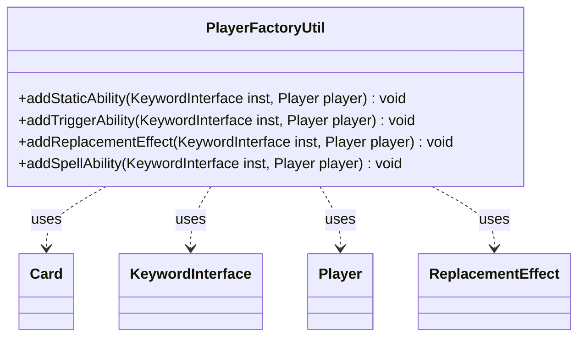

---
aliases:
  - PlayerFactoryUtil
tags:
  - java/class
  - module/forge-game
  - pkg/forge/game/player
fqn: forge.game.player.PlayerFactoryUtil
package: forge.game.player
module: forge-game
kind: Class
---

# PlayerFactoryUtil

**Package:** `forge.game.player`   **Module:** `forge-game`   **Kind:** Class



## Relationships
**Uses:**
- [[forge.game.card.Card|Card]]
- [[forge.game.keyword.KeywordInterface|KeywordInterface]]
- [[forge.game.player.Player|Player]]
- [[forge.game.replacement.ReplacementEffect|ReplacementEffect]]

## Design Description

Player keywords like Hexproof, Shroud, and Protection are normally written on cards, but they sometimes apply to a player directly; `PlayerFactoryUtil` is the static-helper that translates such a player-borne `KeywordInterface` into the engine objects that implement it. Mirroring the card-side `CardFactoryUtil`, it exposes four parallel installers—`addStaticAbility`, `addTriggerAbility`, `addReplacementEffect`, and `addSpellAbility`—each taking the keyword instance and its owning `Player`.

Internally it builds Forge's script-string effect definitions and attaches the resulting `StaticAbility` and `ReplacementEffect` objects to the keyword, anchoring them to the player's synthetic `getKeywordCard()` in the Command zone. Only the static (can't-target/can't-attach) and damage-prevention replacement paths are populated; the trigger and spell hooks are intentionally empty stubs, leaving the symmetric structure ready for future keyword support.

## Source
`forge-game/src/main/java/forge/game/player/PlayerFactoryUtil.java`

```java
package forge.game.player;

import forge.game.card.Card;
import forge.game.card.CardFactoryUtil;
import forge.game.keyword.KeywordInterface;
import forge.game.replacement.ReplacementEffect;
import forge.game.replacement.ReplacementHandler;
import forge.game.staticability.StaticAbility;

public class PlayerFactoryUtil {

    public static void addStaticAbility(final KeywordInterface inst, final Player player) {
        String keyword = inst.getOriginal();

        if (keyword.startsWith("Hexproof")) {
            final StringBuilder sbDesc = new StringBuilder("Hexproof");
            final StringBuilder sbValid = new StringBuilder();

            if (!keyword.equals("Hexproof")) {
                final String[] k = keyword.split(":");

                sbDesc.append(" from ").append(k[2]);
                sbValid.append("| ValidSource$ ").append(k[1]);
            }

            String effect = "Mode$ CantTarget | ValidTarget$ Player.You | Secondary$ True "
                    + sbValid.toString() + " | Activator$ Opponent | EffectZone$ Command | Description$ "
                    + sbDesc.toString() + " (" + inst.getReminderText() + ")";

            final Card card = player.getKeywordCard();
            inst.addStaticAbility(StaticAbility.create(effect, card, card.getCurrentState(), false));
        } else if (keyword.equals("Shroud")) {
            String effect = "Mode$ CantTarget | ValidTarget$ Player.You | Secondary$ True "
                    + "| EffectZone$ Command | Description$ Shroud (" + inst.getReminderText() + ")";

            final Card card = player.getKeywordCard();
            inst.addStaticAbility(StaticAbility.create(effect, card, card.getCurrentState(), false));
        } else if (keyword.startsWith("Protection")) {
            String valid = CardFactoryUtil.getProtectionValid(keyword, false);
            String effect = "Mode$ CantTarget | ValidTarget$ Player.You | EffectZone$ Command | Secondary$ True ";
            if (!valid.isEmpty()) {
                effect += "| ValidSource$ " + valid;
            }
            final Card card = player.getKeywordCard();
            inst.addStaticAbility(StaticAbility.create(effect, card, card.getCurrentState(), false));

            // Attach
            effect = "Mode$ CantAttach | Target$ Player.You | EffectZone$ Command | Secondary$ True ";
            if (!valid.isEmpty()) {
                effect += "| ValidCard$ " + valid;
            }
            // This effect doesn't remove something
            if (keyword.startsWith("Protection:")) {
                final String[] kws = keyword.split(":");
                if (kws.length > 3) {
                    effect += " | Exceptions$ " + kws[3];
                }
            }
            inst.addStaticAbility(StaticAbility.create(effect, card, card.getCurrentState(), false));
        }
    }

    public static void addTriggerAbility(final KeywordInterface inst, Player player) {
    }

    public static void addReplacementEffect(final KeywordInterface inst, Player player) {
        String keyword = inst.getOriginal();
        String effect = null;

        if (keyword.startsWith("Protection")) {
            String validSource = CardFactoryUtil.getProtectionValid(keyword, true);

            effect = "Event$ DamageDone | Prevent$ True | ActiveZones$ Command | ValidTarget$ You";
            if (!validSource.isEmpty()) {
                effect += " | ValidSource$ " + validSource;
            }
            effect += " | Secondary$ True | Description$ " + keyword;
        }

        if (effect != null) {
            final Card card = player.getKeywordCard();
            ReplacementEffect re = ReplacementHandler.parseReplacement(effect, card, false, card.getCurrentState());
            inst.addReplacement(re);
        }
    }

    public static void addSpellAbility(final KeywordInterface inst, Player player) {
    }
}
```

## Python
`forge/game/player/PlayerFactoryUtil.py`

```python
from forge.game.card.Card import Card
from forge.game.card.CardFactoryUtil import CardFactoryUtil
from forge.game.keyword.KeywordInterface import KeywordInterface
from forge.game.player.Player import Player
from forge.game.replacement.ReplacementEffect import ReplacementEffect
from forge.game.replacement.ReplacementHandler import ReplacementHandler
from forge.game.staticability.StaticAbility import StaticAbility


class PlayerFactoryUtil:

    @staticmethod
    def addStaticAbility(inst: KeywordInterface, player: Player) -> None:
        keyword = inst.getOriginal()

        if keyword.startswith("Hexproof"):
            sbDesc = ["Hexproof"]
            sbValid = []

            if keyword != "Hexproof":
                k = keyword.split(":")

                sbDesc.append(" from " + k[2])
                sbValid.append("| ValidSource$ " + k[1])

            effect = ("Mode$ CantTarget | ValidTarget$ Player.You | Secondary$ True "
                      + "".join(sbValid) + " | Activator$ Opponent | EffectZone$ Command | Description$ "
                      + "".join(sbDesc) + " (" + inst.getReminderText() + ")")

            card = player.getKeywordCard()
            inst.addStaticAbility(StaticAbility.create(effect, card, card.getCurrentState(), False))
        elif keyword == "Shroud":
            effect = ("Mode$ CantTarget | ValidTarget$ Player.You | Secondary$ True "
                      + "| EffectZone$ Command | Description$ Shroud (" + inst.getReminderText() + ")")

            card = player.getKeywordCard()
            inst.addStaticAbility(StaticAbility.create(effect, card, card.getCurrentState(), False))
        elif keyword.startswith("Protection"):
            valid = CardFactoryUtil.getProtectionValid(keyword, False)
            effect = "Mode$ CantTarget | ValidTarget$ Player.You | EffectZone$ Command | Secondary$ True "
            if valid:
                effect += "| ValidSource$ " + valid
            card = player.getKeywordCard()
            inst.addStaticAbility(StaticAbility.create(effect, card, card.getCurrentState(), False))

            # Attach
            effect = "Mode$ CantAttach | Target$ Player.You | EffectZone$ Command | Secondary$ True "
            if valid:
                effect += "| ValidCard$ " + valid
            # This effect doesn't remove something
            if keyword.startswith("Protection:"):
                kws = keyword.split(":")
                if len(kws) > 3:
                    effect += " | Exceptions$ " + kws[3]
            inst.addStaticAbility(StaticAbility.create(effect, card, card.getCurrentState(), False))

    @staticmethod
    def addTriggerAbility(inst: KeywordInterface, player: Player) -> None:
        pass

    @staticmethod
    def addReplacementEffect(inst: KeywordInterface, player: Player) -> None:
        keyword = inst.getOriginal()
        effect = None

        if keyword.startswith("Protection"):
            validSource = CardFactoryUtil.getProtectionValid(keyword, True)

            effect = "Event$ DamageDone | Prevent$ True | ActiveZones$ Command | ValidTarget$ You"
            if validSource:
                effect += " | ValidSource$ " + validSource
            effect += " | Secondary$ True | Description$ " + keyword

        if effect is not None:
            card = player.getKeywordCard()
            re = ReplacementHandler.parseReplacement(effect, card, False, card.getCurrentState())
            inst.addReplacement(re)

    @staticmethod
    def addSpellAbility(inst: KeywordInterface, player: Player) -> None:
        pass
```
