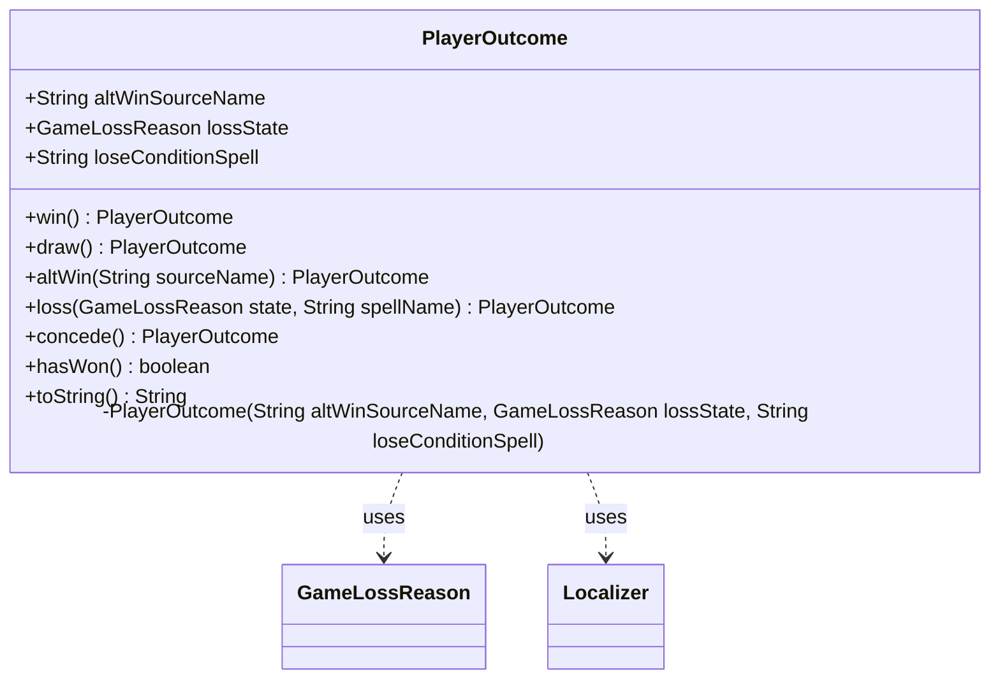

---
aliases:
  - PlayerOutcome
tags:
  - java/class
  - module/forge-game
  - pkg/forge/game/player
fqn: forge.game.player.PlayerOutcome
package: forge.game.player
module: forge-game
kind: Class
---

# PlayerOutcome

**Package:** `forge.game.player` &nbsp; **Module:** `forge-game` &nbsp; **Kind:** Class



## Relationships
**Uses:**
- [[forge.game.player.GameLossReason|GameLossReason]]
- [[forge.util.Localizer|Localizer]]

## Source
`forge-game/src/main/java/forge/game/player/PlayerOutcome.java`

```java
package forge.game.player;


import forge.util.Localizer;

/**
 * TODO: Write javadoc for this type.
 */
public class PlayerOutcome {
    public final String altWinSourceName;
    public final GameLossReason lossState;
    public final String loseConditionSpell;

    private PlayerOutcome(String altWinSourceName, GameLossReason lossState, String loseConditionSpell) {
        this.altWinSourceName = altWinSourceName;
        this.loseConditionSpell = loseConditionSpell;
        this.lossState = lossState;
    }

    /**
     * TODO: Write javadoc for this method.
     * @return
     */
    public static PlayerOutcome win() {
        return new PlayerOutcome(null, null, null);
    }

    public static PlayerOutcome draw() {
        return new PlayerOutcome(null, GameLossReason.IntentionalDraw, null);
    }

    public static PlayerOutcome altWin(String sourceName) {
        return new PlayerOutcome(sourceName, null, null);
    }

    /**
     * TODO: Write javadoc for this method.
     * @param state
     * @param spellName
     * @return
     */
    public static PlayerOutcome loss(GameLossReason state, String spellName) {
        return new PlayerOutcome(null, state, spellName);
    }

    /**
     * TODO: Write javadoc for this method.
     * @return
     */
    public static PlayerOutcome concede() {
        return new PlayerOutcome(null, GameLossReason.Conceded, null);
    }

    public boolean hasWon() {
        return lossState == null;
    }
    
    /* (non-Javadoc)
     * @see java.lang.Object#toString()
     */
    @Override
    public String toString() {
        Localizer localizer = Localizer.getInstance();
        if ( lossState == null ) {
            if ( altWinSourceName == null )
                return localizer.getMessage("lblWonBecauseAllOpponentsHaveLost");
            else 
                return localizer.getMessage("lblWonDueToEffectOf").replace("%s", altWinSourceName);
        }
        switch(lossState){
            case Conceded: return localizer.getMessage("lblConceded");
            case Milled: return localizer.getMessage("lblLostTryingToDrawCardsFromEmptyLibrary");
            case LifeReachedZero: return localizer.getMessage("lblLostBecauseLifeTotalReachedZero");
            case Poisoned: return localizer.getMessage("lblLostBecauseOfObtainingTenPoisonCounters");
            case OpponentWon: return localizer.getMessage("lblLostBecauseAnOpponentHasWonBySpell").replace("%s", loseConditionSpell);
            case SpellEffect: return localizer.getMessage("lblLostDueToEffectOfSpell").replace("%s", loseConditionSpell);
            case CommanderDamage: return localizer.getMessage("lblLostDueToAccumulationOf21DamageFromGenerals");
            case IntentionalDraw: return localizer.getMessage("lblAcceptedThatTheGameIsADraw");
        }
        return localizer.getMessage("lblLostForUnknownReasonBug");
    }

}
```
