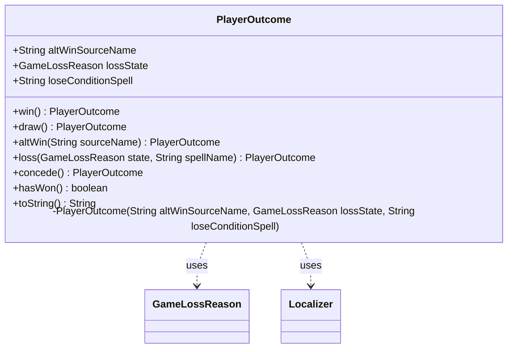

---
aliases:
  - PlayerOutcome
tags:
  - java/class
  - module/forge-game
  - pkg/forge/game/player
fqn: forge.game.player.PlayerOutcome
package: forge.game.player
module: forge-game
kind: Class
---

# PlayerOutcome

**Package:** `forge.game.player`   **Module:** `forge-game`   **Kind:** Class



## Relationships
**Uses:**
- [[forge.game.player.GameLossReason|GameLossReason]]
- [[forge.util.Localizer|Localizer]]

## Design Description

PlayerOutcome is an immutable value object that records the terminal result of a game for a single player—win, draw, alternate-source win, loss, or concession—capturing the reason and any associated source or spell name in three final fields. Its private constructor is reached only through static factory methods (`win`, `draw`, `altWin`, `loss`, `concede`), each encoding a specific outcome scenario and giving callers an intention-revealing API rather than raw field assignment. It collaborates with the `GameLossReason` enum to classify defeats and queries `hasWon()` by treating a null loss state as victory. The `toString()` method delegates to `Localizer` to translate each outcome into a human-readable, internationalized message, switching over the loss reason and interpolating the source or spell name. The design favors immutability, factory-based construction, and separation of state from presentation.

## Source
`forge-game/src/main/java/forge/game/player/PlayerOutcome.java`

```java
package forge.game.player;


import forge.util.Localizer;

/**
 * TODO: Write javadoc for this type.
 */
public class PlayerOutcome {
    public final String altWinSourceName;
    public final GameLossReason lossState;
    public final String loseConditionSpell;

    private PlayerOutcome(String altWinSourceName, GameLossReason lossState, String loseConditionSpell) {
        this.altWinSourceName = altWinSourceName;
        this.loseConditionSpell = loseConditionSpell;
        this.lossState = lossState;
    }

    /**
     * TODO: Write javadoc for this method.
     * @return
     */
    public static PlayerOutcome win() {
        return new PlayerOutcome(null, null, null);
    }

    public static PlayerOutcome draw() {
        return new PlayerOutcome(null, GameLossReason.IntentionalDraw, null);
    }

    public static PlayerOutcome altWin(String sourceName) {
        return new PlayerOutcome(sourceName, null, null);
    }

    /**
     * TODO: Write javadoc for this method.
     * @param state
     * @param spellName
     * @return
     */
    public static PlayerOutcome loss(GameLossReason state, String spellName) {
        return new PlayerOutcome(null, state, spellName);
    }

    /**
     * TODO: Write javadoc for this method.
     * @return
     */
    public static PlayerOutcome concede() {
        return new PlayerOutcome(null, GameLossReason.Conceded, null);
    }

    public boolean hasWon() {
        return lossState == null;
    }
    
    /* (non-Javadoc)
     * @see java.lang.Object#toString()
     */
    @Override
    public String toString() {
        Localizer localizer = Localizer.getInstance();
        if ( lossState == null ) {
            if ( altWinSourceName == null )
                return localizer.getMessage("lblWonBecauseAllOpponentsHaveLost");
            else 
                return localizer.getMessage("lblWonDueToEffectOf").replace("%s", altWinSourceName);
        }
        switch(lossState){
            case Conceded: return localizer.getMessage("lblConceded");
            case Milled: return localizer.getMessage("lblLostTryingToDrawCardsFromEmptyLibrary");
            case LifeReachedZero: return localizer.getMessage("lblLostBecauseLifeTotalReachedZero");
            case Poisoned: return localizer.getMessage("lblLostBecauseOfObtainingTenPoisonCounters");
            case OpponentWon: return localizer.getMessage("lblLostBecauseAnOpponentHasWonBySpell").replace("%s", loseConditionSpell);
            case SpellEffect: return localizer.getMessage("lblLostDueToEffectOfSpell").replace("%s", loseConditionSpell);
            case CommanderDamage: return localizer.getMessage("lblLostDueToAccumulationOf21DamageFromGenerals");
            case IntentionalDraw: return localizer.getMessage("lblAcceptedThatTheGameIsADraw");
        }
        return localizer.getMessage("lblLostForUnknownReasonBug");
    }

}
```

## Python
`forge/game/player/PlayerOutcome.py`

```python
from forge.game.player.GameLossReason import GameLossReason
from forge.util.Localizer import Localizer


# TODO: Write javadoc for this type.
class PlayerOutcome:
    def __init__(self, altWinSourceName: str, lossState: GameLossReason, loseConditionSpell: str):
        self.altWinSourceName = altWinSourceName
        self.loseConditionSpell = loseConditionSpell
        self.lossState = lossState

    # TODO: Write javadoc for this method.
    # @return
    @staticmethod
    def win() -> "PlayerOutcome":
        return PlayerOutcome(None, None, None)

    @staticmethod
    def draw() -> "PlayerOutcome":
        return PlayerOutcome(None, GameLossReason.IntentionalDraw, None)

    @staticmethod
    def altWin(sourceName: str) -> "PlayerOutcome":
        return PlayerOutcome(sourceName, None, None)

    # TODO: Write javadoc for this method.
    # @param state
    # @param spellName
    # @return
    @staticmethod
    def loss(state: GameLossReason, spellName: str) -> "PlayerOutcome":
        return PlayerOutcome(None, state, spellName)

    # TODO: Write javadoc for this method.
    # @return
    @staticmethod
    def concede() -> "PlayerOutcome":
        return PlayerOutcome(None, GameLossReason.Conceded, None)

    def hasWon(self) -> bool:
        return self.lossState is None

    # (non-Javadoc)
    # @see java.lang.Object#toString()
    def toString(self) -> str:
        localizer = Localizer.getInstance()
        if self.lossState is None:
            if self.altWinSourceName is None:
                return localizer.getMessage("lblWonBecauseAllOpponentsHaveLost")
            else:
                return localizer.getMessage("lblWonDueToEffectOf").replace("%s", self.altWinSourceName)
        if self.lossState == GameLossReason.Conceded:
            return localizer.getMessage("lblConceded")
        elif self.lossState == GameLossReason.Milled:
            return localizer.getMessage("lblLostTryingToDrawCardsFromEmptyLibrary")
        elif self.lossState == GameLossReason.LifeReachedZero:
            return localizer.getMessage("lblLostBecauseLifeTotalReachedZero")
        elif self.lossState == GameLossReason.Poisoned:
            return localizer.getMessage("lblLostBecauseOfObtainingTenPoisonCounters")
        elif self.lossState == GameLossReason.OpponentWon:
            return localizer.getMessage("lblLostBecauseAnOpponentHasWonBySpell").replace("%s", self.loseConditionSpell)
        elif self.lossState == GameLossReason.SpellEffect:
            return localizer.getMessage("lblLostDueToEffectOfSpell").replace("%s", self.loseConditionSpell)
        elif self.lossState == GameLossReason.CommanderDamage:
            return localizer.getMessage("lblLostDueToAccumulationOf21DamageFromGenerals")
        elif self.lossState == GameLossReason.IntentionalDraw:
            return localizer.getMessage("lblAcceptedThatTheGameIsADraw")
        return localizer.getMessage("lblLostForUnknownReasonBug")

    def __str__(self) -> str:
        return self.toString()
```
