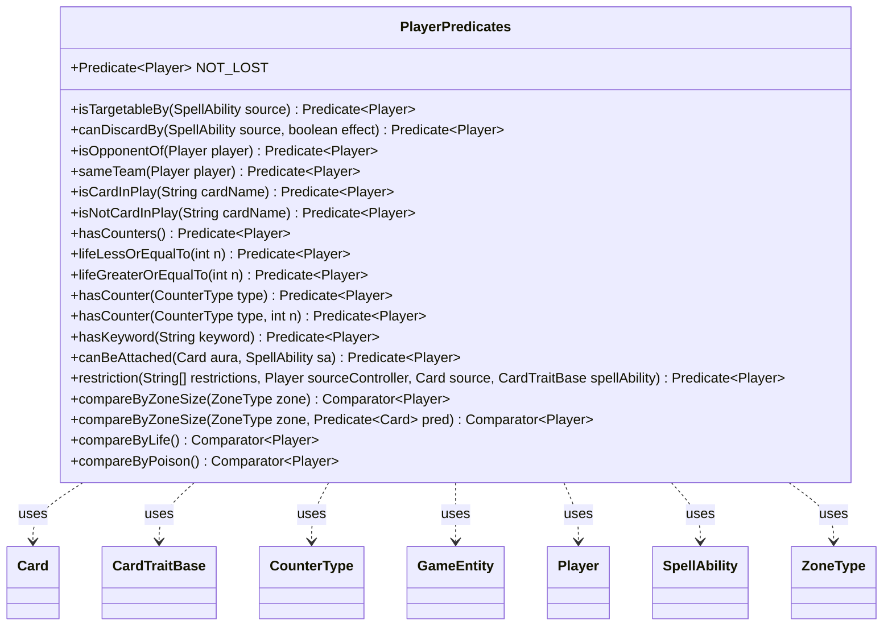

---
aliases:
  - PlayerPredicates
tags:
  - java/class
  - module/forge-game
  - pkg/forge/game/player
fqn: forge.game.player.PlayerPredicates
package: forge.game.player
module: forge-game
kind: Class
---

# PlayerPredicates

**Package:** `forge.game.player`   **Module:** `forge-game`   **Kind:** Class



## Relationships
**Uses:**
- [[forge.game.CardTraitBase|CardTraitBase]]
- [[forge.game.GameEntity|GameEntity]]
- [[forge.game.card.Card|Card]]
- [[forge.game.card.CounterType|CounterType]]
- [[forge.game.player.Player|Player]]
- [[forge.game.spellability.SpellAbility|SpellAbility]]
- [[forge.game.zone.ZoneType|ZoneType]]

## Design Description

forge.game.player.PlayerPredicates is a final utility class that centralizes the construction of reusable `Predicate<Player>` filters and `Comparator<Player>` orderings for the game engine. Rather than holding state, it exposes only static factory methods that capture their arguments in lambdas and method references, deferring evaluation until each player is tested—letting callers compose declarative queries such as targetability, opponent/team relationships, life and counter thresholds, keyword possession, board presence, and validity restrictions.

Its predicates collaborate with the core game model, delegating to behavior on Player and GameEntity and drawing on SpellAbility, Card, CardTraitBase, CounterType, and ZoneType to express domain rules; the comparators rank players by zone size, life, or poison. The design intent is a stateless, side-effect-free helper that concentrates player-filtering logic in one place, keeping selection criteria consistent and composable (e.g., negation via `isNotCardInPlay`) across the codebase.

## Source
`forge-game/src/main/java/forge/game/player/PlayerPredicates.java`

```java
package forge.game.player;

import java.util.Comparator;
import java.util.function.Predicate;

import forge.game.CardTraitBase;
import forge.game.GameEntity;
import forge.game.card.Card;
import forge.game.card.CardLists;
import forge.game.card.CounterType;
import forge.game.spellability.SpellAbility;
import forge.game.zone.ZoneType;

public final class PlayerPredicates {

    public static Predicate<Player> isTargetableBy(final SpellAbility source) {
        return source::canTarget;
    }

    public static Predicate<Player> canDiscardBy(final SpellAbility source, final boolean effect) {
        return p -> p.canDiscardBy(source, effect);
    }

    public static Predicate<Player> isOpponentOf(final Player player) {
        return p -> p.isOpponentOf(player);
    }
    
    public static Predicate<Player> sameTeam(final Player player) {
        return player::sameTeam;
    }

    public static Predicate<Player> isCardInPlay(final String cardName) {
        return p -> p.isCardInPlay(cardName);
    }
    
    public static Predicate<Player> isNotCardInPlay(final String cardName) {
        return isCardInPlay(cardName).negate();
    }

    public static Predicate<Player> hasCounters() {
        return GameEntity::hasCounters;
    }

    public static Predicate<Player> lifeLessOrEqualTo(final int n) {
        return p -> p.getLife() <= n;
    }

    public static Predicate<Player> lifeGreaterOrEqualTo(final int n) {
        return p -> p.getLife() >= n;
    }

    public static Predicate<Player> hasCounter(final CounterType type) {
        return hasCounter(type, 1);
    }

    public static Predicate<Player> hasCounter(final CounterType type, final int n) {
        return p -> p.getCounters(type) >= n;
    }
    
    public static Predicate<Player> hasKeyword(final String keyword) {
        return p -> p.hasKeyword(keyword);
    }

    public static Predicate<Player> canBeAttached(final Card aura, SpellAbility sa) {
        return p -> p.canBeAttached(aura, sa);
    }

    public static Predicate<Player> restriction(final String[] restrictions, final Player sourceController, final Card source, final CardTraitBase spellAbility) {
        return c -> c != null && c.isValid(restrictions, sourceController, source, spellAbility);
    }

    public static Comparator<Player> compareByZoneSize(final ZoneType zone) {
        return Comparator.comparingInt(arg0 -> arg0.getCardsIn(zone).size());
    }
    
    public static Comparator<Player> compareByZoneSize(final ZoneType zone, final Predicate<Card> pred) {
        return Comparator.comparingInt(arg0 -> CardLists.count(arg0.getCardsIn(zone), pred));
    }
    
    public static Comparator<Player> compareByLife() {
        return Comparator.comparingInt(Player::getLife);
    }
    
    public static Comparator<Player> compareByPoison() {
        return Comparator.comparingInt(Player::getPoisonCounters);
    }

    public static final Predicate<Player> NOT_LOST = p -> p.getOutcome() == null || p.getOutcome().hasWon();
}
```

## Python
`forge/game/player/PlayerPredicates.py`

```python
from forge.game.CardTraitBase import CardTraitBase
from forge.game.GameEntity import GameEntity
from forge.game.card.Card import Card
from forge.game.card.CardLists import CardLists
from forge.game.card.CounterType import CounterType
from forge.game.player.Player import Player
from forge.game.spellability.SpellAbility import SpellAbility
from forge.game.zone.ZoneType import ZoneType


class PlayerPredicates:

    @staticmethod
    def isTargetableBy(source):
        return lambda p: source.canTarget(p)

    @staticmethod
    def canDiscardBy(source, effect):
        return lambda p: p.canDiscardBy(source, effect)

    @staticmethod
    def isOpponentOf(player):
        return lambda p: p.isOpponentOf(player)

    @staticmethod
    def sameTeam(player):
        return lambda p: player.sameTeam(p)

    @staticmethod
    def isCardInPlay(cardName):
        return lambda p: p.isCardInPlay(cardName)

    @staticmethod
    def isNotCardInPlay(cardName):
        inner = PlayerPredicates.isCardInPlay(cardName)
        return lambda p: not inner(p)

    @staticmethod
    def hasCounters():
        return lambda p: p.hasCounters()

    @staticmethod
    def lifeLessOrEqualTo(n):
        return lambda p: p.getLife() <= n

    @staticmethod
    def lifeGreaterOrEqualTo(n):
        return lambda p: p.getLife() >= n

    @staticmethod
    def hasCounter(type, n=1):
        return lambda p: p.getCounters(type) >= n

    @staticmethod
    def hasKeyword(keyword):
        return lambda p: p.hasKeyword(keyword)

    @staticmethod
    def canBeAttached(aura, sa):
        return lambda p: p.canBeAttached(aura, sa)

    @staticmethod
    def restriction(restrictions, sourceController, source, spellAbility):
        return lambda c: c is not None and c.isValid(restrictions, sourceController, source, spellAbility)

    @staticmethod
    def compareByZoneSize(zone, pred=None):
        if pred is None:
            return lambda arg0: arg0.getCardsIn(zone).size()
        return lambda arg0: CardLists.count(arg0.getCardsIn(zone), pred)

    @staticmethod
    def compareByLife():
        return lambda p: p.getLife()

    @staticmethod
    def compareByPoison():
        return lambda p: p.getPoisonCounters()


PlayerPredicates.NOT_LOST = lambda p: p.getOutcome() is None or p.getOutcome().hasWon()
```
