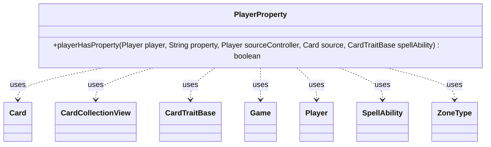

---
aliases:
  - PlayerProperty
tags:
  - java/class
  - module/forge-game
  - pkg/forge/game/player
fqn: forge.game.player.PlayerProperty
package: forge.game.player
module: forge-game
kind: Class
---

# PlayerProperty

**Package:** `forge.game.player`   **Module:** `forge-game`   **Kind:** Class



## Relationships
**Uses:**
- [[forge.game.CardTraitBase|CardTraitBase]]
- [[forge.game.Game|Game]]
- [[forge.game.card.Card|Card]]
- [[forge.game.card.CardCollectionView|CardCollectionView]]
- [[forge.game.player.Player|Player]]
- [[forge.game.spellability.SpellAbility|SpellAbility]]
- [[forge.game.zone.ZoneType|ZoneType]]

## Design Description

PlayerProperty is a stateless utility class whose sole responsibility is to evaluate whether a given Player satisfies a named property restriction. Its one public static method, `playerHasProperty`, accepts a target Player along with the evaluation context — a property keyword string, the source's controller, the source Card, and the originating CardTraitBase — and returns a boolean verdict. It serves as the player-focused counterpart in Forge's text-driven restriction system, parsing property keywords (e.g. "Opponent", "isMonarch", "controls...", "withMost...") into concrete game-state queries.

The class collaborates broadly with the game model: it reaches the Game for phase, combat, and player data, inspects Card and CardCollectionView holdings across ZoneType zones, and delegates value parsing to AbilityUtils, CardLists, and Expressions. The design intent is a centralized, extensible dispatch table — a long if/else chain keyed on property prefixes — that keeps card-scripting predicates declarative while defaulting unknown properties to false.

## Source
`forge-game/src/main/java/forge/game/player/PlayerProperty.java`

```java
package forge.game.player;

import com.google.common.collect.Iterables;
import com.google.common.collect.Lists;
import forge.game.CardTraitBase;
import forge.game.Game;
import forge.game.ability.AbilityUtils;
import forge.game.card.Card;
import forge.game.card.CardCollectionView;
import forge.game.card.CardLists;
import forge.game.card.CardPredicates;
import forge.game.spellability.SpellAbility;
import forge.game.zone.ZoneType;
import forge.util.Expressions;
import forge.util.TextUtil;

import java.util.*;
import java.util.regex.Matcher;
import java.util.regex.Pattern;

public class PlayerProperty {

    public static boolean playerHasProperty(Player player, String property, Player sourceController, Card source, CardTraitBase spellAbility) {
        Game game = player.getGame();
        if (property.equals("Activator")) {
            if (!player.equals(spellAbility.getHostCard().getController())) {
                return false;
            }
        } else if (property.equals("You")) {
            if (!player.equals(sourceController)) {
                return false;
            }
        } else if (property.equals("Opponent")) {
            if (player.equals(sourceController) || !player.isOpponentOf(sourceController)) {
                return false;
            }
        } else if (property.startsWith("OpponentOf ")) {
            final String v = property.split(" ")[1];
            final List<Player> players = AbilityUtils.getDefinedPlayers(source, v, spellAbility);
            for (final Player p : players) {
                if (player.equals(p) || !player.isOpponentOf(p)) {
                    return false;
                }
            }
        } else if (property.startsWith("PlayerUID_")) {
            if (player.getId() != Integer.parseInt(property.split("PlayerUID_")[1])) {
                return false;
            }
        } else if (property.equals("YourTeam")) {
            if (!player.sameTeam(sourceController)) {
                return false;
            }
        } else if (property.equals("Allies")) {
            if (player.equals(sourceController) || player.isOpponentOf(sourceController)) {
                return false;
            }
        } else if (property.equals("Active")) {
            if (!game.getPhaseHandler().isPlayerTurn(player)) {
                return false;
            }
        } else if (property.equals("NonActive")) {
            if (game.getPhaseHandler().isPlayerTurn(player)) {
                return false;
            }
        } else if (property.equals("OpponentToActive")) {
            final Player active = game.getPhaseHandler().getPlayerTurn();
            if (player.equals(active) || !player.isOpponentOf(active)) {
                return false;
            }
        } else if (property.equals("Other")) {
            if (player.equals(sourceController)) {
                return false;
            }
        } else if (property.equals("CardOwner")) {
            if (!player.equals(source.getOwner())) {
                return false;
            }
        } else if (property.equals("descended")) {
            if (player.getDescended() < 1) {
                return false;
            }
        } else if (property.equals("committedCrimeThisTurn")) {
            if (player.getCommittedCrimeThisTurn() < 1) return false;
        } else if (property.equals("isMonarch")) {
            if (!player.isMonarch()) {
                return false;
            }
        } else if (property.equals("hasInitiative")) {
            if (!player.hasInitiative()) {
                return false;
            }
        } else if (property.equals("hasBlessing")) {
            if (!player.hasBlessing()) {
                return false;
            }
        } else if (property.equals("CanBeEnchantedBy")) {
            if (!player.canBeAttached(source, null)) {
                return false;
            }
        } else if (property.startsWith("damageDoneSingleSource")) {
            String props = property.split(" ")[1];
            List<Integer> sourceDmg = game.getDamageDoneThisTurn(null, false, "Card.YouCtrl", null, source, sourceController, spellAbility);
            int maxDmg = sourceDmg.isEmpty() ? 0 : Collections.max(sourceDmg);
            if (!Expressions.compare(maxDmg, props.substring(0, 2), AbilityUtils.calculateAmount(source, props.substring(2), spellAbility))) {
                return false;
            }
        } else if (property.startsWith("wasDealtCombatDamageThisCombatBy ")) {
            String v = property.split(" ")[1];
            boolean found = false;

            final List<Card> cards = AbilityUtils.getDefinedCards(source, v, spellAbility);
            for (final Card card : cards) {
                if (card.getDamageHistory().getThisCombatDamaged().contains(player)) {
                    found = true;
                    break;
                }
            }
            if (!found) {
                return false;
            }
        } else if (property.startsWith("wasDealtDamageThisGameBy ")) {
            String v = property.split(" ")[1];
            boolean found = false;

            final List<Card> cards = AbilityUtils.getDefinedCards(source, v, spellAbility);
            for (final Card card : cards) {
                if (card.getDamageHistory().getThisGameDamaged().contains(player)) {
                    found = true;
                    break;
                }
            }
            if (!found) {
                return false;
            }
        } else if (property.startsWith("wasDealt")) {
            Boolean combat = null;
            if (property.contains("CombatDamage")) {
                combat = true;
            }
            String validCard = null;
            String comp = "GE";
            int right = 1;

            if (property.contains("ThisTurnBy")) {
                int idx = 2;
                String[] props = property.split(" ");
                if (property.contains("BySource")) {
                    idx--;
                } else {
                    validCard = props[1];
                }
                if (props.length > idx) {
                    comp = props[idx].substring(0, 2);
                    right = AbilityUtils.calculateAmount(source, props[idx].substring(2), spellAbility);
                }
            }
            int result;
            if (property.contains("BySource")) {
                result = source.getDamageHistory().getDamageDoneThisTurn(combat, false, property.contains("SourceTimes"), null, "You", source, player, spellAbility);
            } else {
                result = game.getDamageDoneThisTurn(combat, validCard == null, validCard, "You", source, player, spellAbility).size();
            }
            if (!Expressions.compare(result, comp, right)) {
                return false;
            }
        } else if (property.equals("attackedBySourceThisCombat")) {
            if (game.getCombat() == null || !player.equals(game.getCombat().getDefenderPlayerByAttacker(source))) {
                return false;
            }
        } else if (property.equals("attackedBySourceThisTurn")) {
            if (!source.getDamageHistory().hasAttackedThisTurn(player)) {
                return false;
            }
        } else if (property.equals("Attacking")) {
            if (game.getCombat() == null || !player.equals(game.getCombat().getAttackingPlayer())) {
                return false;
            }
        } else if (property.equals("Defending")) {
            if (game.getCombat() == null || !game.getCombat().getAttackersAndDefenders().values().contains(player)) {
                return false;
            }
        } else if (property.startsWith("LostLifeThisTurn")) {
            String comparator = "GE";
            int value = 1;

            if (!property.equals("LostLifeThisTurn")) {
                // Parse value from "LostLifeThisTurn GE3"
                String compareAndValue = property.split(" ")[1];
                comparator = compareAndValue.substring(0, 2); // This should typically be GE
                final String rightString = compareAndValue.substring(2);
                value = AbilityUtils.calculateAmount(source, rightString, spellAbility);
            }
            if (!Expressions.compare(player.getLifeLostThisTurn(), comparator, value)) {
                return false;
            }
        } else if (property.equals("TappedLandForManaThisTurn")) {
            if (!player.hasTappedLandForManaThisTurn()) {
                return false;
            }
        } else if (property.equals("CardsInHandAtBeginningOfTurn")) {
            if (player.getNumCardsInHandStartedThisTurnWith() <= 0) {
                return false;
            }
        } else if (property.equals("IsRemembered")) {
            if (!source.isRemembered(player)) {
                return false;
            }
        } else if (property.equals("IsRememberedOrController")) {
            boolean found = false;
            for (Object o : source.getRemembered()) {
                if (o instanceof Player) {
                    final Player p = (Player) o;
                    if (p.equals(player)) {
                        found = true;
                        break;
                    }
                } else if (o instanceof Card) {
                    final Card c = (Card) o;
                    if (c.getController().equals(player)) {
                        found = true;
                        break;
                    }
                }
            }
            if (!found) {
                return false;
            }
        } else if (property.equals("IsTriggerRemembered")) {
            boolean found = false;
            for (Object o : spellAbility.getTriggerRemembered()) {
                if (o instanceof Player) {
                    Player trigRem = (Player) o;
                    if (trigRem.equals(player)) {
                        found = true;
                        break;
                    }
                }
            }
            if (!found) {
                return false;
            }
        } else if (property.equals("EnchantedBy")) {
            if (!player.isEnchantedBy(source)) {
                return false;
            }
        } else if (property.equals("EnchantedController")) {
            Card enchanting = source.getEnchantingCard();
            if (enchanting == null || !player.equals(enchanting.getController())) {
                return false;
            }
        } else if (property.equals("Chosen")) {
            if (source.getChosenPlayer() == null || !source.getChosenPlayer().equals(player)) {
                return false;
            }
        } else if (property.equals("NotedDefender")) {
            String tracker = player.getDraftNotes().getOrDefault("Cogwork Tracker", "");

            return Arrays.asList(tracker.split(",")).contains(String.valueOf(player));
        } else if (property.startsWith("life")) {
            int life = player.getLife();
            int amount = AbilityUtils.calculateAmount(source, property.substring(6), spellAbility);

            if (!Expressions.compare(life, property, amount)) {
                return false;
            }
        } else if (property.equals("IsPoisoned")) {
            if (player.getPoisonCounters() <= 0) {
                return false;
            }
        } else if (property.equals("IsCorrupted")) {
            if (player.getPoisonCounters() <= 2) {
                return false;
            }
        } else if (property.equals("NoSpeed")) {
            if (!player.noSpeed()) {
                return false;
            }
        } else if (property.equals("MaxSpeed")) {
            if (!player.maxSpeed()) {
                return false;
            }
        } else if (property.equals("targetedBy")) {
            if (!(spellAbility instanceof SpellAbility)) {
                return false;
            }
            SpellAbility sp = (SpellAbility)spellAbility;
            if (!sp.getRootAbility().isTargeting(player)) {
                return false;
            }
        } else if (property.startsWith("controls")) {
            // this allows escaping _ with \ in case of complex restrictions (used on Turf War)
            List<String> type = new ArrayList<>();
            Pattern regex = Pattern.compile("(?:\\\\.|[^_\\\\]++)+");
            Matcher regexMatcher = regex.matcher(property.substring(8));
            while (regexMatcher.find()) {
                type.add(regexMatcher.group());
            }
            final CardCollectionView list = CardLists.getValidCards(player.getCardsIn(ZoneType.Battlefield), type.get(0).replace("\\_", "_"), sourceController, source, spellAbility);
            String comparator = type.size() > 1 ? type.get(1) : "GE";
            int y = type.size() > 1 ? AbilityUtils.calculateAmount(source, comparator.substring(2), spellAbility) : 1;
            if (!Expressions.compare(list.size(), comparator, y)) {
                return false;
            }
        } else if (property.startsWith("HasCardsIn")) { // HasCardsIn[zonetype]_[cardtype]_[comparator]
            final String[] type = property.substring(10).split("_");
            final CardCollectionView list = CardLists.getValidCards(player.getCardsIn(ZoneType.smartValueOf(type[0])), type[1], sourceController, source, spellAbility);
            String comparator = type[2];
            int y = AbilityUtils.calculateAmount(source, comparator.substring(2), spellAbility);
            if (!Expressions.compare(list.size(), comparator, y)) {
                return false;
            }
        } else if (property.startsWith("withMore")) {
            final String cardType = property.split("sThan")[0].substring(8);
            final Player controller = "Active".equals(property.split("sThan")[1]) ? game.getPhaseHandler().getPlayerTurn() : sourceController;
            final CardCollectionView oppList = CardLists.getType(player.getCardsIn(ZoneType.Battlefield), cardType);
            final CardCollectionView yourList = CardLists.getType(controller.getCardsIn(ZoneType.Battlefield), cardType);
            if (oppList.size() <= yourList.size()) {
                return false;
            }
        } else if (property.startsWith("withAtLeast")) {
            final String cardType = property.split("More")[1].split("sThan")[0];
            final int amount = Integer.parseInt(property.substring(11, 12));
            final Player controller = "Active".equals(property.split("sThan")[1]) ? game.getPhaseHandler().getPlayerTurn() : sourceController;
            final CardCollectionView oppList = CardLists.getType(player.getCardsIn(ZoneType.Battlefield), cardType);
            final CardCollectionView yourList = CardLists.getType(controller.getCardsIn(ZoneType.Battlefield), cardType);
            if (oppList.size() < yourList.size() + amount) {
                return false;
            }
        } else if (property.startsWith("hasMore")) {
            final Player controller = property.contains("Than") && "Active".equals(property.split("Than")[1]) ? game.getPhaseHandler().getPlayerTurn() : sourceController;
            if (property.substring(7).startsWith("Life") && player.getLife() <= controller.getLife()) {
                return false;
            } else if (property.substring(7).startsWith("CardsInHand")
                    && player.getCardsIn(ZoneType.Hand).size() <= controller.getCardsIn(ZoneType.Hand).size()) {
                return false;
            }
        } else if (property.startsWith("hasFewer")) {
            final String cardType = property.split("sIn")[0].substring(8);
            final Player controller = "Active".equals(property.split("Than")[1]) ? game.getPhaseHandler().getPlayerTurn() : sourceController;
            final ZoneType zt = property.substring(8).startsWith("CreaturesInYard") ? ZoneType.Graveyard : ZoneType.Battlefield;
            final CardCollectionView oppList = CardLists.getType(player.getCardsIn(zt), cardType);
            final CardCollectionView yourList = CardLists.getType(controller.getCardsIn(zt), cardType);
            if (oppList.size() >= yourList.size()) {
                return false;
            }
        } else if (property.startsWith("withMost")) {
            final String kind = property.substring(8);
            if (kind.equals("Life")) {
                int highestLife = player.getLife(); // Negative base just in case a few Lich's are running around
                for (final Player p : game.getPlayers()) {
                    if (p.getLife() > highestLife) {
                        highestLife = p.getLife();
                    }
                }
                if (player.getLife() != highestLife) {
                    return false;
                }
            }
            else if (kind.equals("PermanentInPlay")) {
                int typeNum = 0;
                List<Player> controlmost = new ArrayList<>();
                for (final Player p : game.getPlayers()) {
                    final int num = p.getCardsIn(ZoneType.Battlefield).size();
                    if (num > typeNum) {
                        typeNum = num;
                        controlmost.clear();
                    }
                    if (num == typeNum) {
                        controlmost.add(p);
                    }
                }

                if (controlmost.size() != 1 || !controlmost.contains(player)) {
                    return false;
                }
            }
            else if (kind.equals("CardsInHand")) {
                int largestHand = 0;
                Player withLargestHand = null;
                for (final Player p : game.getPlayers()) {
                    if (p.getCardsIn(ZoneType.Hand).size() > largestHand) {
                        largestHand = p.getCardsIn(ZoneType.Hand).size();
                        withLargestHand = p;
                    }
                }
                if (!player.equals(withLargestHand)) {
                    return false;
                }
            }
            else if (kind.startsWith("Type")) {
                String type = property.split("Type")[1];
                boolean checkOnly = false;
                if (type.endsWith("Only")) {
                    checkOnly = true;
                    type = TextUtil.fastReplace(type, "Only", "");
                }
                int typeNum = 0;
                List<Player> controlmost = new ArrayList<>();
                for (final Player p : game.getPlayers()) {
                    final int num = CardLists.getType(p.getCardsIn(ZoneType.Battlefield), type).size();
                    if (num > typeNum) {
                        typeNum = num;
                        controlmost.clear();
                    }
                    if (num == typeNum) {
                        controlmost.add(p);
                    }
                }
                if (checkOnly && controlmost.size() != 1) {
                    return false;
                }
                if (!controlmost.contains(player)) {
                    return false;
                }
            }
        } else if (property.startsWith("withLowest")) {
            if (property.substring(10).equals("Life")) {
                int lowestLife = player.getLife();
                List<Player> lowestlifep = new ArrayList<>();
                for (final Player p : game.getPlayers()) {
                    if (p.getLife() == lowestLife) {
                        lowestlifep.add(p);
                    } else if (p.getLife() < lowestLife) {
                        lowestLife = p.getLife();
                        lowestlifep.clear();
                        lowestlifep.add(p);
                    }
                }
                if (!lowestlifep.contains(player)) {
                    return false;
                }
            }
        } else if (property.startsWith("Triggered") || property.equals("OriginalHostRemembered")) {
            if (!AbilityUtils.getDefinedPlayers(source, property, spellAbility).contains(player)) {
                return false;
            }
        } else if (property.equals("castSpellThisTurn")) {
            if (player.getSpellsCastThisTurn() == 0) {
                return false;
            }
        } else if (property.equals("attackedWithCreaturesThisTurn")) {
            if (player.getCreaturesAttackedThisTurn().isEmpty()) {
                return false;
            }
        } else if (property.startsWith("wasAttackedThisTurnBy")) {
            String restriction = property.split(" ")[1];
            for (Card c : sourceController.getCreaturesAttackedThisTurn(player)) {
                if (c.isValid(restriction, sourceController, source, spellAbility)) {
                    return true;
                }
            }
            return false;
        } else if (property.equals("attackedYouTheirCurrentTurn")) {
            if (!Iterables.contains(player.getAttackedPlayersMyTurn(), sourceController)) {
                return false;
            }
        } else if (property.startsWith("attackedYouCtrlTheirCurrentTurn")) {
            CardCollectionView cardsYouCtrl = CardLists.filter(sourceController.getCardsIn(ZoneType.Battlefield),
                    CardPredicates.isType(property.split("_")[1]));
            for (Card card : cardsYouCtrl) {
                if (!player.getCreaturesAttackedThisTurn(card).isEmpty()) {
                    return true;
                }
            }
            return false;
        } else if (property.equals("attackedYouTheirLastTurn")) {
            if (!player.getAttackedPlayersMyLastTurn().contains(sourceController)) {
                return false;
            }
        } else if (property.equals("BeenAttackedThisCombat")) {
            for (Player p : game.getRegisteredPlayers()) {
                if (p.getAttackedPlayersMyCombat().contains(player)) {
                    return true;
                }
            }
            return false;
        } else if (property.equals("VenturedThisTurn")) {
            if (player.getVenturedThisTurn() < 1) {
                return false;
            }
        } else if (property.startsWith("Condition")) {
            if (AbilityUtils.playerXCount(Lists.newArrayList(player), property, source, spellAbility) == 0) {
                return false;
            }
        } else if (property.startsWith("NotedFor")) {
            final String key = property.substring("NotedFor".length());
            for (String note : player.getNotesForName(key)) {
                if (note.equals("Name:" + source.getName())) {
                    return true;
                }
                if (note.equals("Id:" + source.getId())) {
                    return true;
                }
            }
            return false;
        } else {
            // could print error msg for unknown property here, though it'd need to check that it's not "Any" case
            return false;
        }
        return true;
    }

}
```

## Python
`forge/game/player/PlayerProperty.py`

```python
from forge.game.CardTraitBase import CardTraitBase
from forge.game.Game import Game
from forge.game.ability.AbilityUtils import AbilityUtils
from forge.game.card.Card import Card
from forge.game.card.CardCollectionView import CardCollectionView
from forge.game.card.CardLists import CardLists
from forge.game.card.CardPredicates import CardPredicates
from forge.game.player.Player import Player
from forge.game.spellability.SpellAbility import SpellAbility
from forge.game.zone.ZoneType import ZoneType
from forge.util.Expressions import Expressions
from forge.util.TextUtil import TextUtil

import re


class PlayerProperty:

    @staticmethod
    def playerHasProperty(player, property, sourceController, source, spellAbility):
        game = player.getGame()
        if property == "Activator":
            if not player == spellAbility.getHostCard().getController():
                return False
        elif property == "You":
            if not player == sourceController:
                return False
        elif property == "Opponent":
            if player == sourceController or not player.isOpponentOf(sourceController):
                return False
        elif property.startswith("OpponentOf "):
            v = property.split(" ")[1]
            players = AbilityUtils.getDefinedPlayers(source, v, spellAbility)
            for p in players:
                if player == p or not player.isOpponentOf(p):
                    return False
        elif property.startswith("PlayerUID_"):
            if player.getId() != int(property.split("PlayerUID_")[1]):
                return False
        elif property == "YourTeam":
            if not player.sameTeam(sourceController):
                return False
        elif property == "Allies":
            if player == sourceController or player.isOpponentOf(sourceController):
                return False
        elif property == "Active":
            if not game.getPhaseHandler().isPlayerTurn(player):
                return False
        elif property == "NonActive":
            if game.getPhaseHandler().isPlayerTurn(player):
                return False
        elif property == "OpponentToActive":
            active = game.getPhaseHandler().getPlayerTurn()
            if player == active or not player.isOpponentOf(active):
                return False
        elif property == "Other":
            if player == sourceController:
                return False
        elif property == "CardOwner":
            if not player == source.getOwner():
                return False
        elif property == "descended":
            if player.getDescended() < 1:
                return False
        elif property == "committedCrimeThisTurn":
            if player.getCommittedCrimeThisTurn() < 1:
                return False
        elif property == "isMonarch":
            if not player.isMonarch():
                return False
        elif property == "hasInitiative":
            if not player.hasInitiative():
                return False
        elif property == "hasBlessing":
            if not player.hasBlessing():
                return False
        elif property == "CanBeEnchantedBy":
            if not player.canBeAttached(source, None):
                return False
        elif property.startswith("damageDoneSingleSource"):
            props = property.split(" ")[1]
            sourceDmg = game.getDamageDoneThisTurn(None, False, "Card.YouCtrl", None, source, sourceController, spellAbility)
            maxDmg = 0 if not sourceDmg else max(sourceDmg)
            if not Expressions.compare(maxDmg, props[0:2], AbilityUtils.calculateAmount(source, props[2:], spellAbility)):
                return False
        elif property.startswith("wasDealtCombatDamageThisCombatBy "):
            v = property.split(" ")[1]
            found = False

            cards = AbilityUtils.getDefinedCards(source, v, spellAbility)
            for card in cards:
                if player in card.getDamageHistory().getThisCombatDamaged():
                    found = True
                    break
            if not found:
                return False
        elif property.startswith("wasDealtDamageThisGameBy "):
            v = property.split(" ")[1]
            found = False

            cards = AbilityUtils.getDefinedCards(source, v, spellAbility)
            for card in cards:
                if player in card.getDamageHistory().getThisGameDamaged():
                    found = True
                    break
            if not found:
                return False
        elif property.startswith("wasDealt"):
            combat = None
            if "CombatDamage" in property:
                combat = True
            validCard = None
            comp = "GE"
            right = 1

            if "ThisTurnBy" in property:
                idx = 2
                props = property.split(" ")
                if "BySource" in property:
                    idx -= 1
                else:
                    validCard = props[1]
                if len(props) > idx:
                    comp = props[idx][0:2]
                    right = AbilityUtils.calculateAmount(source, props[idx][2:], spellAbility)
            if "BySource" in property:
                result = source.getDamageHistory().getDamageDoneThisTurn(combat, False, "SourceTimes" in property, None, "You", source, player, spellAbility)
            else:
                result = len(game.getDamageDoneThisTurn(combat, validCard is None, validCard, "You", source, player, spellAbility))
            if not Expressions.compare(result, comp, right):
                return False
        elif property == "attackedBySourceThisCombat":
            if game.getCombat() is None or not player == game.getCombat().getDefenderPlayerByAttacker(source):
                return False
        elif property == "attackedBySourceThisTurn":
            if not source.getDamageHistory().hasAttackedThisTurn(player):
                return False
        elif property == "Attacking":
            if game.getCombat() is None or not player == game.getCombat().getAttackingPlayer():
                return False
        elif property == "Defending":
            if game.getCombat() is None or player not in game.getCombat().getAttackersAndDefenders().values():
                return False
        elif property.startswith("LostLifeThisTurn"):
            comparator = "GE"
            value = 1

            if property != "LostLifeThisTurn":
                # Parse value from "LostLifeThisTurn GE3"
                compareAndValue = property.split(" ")[1]
                comparator = compareAndValue[0:2]  # This should typically be GE
                rightString = compareAndValue[2:]
                value = AbilityUtils.calculateAmount(source, rightString, spellAbility)
            if not Expressions.compare(player.getLifeLostThisTurn(), comparator, value):
                return False
        elif property == "TappedLandForManaThisTurn":
            if not player.hasTappedLandForManaThisTurn():
                return False
        elif property == "CardsInHandAtBeginningOfTurn":
            if player.getNumCardsInHandStartedThisTurnWith() <= 0:
                return False
        elif property == "IsRemembered":
            if not source.isRemembered(player):
                return False
        elif property == "IsRememberedOrController":
            found = False
            for o in source.getRemembered():
                if isinstance(o, Player):
                    p = o
                    if p == player:
                        found = True
                        break
                elif isinstance(o, Card):
                    c = o
                    if c.getController() == player:
                        found = True
                        break
            if not found:
                return False
        elif property == "IsTriggerRemembered":
            found = False
            for o in spellAbility.getTriggerRemembered():
                if isinstance(o, Player):
                    trigRem = o
                    if trigRem == player:
                        found = True
                        break
            if not found:
                return False
        elif property == "EnchantedBy":
            if not player.isEnchantedBy(source):
                return False
        elif property == "EnchantedController":
            enchanting = source.getEnchantingCard()
            if enchanting is None or not player == enchanting.getController():
                return False
        elif property == "Chosen":
            if source.getChosenPlayer() is None or not source.getChosenPlayer() == player:
                return False
        elif property == "NotedDefender":
            tracker = player.getDraftNotes().getOrDefault("Cogwork Tracker", "")

            return str(player) in tracker.split(",")
        elif property.startswith("life"):
            life = player.getLife()
            amount = AbilityUtils.calculateAmount(source, property[6:], spellAbility)

            if not Expressions.compare(life, property, amount):
                return False
        elif property == "IsPoisoned":
            if player.getPoisonCounters() <= 0:
                return False
        elif property == "IsCorrupted":
            if player.getPoisonCounters() <= 2:
                return False
        elif property == "NoSpeed":
            if not player.noSpeed():
                return False
        elif property == "MaxSpeed":
            if not player.maxSpeed():
                return False
        elif property == "targetedBy":
            if not isinstance(spellAbility, SpellAbility):
                return False
            sp = spellAbility
            if not sp.getRootAbility().isTargeting(player):
                return False
        elif property.startswith("controls"):
            # this allows escaping _ with \ in case of complex restrictions (used on Turf War)
            type = []
            regex = re.compile(r"(?:\\.|[^_\\]+)+")
            for m in regex.finditer(property[8:]):
                type.append(m.group())
            list = CardLists.getValidCards(player.getCardsIn(ZoneType.Battlefield), type[0].replace("\\_", "_"), sourceController, source, spellAbility)
            comparator = type[1] if len(type) > 1 else "GE"
            y = AbilityUtils.calculateAmount(source, comparator[2:], spellAbility) if len(type) > 1 else 1
            if not Expressions.compare(list.size(), comparator, y):
                return False
        elif property.startswith("HasCardsIn"):  # HasCardsIn[zonetype]_[cardtype]_[comparator]
            type = property[10:].split("_")
            list = CardLists.getValidCards(player.getCardsIn(ZoneType.smartValueOf(type[0])), type[1], sourceController, source, spellAbility)
            comparator = type[2]
            y = AbilityUtils.calculateAmount(source, comparator[2:], spellAbility)
            if not Expressions.compare(list.size(), comparator, y):
                return False
        elif property.startswith("withMore"):
            cardType = property.split("sThan")[0][8:]
            controller = game.getPhaseHandler().getPlayerTurn() if "Active" == property.split("sThan")[1] else sourceController
            oppList = CardLists.getType(player.getCardsIn(ZoneType.Battlefield), cardType)
            yourList = CardLists.getType(controller.getCardsIn(ZoneType.Battlefield), cardType)
            if oppList.size() <= yourList.size():
                return False
        elif property.startswith("withAtLeast"):
            cardType = property.split("More")[1].split("sThan")[0]
            amount = int(property[11:12])
            controller = game.getPhaseHandler().getPlayerTurn() if "Active" == property.split("sThan")[1] else sourceController
            oppList = CardLists.getType(player.getCardsIn(ZoneType.Battlefield), cardType)
            yourList = CardLists.getType(controller.getCardsIn(ZoneType.Battlefield), cardType)
            if oppList.size() < yourList.size() + amount:
                return False
        elif property.startswith("hasMore"):
            controller = game.getPhaseHandler().getPlayerTurn() if "Than" in property and "Active" == property.split("Than")[1] else sourceController
            if property[7:].startswith("Life") and player.getLife() <= controller.getLife():
                return False
            elif property[7:].startswith("CardsInHand") \
                    and player.getCardsIn(ZoneType.Hand).size() <= controller.getCardsIn(ZoneType.Hand).size():
                return False
        elif property.startswith("hasFewer"):
            cardType = property.split("sIn")[0][8:]
            controller = game.getPhaseHandler().getPlayerTurn() if "Active" == property.split("Than")[1] else sourceController
            zt = ZoneType.Graveyard if property[8:].startswith("CreaturesInYard") else ZoneType.Battlefield
            oppList = CardLists.getType(player.getCardsIn(zt), cardType)
            yourList = CardLists.getType(controller.getCardsIn(zt), cardType)
            if oppList.size() >= yourList.size():
                return False
        elif property.startswith("withMost"):
            kind = property[8:]
            if kind == "Life":
                highestLife = player.getLife()  # Negative base just in case a few Lich's are running around
                for p in game.getPlayers():
                    if p.getLife() > highestLife:
                        highestLife = p.getLife()
                if player.getLife() != highestLife:
                    return False
            elif kind == "PermanentInPlay":
                typeNum = 0
                controlmost = []
                for p in game.getPlayers():
                    num = p.getCardsIn(ZoneType.Battlefield).size()
                    if num > typeNum:
                        typeNum = num
                        controlmost.clear()
                    if num == typeNum:
                        controlmost.append(p)

                if len(controlmost) != 1 or player not in controlmost:
                    return False
            elif kind == "CardsInHand":
                largestHand = 0
                withLargestHand = None
                for p in game.getPlayers():
                    if p.getCardsIn(ZoneType.Hand).size() > largestHand:
                        largestHand = p.getCardsIn(ZoneType.Hand).size()
                        withLargestHand = p
                if not player == withLargestHand:
                    return False
            elif kind.startswith("Type"):
                type = property.split("Type")[1]
                checkOnly = False
                if type.endswith("Only"):
                    checkOnly = True
                    type = TextUtil.fastReplace(type, "Only", "")
                typeNum = 0
                controlmost = []
                for p in game.getPlayers():
                    num = CardLists.getType(p.getCardsIn(ZoneType.Battlefield), type).size()
                    if num > typeNum:
                        typeNum = num
                        controlmost.clear()
                    if num == typeNum:
                        controlmost.append(p)
                if checkOnly and len(controlmost) != 1:
                    return False
                if player not in controlmost:
                    return False
        elif property.startswith("withLowest"):
            if property[10:] == "Life":
                lowestLife = player.getLife()
                lowestlifep = []
                for p in game.getPlayers():
                    if p.getLife() == lowestLife:
                        lowestlifep.append(p)
                    elif p.getLife() < lowestLife:
                        lowestLife = p.getLife()
                        lowestlifep.clear()
                        lowestlifep.append(p)
                if player not in lowestlifep:
                    return False
        elif property.startswith("Triggered") or property == "OriginalHostRemembered":
            if player not in AbilityUtils.getDefinedPlayers(source, property, spellAbility):
                return False
        elif property == "castSpellThisTurn":
            if player.getSpellsCastThisTurn() == 0:
                return False
        elif property == "attackedWithCreaturesThisTurn":
            if not player.getCreaturesAttackedThisTurn():
                return False
        elif property.startswith("wasAttackedThisTurnBy"):
            restriction = property.split(" ")[1]
            for c in sourceController.getCreaturesAttackedThisTurn(player):
                if c.isValid(restriction, sourceController, source, spellAbility):
                    return True
            return False
        elif property == "attackedYouTheirCurrentTurn":
            if sourceController not in player.getAttackedPlayersMyTurn():
                return False
        elif property.startswith("attackedYouCtrlTheirCurrentTurn"):
            cardsYouCtrl = CardLists.filter(sourceController.getCardsIn(ZoneType.Battlefield),
                    CardPredicates.isType(property.split("_")[1]))
            for card in cardsYouCtrl:
                if player.getCreaturesAttackedThisTurn(card):
                    return True
            return False
        elif property == "attackedYouTheirLastTurn":
            if sourceController not in player.getAttackedPlayersMyLastTurn():
                return False
        elif property == "BeenAttackedThisCombat":
            for p in game.getRegisteredPlayers():
                if player in p.getAttackedPlayersMyCombat():
                    return True
            return False
        elif property == "VenturedThisTurn":
            if player.getVenturedThisTurn() < 1:
                return False
        elif property.startswith("Condition"):
            if AbilityUtils.playerXCount([player], property, source, spellAbility) == 0:
                return False
        elif property.startswith("NotedFor"):
            key = property[len("NotedFor"):]
            for note in player.getNotesForName(key):
                if note == "Name:" + source.getName():
                    return True
                if note == "Id:" + str(source.getId()):
                    return True
            return False
        else:
            # could print error msg for unknown property here, though it'd need to check that it's not "Any" case
            return False
        return True
```
