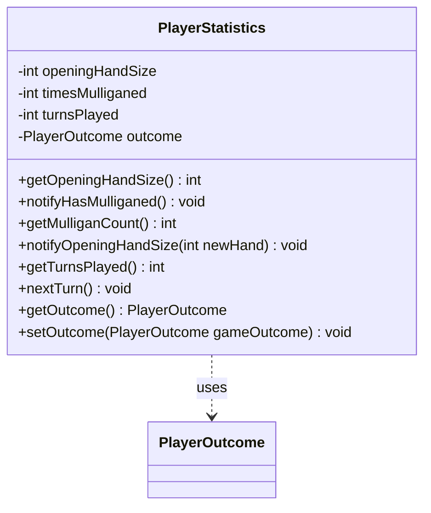

---
aliases:
  - PlayerStatistics
tags:
  - java/class
  - module/forge-game
  - pkg/forge/game/player
fqn: forge.game.player.PlayerStatistics
package: forge.game.player
module: forge-game
kind: Class
---

# PlayerStatistics

**Package:** `forge.game.player` &nbsp; **Module:** `forge-game` &nbsp; **Kind:** Class



## Relationships
**Uses:**
- [[forge.game.player.PlayerOutcome|PlayerOutcome]]

## Design Description

PlayerStatistics is a lightweight, mutable data-holder that records per-player metrics accumulated over the course of a single game: opening hand size, number of mulligans taken, turns played, and the player's eventual result. It exposes simple paired notify/getter methods (and `nextTurn`) so game logic can increment counters as events occur and query the tallies afterward, for example to report end-of-game outcomes.

Its only collaborator is PlayerOutcome, which it stores and returns to capture how the player's game ended, keeping win/loss semantics delegated to that dedicated type. The class implements no interface and extends no supertype, reflecting a deliberately minimal design: it carries no game logic itself, instead serving purely as an aggregation point that the surrounding player and game classes drive and read.

## Source
`forge-game/src/main/java/forge/game/player/PlayerStatistics.java`

```java
/*
 * Forge: Play Magic: the Gathering.
 * Copyright (C) 2011  Forge Team
 *
 * This program is free software: you can redistribute it and/or modify
 * it under the terms of the GNU General Public License as published by
 * the Free Software Foundation, either version 3 of the License, or
 * (at your option) any later version.
 * 
 * This program is distributed in the hope that it will be useful,
 * but WITHOUT ANY WARRANTY; without even the implied warranty of
 * MERCHANTABILITY or FITNESS FOR A PARTICULAR PURPOSE.  See the
 * GNU General Public License for more details.
 * 
 * You should have received a copy of the GNU General Public License
 * along with this program.  If not, see <http://www.gnu.org/licenses/>.
 */
package forge.game.player;

/**
 * The Class GamePlayerRating.
 * 
 * @author Max
 */
public class PlayerStatistics {

    /** The opening hand size. */
    private int openingHandSize = 7;

    /** The times mulliganed. */
    private int timesMulliganed = 0;

    private int turnsPlayed = 0;

    private PlayerOutcome outcome;

    /**
     * Gets the opening hand size.
     * 
     * @return the opening hand size
     */
    public final int getOpeningHandSize() {
        return this.openingHandSize;
    }

    /**
     * Notify has mulliganed.
     */
    public final void notifyHasMulliganed() {
        this.timesMulliganed++;
    }

    /**
     * Gets the mulligan count.
     * 
     * @return the mulligan count
     */
    public final int getMulliganCount() {
        return this.timesMulliganed;
    }

    /**
     * Notify opening hand size.
     * 
     * @param newHand
     *            the new hand
     */
    public final void notifyOpeningHandSize(final int newHand) {
        this.openingHandSize = newHand;
    }

    public int getTurnsPlayed() {
        return turnsPlayed;
    }

    public void nextTurn() {
        this.turnsPlayed++;
    }

    public PlayerOutcome getOutcome() {
        return outcome;
    }

    public void setOutcome(PlayerOutcome gameOutcome) {
        this.outcome = gameOutcome;
    }
}
```

## Python
`forge/game/player/PlayerStatistics.py`

```python
from forge.game.player.PlayerOutcome import PlayerOutcome


class PlayerStatistics:
    """The Class GamePlayerRating.

    @author Max
    """

    def __init__(self):
        # The opening hand size.
        self.openingHandSize = 7

        # The times mulliganed.
        self.timesMulliganed = 0

        self.turnsPlayed = 0

        self.outcome = None

    def getOpeningHandSize(self) -> int:
        """Gets the opening hand size.

        @return the opening hand size
        """
        return self.openingHandSize

    def notifyHasMulliganed(self) -> None:
        """Notify has mulliganed."""
        self.timesMulliganed += 1

    def getMulliganCount(self) -> int:
        """Gets the mulligan count.

        @return the mulligan count
        """
        return self.timesMulliganed

    def notifyOpeningHandSize(self, newHand: int) -> None:
        """Notify opening hand size.

        @param newHand
                   the new hand
        """
        self.openingHandSize = newHand

    def getTurnsPlayed(self) -> int:
        return self.turnsPlayed

    def nextTurn(self) -> None:
        self.turnsPlayed += 1

    def getOutcome(self) -> PlayerOutcome:
        return self.outcome

    def setOutcome(self, gameOutcome: PlayerOutcome) -> None:
        self.outcome = gameOutcome
```
