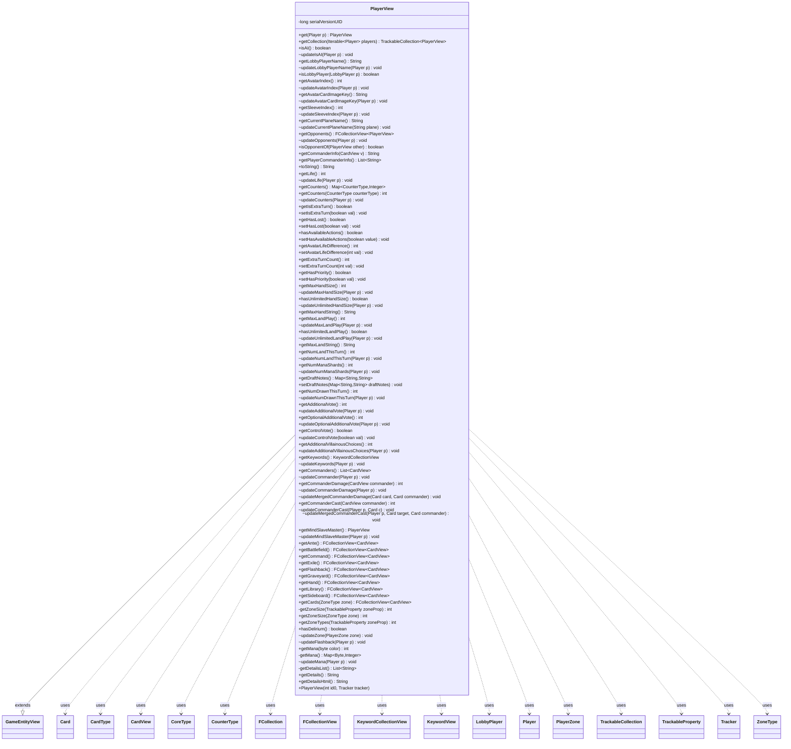

---
aliases:
  - PlayerView
tags:
  - java/class
  - module/forge-game
  - pkg/forge/game/player
fqn: forge.game.player.PlayerView
package: forge.game.player
module: forge-game
kind: Class
---

# PlayerView

**Package:** `forge.game.player`   **Module:** `forge-game`   **Kind:** Class



## Relationships
**Extends:**
- [[forge.game.GameEntityView|GameEntityView]]
**Uses:**
- [[forge.LobbyPlayer|LobbyPlayer]]
- [[forge.card.CardType|CardType]]
- [[forge.card.CardType.CoreType|CoreType]]
- [[forge.game.card.Card|Card]]
- [[forge.game.card.CardView|CardView]]
- [[forge.game.card.CounterType|CounterType]]
- [[forge.game.keyword.KeywordCollectionView|KeywordCollectionView]]
- [[forge.game.keyword.KeywordView|KeywordView]]
- [[forge.game.player.Player|Player]]
- [[forge.game.zone.PlayerZone|PlayerZone]]
- [[forge.game.zone.ZoneType|ZoneType]]
- [[forge.trackable.TrackableCollection|TrackableCollection]]
- [[forge.trackable.TrackableProperty|TrackableProperty]]
- [[forge.trackable.Tracker|Tracker]]
- [[forge.util.collect.FCollection|FCollection]]
- [[forge.util.collect.FCollectionView|FCollectionView]]

## Design Description

PlayerView is a client-side, serializable read model of a `Player`, extending `GameEntityView` to expose player state to the UI and AI without granting direct access to the mutable game-engine `Player` object. It stores every attribute — life, counters, mana, keywords, commander damage/cast, votes, hand and land limits, and the contents of each game zone — as `TrackableProperty` entries, so changes propagate through the shared `Tracker` for incremental synchronization across the network boundary.

Its design splits responsibilities cleanly: public getters return cached snapshot data for consumers (resolving `CardView`/`PlayerView` references rather than live cards), while package-private `update*` methods pull fresh values from a source `Player`, keeping mutation confined to the engine side. Static `get`/`getCollection` factories map `Player` instances to their views, and presentation helpers (`getCommanderInfo`, `getDetails`, `getDetailsHtml`) compose localized, human-readable summaries, concentrating display formatting in the view layer.

## Source
`forge-game/src/main/java/forge/game/player/PlayerView.java`

```java
package forge.game.player;

import com.google.common.collect.Iterables;
import com.google.common.collect.Lists;
import com.google.common.collect.Maps;
import forge.LobbyPlayer;
import forge.card.CardType;
import forge.card.MagicColor;
import forge.card.mana.ManaAtom;
import forge.game.GameEntityView;
import forge.game.card.Card;
import forge.game.card.CardView;
import forge.game.card.CounterType;
import forge.game.keyword.KeywordView;
import forge.game.keyword.KeywordCollectionView;
import forge.game.zone.PlayerZone;
import forge.game.zone.ZoneType;
import forge.trackable.TrackableCollection;
import forge.trackable.TrackableProperty;
import forge.trackable.Tracker;
import forge.util.CardTranslation;
import forge.util.Lang;
import forge.util.Localizer;
import forge.util.collect.FCollection;
import forge.util.collect.FCollectionView;
import org.apache.commons.lang3.StringUtils;

import java.util.*;
import java.util.Map.Entry;

public class PlayerView extends GameEntityView {
    private static final long serialVersionUID = 7005892740909549086L;

    public static PlayerView get(Player p) {
        return p == null ? null : p.getView();
    }

    public static TrackableCollection<PlayerView> getCollection(Iterable<Player> players) {
        if (players == null) {
            return null;
        }
        TrackableCollection<PlayerView> collection = new TrackableCollection<>();
        for (Player p : players) {
            collection.add(p.getView());
        }
        return collection;
    }

    public PlayerView(final int id0, final Tracker tracker) {
        super(id0, tracker);

        set(TrackableProperty.Mana, Maps.newHashMapWithExpectedSize(MagicColor.NUMBER_OR_COLORS + 1));
    }

    public boolean isAI()   {
        return get(TrackableProperty.IsAI);
    }
    void updateIsAI(Player p) {
        set(TrackableProperty.IsAI, p.getController().isAI());
    }

    public String getLobbyPlayerName() {
        return get(TrackableProperty.LobbyPlayerName);
    }
    void updateLobbyPlayerName(Player p) {
        set(TrackableProperty.LobbyPlayerName, p.getLobbyPlayer().getName());
    }
    public boolean isLobbyPlayer(LobbyPlayer p) {
        return getLobbyPlayerName().equals(p.getName());
    }

    public int getAvatarIndex() {
        return get(TrackableProperty.AvatarIndex);
    }
    void updateAvatarIndex(Player p) {
        set(TrackableProperty.AvatarIndex, p.getLobbyPlayer().getAvatarIndex());
    }

    public String getAvatarCardImageKey() {
        return get(TrackableProperty.AvatarCardImageKey);
    }
    void updateAvatarCardImageKey(Player p) {
        set(TrackableProperty.AvatarCardImageKey, p.getLobbyPlayer().getAvatarCardImageKey());
    }

    public int getSleeveIndex() {
        return get(TrackableProperty.SleeveIndex);
    }
    void updateSleeveIndex(Player p) {
        set(TrackableProperty.SleeveIndex, p.getLobbyPlayer().getSleeveIndex());
    }

    public String getCurrentPlaneName() { return get(TrackableProperty.CurrentPlane); }
    void updateCurrentPlaneName( String plane ) {
        set(TrackableProperty.CurrentPlane, plane);
    }

    public FCollectionView<PlayerView> getOpponents() {
        return Objects.requireNonNullElse(this.<FCollectionView<PlayerView>>get(TrackableProperty.Opponents), new FCollection<>());
    }
    void updateOpponents(Player p) {
        set(TrackableProperty.Opponents, PlayerView.getCollection(p.getOpponents()));
    }

    public boolean isOpponentOf(final PlayerView other) {
        return getOpponents().contains(other);
    }

    public final String getCommanderInfo(CardView v) {
        if (v == null) {
            return StringUtils.EMPTY;
        }

        final StringBuilder sb = new StringBuilder();

        sb.append(Localizer.getInstance().getMessage("lblCommanderCastCard", getCommanderCast(v)));
        sb.append("\n");

        for (final PlayerView p : Iterables.concat(Collections.singleton(this), getOpponents())) {
            final int damage = p.getCommanderDamage(v);
            if (damage > 0) {
                sb.append(Localizer.getInstance().getMessage("lblCommanderDealNDamageToPlayer", p, CardTranslation.getTranslatedName(v.getName()), damage));
                sb.append("\n");
            }
        }
        return sb.toString();
    }

    public final List<String> getPlayerCommanderInfo() {
        final List<CardView> commanders = getCommanders();
        if (commanders == null || commanders.isEmpty()) {
            return Collections.emptyList();
        }

        final FCollectionView<PlayerView> opponents = getOpponents();
        for (PlayerView opponent: opponents) {
            if (opponent.getCommanders() == null) {
                return Collections.emptyList();
            }
        }

        final List<String> info = Lists.newArrayListWithExpectedSize(opponents.size());

        info.add("Commanders:");
        for (final CardView v : commanders) {
            info.add(Localizer.getInstance().getMessage("lblCommanderCastPlayer", CardTranslation.getTranslatedName(v.getName()), getCommanderCast(v)));
        }

        // own commanders
        for (final CardView v : commanders) {
            final int damage = getCommanderDamage(v);
            if (damage > 0) {
                info.add(Localizer.getInstance().getMessage("lblNCommanderDamageFromOwnCommander", CardTranslation.getTranslatedName(v.getName()), damage));
            }
        }

        // opponents commanders
        for (final PlayerView p : opponents) {
            for (final CardView v : p.getCommanders()) {
                final int damage = getCommanderDamage(v);
                if (damage > 0) {
                    info.add(Localizer.getInstance().getMessage("lblNCommanderDamageFromPlayerCommander", p, CardTranslation.getTranslatedName(v.getName()), damage));
                }
            }
        }
        return info;
    }

    @Override
    public String toString() {
        return getName();
    }

    public int getLife() {
        return get(TrackableProperty.Life);
    }
    void updateLife(Player p) {
        set(TrackableProperty.Life, p.getLife());
    }

    public Map<CounterType, Integer> getCounters() {
        return get(TrackableProperty.Counters);
    }
    public int getCounters(CounterType counterType) {
        final Map<CounterType, Integer> counters = getCounters();
        if (counters != null) {
            Integer count = counters.get(counterType);
            if (count != null) {
                return count;
            }
        }
        return 0;
    }
    void updateCounters(Player p) {
        set(TrackableProperty.Counters, p.getCounters());
        flagAsChanged(TrackableProperty.Counters);
    }

    public boolean getIsExtraTurn() {
        return get(TrackableProperty.IsExtraTurn);
    }
    public void setIsExtraTurn(final boolean val) {
        set(TrackableProperty.IsExtraTurn, val);
    }

    public boolean getHasLost() {
        return get(TrackableProperty.HasLost);
    }
    public void setHasLost(final boolean val) {
        set(TrackableProperty.HasLost, val);
    }

    public boolean hasAvailableActions() {
        return get(TrackableProperty.HasAvailableActions);
    }
    public void setHasAvailableActions(boolean value) {
        set(TrackableProperty.HasAvailableActions, value);
    }

    public int getAvatarLifeDifference() {
        return get(TrackableProperty.AvatarLifeDifference);
    }
    public void setAvatarLifeDifference(final int val) {
        set(TrackableProperty.AvatarLifeDifference, val);
    }

    public int getExtraTurnCount() {
        return get(TrackableProperty.ExtraTurnCount);
    }
    public void setExtraTurnCount(final int val) {
        set(TrackableProperty.ExtraTurnCount, val);
    }

    public boolean getHasPriority() {
        return get(TrackableProperty.HasPriority);
    }
    public void setHasPriority(final boolean val) {
        set(TrackableProperty.HasPriority, val);
    }

    public int getMaxHandSize() {
        return get(TrackableProperty.MaxHandSize);
    }
    void updateMaxHandSize(Player p) {
        set(TrackableProperty.MaxHandSize, p.getMaxHandSize());
    }

    public boolean hasUnlimitedHandSize() {
        return get(TrackableProperty.HasUnlimitedHandSize);
    }
    void updateUnlimitedHandSize(Player p) {
        set(TrackableProperty.HasUnlimitedHandSize, p.isUnlimitedHandSize());
    }

    public String getMaxHandString() {
        return hasUnlimitedHandSize() ? Localizer.getInstance().getMessage("lblUnlimited") : String.valueOf(getMaxHandSize());
    }

    public int getMaxLandPlay() {
        return get(TrackableProperty.MaxLandPlay);
    }
    void updateMaxLandPlay(Player p) {
        set(TrackableProperty.MaxLandPlay, p.getMaxLandPlays());
    }

    public boolean hasUnlimitedLandPlay() {
        return get(TrackableProperty.HasUnlimitedLandPlay);
    }
    void updateUnlimitedLandPlay(Player p) {
        set(TrackableProperty.HasUnlimitedLandPlay, p.getMaxLandPlaysInfinite());
    }

    public String getMaxLandString() {
        return hasUnlimitedLandPlay() ? "unlimited" : String.valueOf(getMaxLandPlay());
    }

    public int getNumLandThisTurn() {
        return get(TrackableProperty.NumLandThisTurn);
    }
    void updateNumLandThisTurn(Player p) {
        set(TrackableProperty.NumLandThisTurn, p.getLandsPlayedThisTurn());
    }

    public int getNumManaShards() {
        return get(TrackableProperty.NumManaShards);
    }
    void updateNumManaShards(Player p) {
        set(TrackableProperty.NumManaShards, p.getNumManaShards());
    }

    public Map<String, String> getDraftNotes() {
        return get(TrackableProperty.DraftNotes);
    }
    public void setDraftNotes(Map<String, String> draftNotes) {
        set(TrackableProperty.DraftNotes, draftNotes);
    }

    public int getNumDrawnThisTurn() {
        return get(TrackableProperty.NumDrawnThisTurn);
    }
    void updateNumDrawnThisTurn(Player p) {
        set(TrackableProperty.NumDrawnThisTurn, p.getNumDrawnThisTurn());
    }

    public int getAdditionalVote() {
        return get(TrackableProperty.AdditionalVote);
    }
    public void updateAdditionalVote(Player p) {
        set(TrackableProperty.AdditionalVote, p.getAdditionalVotesAmount());
    }

    public int getOptionalAdditionalVote() {
        return get(TrackableProperty.OptionalAdditionalVote);
    }
    public void updateOptionalAdditionalVote(Player p) {
        set(TrackableProperty.OptionalAdditionalVote, p.getAdditionalOptionalVotesAmount());
    }

    public boolean getControlVote() {
        return get(TrackableProperty.ControlVotes);
    }
    public void updateControlVote(boolean val) {
        set(TrackableProperty.ControlVotes, val);
    }

    public int getAdditionalVillainousChoices() {
        return get(TrackableProperty.AdditionalVillainousChoices);
    }
    public void updateAdditionalVillainousChoices(Player p) {
        set(TrackableProperty.AdditionalVillainousChoices, p.getAdditionalVotesAmount());
    }

    public KeywordCollectionView getKeywords() {
        return get(TrackableProperty.Keywords);
    }
    void updateKeywords(Player p) {
        set(TrackableProperty.Keywords, p.getKeywords().getView());
    }

    public List<CardView> getCommanders() {
        return get(TrackableProperty.Commander);
    }
    void updateCommander(Player p) {
        set(TrackableProperty.Commander, CardView.getCollection(p.getCommanders()));
    }

    public int getCommanderDamage(CardView commander) {
        Map<Integer, Integer> map = get(TrackableProperty.CommanderDamage);
        if (map == null) { return 0; }
        Integer damage = map.get(commander.getId());
        return damage == null ? 0 : damage;
    }
    void updateCommanderDamage(Player p) {
        Map<Integer, Integer> map = Maps.newHashMap();
        for (Entry<Card, Integer> entry : p.getCommanderDamage()) {
            map.put(entry.getKey().getId(), entry.getValue());
        }
        set(TrackableProperty.CommanderDamage, map);
    }
    void updateMergedCommanderDamage(Card card, Card commander) {
        // Add commander damage to top card for card view panel info
        for (final PlayerView p : Iterables.concat(Collections.singleton(this), getOpponents())) {
            Map<Integer, Integer> map = p.get(TrackableProperty.CommanderDamage);
            if (map == null) continue;
            Integer damage = map.get(commander.getId());
            map.put(card.getId(), damage);
        }
    }

    public int getCommanderCast(CardView commander) {
        Map<Integer, Integer> map = get(TrackableProperty.CommanderCast);
        if (map == null) { return 0; }
        Integer damage = map.get(commander.getId());
        return damage == null ? 0 : damage;
    }

    void updateCommanderCast(Player p, Card c) {
        Map<Integer, Integer> map = get(TrackableProperty.CommanderCast);
        if (map == null) {
            map = Maps.newHashMap();
            set(TrackableProperty.CommanderCast, map);
        }
        map.put(c.getId(), p.getCommanderCast(c));
        flagAsChanged(TrackableProperty.CommanderCast);
    }

    void updateMergedCommanderCast(Player p, Card target, Card commander) {
        Map<Integer, Integer> map = get(TrackableProperty.CommanderCast);
        if (map == null) {
            map = Maps.newHashMap();
            set(TrackableProperty.CommanderCast, map);
        }
        map.put(target.getId(), p.getCommanderCast(commander));
        flagAsChanged(TrackableProperty.CommanderCast);
    }

    public PlayerView getMindSlaveMaster() {
        return get(TrackableProperty.MindSlaveMaster);
    }
    void updateMindSlaveMaster(Player p) {
        set(TrackableProperty.MindSlaveMaster, PlayerView.get(p.getControllingPlayer()));
    }

    public FCollectionView<CardView> getAnte() {
        return get(TrackableProperty.Ante);
    }

    public FCollectionView<CardView> getBattlefield() {
        return get(TrackableProperty.Battlefield);
    }

    public FCollectionView<CardView> getCommand() {
        return get(TrackableProperty.Command);
    }

    public FCollectionView<CardView> getExile() {
        return get(TrackableProperty.Exile);
    }

    public FCollectionView<CardView> getFlashback() {
        return get(TrackableProperty.Flashback);
    }

    public FCollectionView<CardView> getGraveyard() {
        return get(TrackableProperty.Graveyard);
    }

    public FCollectionView<CardView> getHand() {
        return get(TrackableProperty.Hand);
    }

    public FCollectionView<CardView> getLibrary() {
        return get(TrackableProperty.Library);
    }

    public FCollectionView<CardView> getSideboard() {
        return get(TrackableProperty.Sideboard);
    }

    public FCollectionView<CardView> getCards(final ZoneType zone) {
        TrackableProperty prop = zone.getTrackableProperty();
        if (prop != null) {
            return get(prop);
        }
        return null;
    }
    private int getZoneSize(TrackableProperty zoneProp) {
        TrackableCollection<CardView> cards = get(zoneProp);
        return cards == null ? 0 : cards.size();
    }

    public int getZoneSize(final ZoneType zone) {
        TrackableProperty prop = zone.getTrackableProperty();
        return prop == null ? 0 : getZoneSize(prop);
    }

    public int getZoneTypes(TrackableProperty zoneProp) {
        TrackableCollection<CardView> cards = get(zoneProp);
        HashSet<CardType.CoreType> types = new HashSet<>();
        if (cards == null)
            return 0;

        for (CardView c : cards) {
            types.addAll(c.getCurrentState().getType().getCoreTypes());
        }

        return types.size();
    }

    public boolean hasDelirium() {
        return getZoneTypes(TrackableProperty.Graveyard) >= 4;
    }

    void updateZone(PlayerZone zone) {
        TrackableProperty prop = zone.getZoneType().getTrackableProperty();
        if (prop == null) { return; }
        set(prop, CardView.getCollection(zone.getCards(false)));

        //update flashback zone when relevant zones change
        switch (zone.getZoneType()) {
            case Command:
            case Graveyard:
            case Library:
            case Exile:
                updateFlashback(zone.getPlayer());
                break;
            default:
                break;
        }
    }

    void updateFlashback(Player p) {
        set(TrackableProperty.Flashback, CardView.getCollection(p.getCardsIn(ZoneType.Flashback)));
    }

    public int getMana(final byte color) {
        return getMana().getOrDefault(color, 0);
    }
    private Map<Byte, Integer> getMana() {
        return get(TrackableProperty.Mana);
    }
    void updateMana(Player p) {
        Map<Byte, Integer> mana = new HashMap<>();
        for (byte b : ManaAtom.MANATYPES) {
            mana.put(b, p.getManaPool().getAmountOfColor(b));
        }
        set(TrackableProperty.Mana, mana);
    }

    private List<String> getDetailsList() {
        final List<String> details = Lists.newArrayListWithCapacity(8);
        details.add(Localizer.getInstance().getMessage("lblLifeHas", getLife()));

        Map<CounterType, Integer> counters = getCounters();
        if (counters != null) {
            for (Entry<CounterType, Integer> p : counters.entrySet()) {
                if (p.getValue() > 0) {
                    details.add(Localizer.getInstance().getMessage("lblTypeCounterHas", p.getKey().getName(), p.getValue()));
                }
            }
        }

        details.add(Localizer.getInstance().getMessage("lblCardInHandHas", getZoneSize(ZoneType.Hand), getMaxHandString()));
        details.add(Localizer.getInstance().getMessage("lblLandsPlayed", getNumLandThisTurn(), getMaxLandString()));
        details.add(Localizer.getInstance().getMessage("lblCardDrawnThisTurnHas", getNumDrawnThisTurn()));
        details.add(Localizer.getInstance().getMessage("lblDamagepreventionHas", getPreventNextDamage()));

        int v = getAdditionalVote();
        if (v > 0) {
            details.add(Localizer.getInstance().getMessage("lblAdditionalVotes", v));
        }
        v = getOptionalAdditionalVote();
        if (v > 0) {
            details.add(Localizer.getInstance().getMessage("lblOptionalAdditionalVotes", v));
        }

        if (getControlVote()) {
            details.add(Localizer.getInstance().getMessage("lblControlsVote"));
        }

        if (getIsExtraTurn()) {
            details.add(Localizer.getInstance().getMessage("lblIsExtraTurn"));
        }
        details.add(Localizer.getInstance().getMessage("lblExtraTurnCountHas", getExtraTurnCount()));

        final String keywords = Lang.joinHomogenous(getKeywords().getValues(), KeywordView::title);
        if (!keywords.isEmpty()) {
            details.add(keywords);
        }
        final FCollectionView<CardView> ante = getAnte();
        if (ante != null && !ante.isEmpty()) {
            details.add(Localizer.getInstance().getMessage("lblAntedHas", Lang.joinHomogenous(ante)));
        }
        details.addAll(getPlayerCommanderInfo());
        return details;
    }
    public String getDetails() {
        final StringBuilder builder = new StringBuilder();
        builder.append(getName());
        builder.append('\n');
        for (final String detailsPart : getDetailsList()) {
            builder.append(detailsPart);
            builder.append('\n');
        }
        return builder.toString();
    }
    public String getDetailsHtml() {
        final StringBuilder builder = new StringBuilder();
        builder.append("<html>");
        builder.append(getName());
        builder.append("<hr/>");
        for (final String line : getDetailsList()) {
            builder.append(line);
            builder.append("<br/>");
        }
        builder.append("</html>");
        return builder.toString();
    }
}
```

## Python
`forge/game/player/PlayerView.py`

```python
from forge.LobbyPlayer import LobbyPlayer
from forge.card.CardType import CardType
from forge.card.CardType.CoreType import CoreType
from forge.card.MagicColor import MagicColor
from forge.card.mana.ManaAtom import ManaAtom
from forge.game.GameEntityView import GameEntityView
from forge.game.card.Card import Card
from forge.game.card.CardView import CardView
from forge.game.card.CounterType import CounterType
from forge.game.keyword.KeywordView import KeywordView
from forge.game.keyword.KeywordCollectionView import KeywordCollectionView
from forge.game.player.Player import Player
from forge.game.zone.PlayerZone import PlayerZone
from forge.game.zone.ZoneType import ZoneType
from forge.trackable.TrackableCollection import TrackableCollection
from forge.trackable.TrackableProperty import TrackableProperty
from forge.trackable.Tracker import Tracker
from forge.util.CardTranslation import CardTranslation
from forge.util.Lang import Lang
from forge.util.Localizer import Localizer
from forge.util.collect.FCollection import FCollection
from forge.util.collect.FCollectionView import FCollectionView


class PlayerView(GameEntityView):
    serialVersionUID = 7005892740909549086

    @staticmethod
    def get(p):
        return None if p is None else p.getView()

    @staticmethod
    def getCollection(players):
        if players is None:
            return None
        collection = TrackableCollection()
        for p in players:
            collection.add(p.getView())
        return collection

    def __init__(self, id0, tracker):
        super().__init__(id0, tracker)

        self.set(TrackableProperty.Mana, {})

    def isAI(self):
        return self.get(TrackableProperty.IsAI)

    def updateIsAI(self, p):
        self.set(TrackableProperty.IsAI, p.getController().isAI())

    def getLobbyPlayerName(self):
        return self.get(TrackableProperty.LobbyPlayerName)

    def updateLobbyPlayerName(self, p):
        self.set(TrackableProperty.LobbyPlayerName, p.getLobbyPlayer().getName())

    def isLobbyPlayer(self, p):
        return self.getLobbyPlayerName() == p.getName()

    def getAvatarIndex(self):
        return self.get(TrackableProperty.AvatarIndex)

    def updateAvatarIndex(self, p):
        self.set(TrackableProperty.AvatarIndex, p.getLobbyPlayer().getAvatarIndex())

    def getAvatarCardImageKey(self):
        return self.get(TrackableProperty.AvatarCardImageKey)

    def updateAvatarCardImageKey(self, p):
        self.set(TrackableProperty.AvatarCardImageKey, p.getLobbyPlayer().getAvatarCardImageKey())

    def getSleeveIndex(self):
        return self.get(TrackableProperty.SleeveIndex)

    def updateSleeveIndex(self, p):
        self.set(TrackableProperty.SleeveIndex, p.getLobbyPlayer().getSleeveIndex())

    def getCurrentPlaneName(self):
        return self.get(TrackableProperty.CurrentPlane)

    def updateCurrentPlaneName(self, plane):
        self.set(TrackableProperty.CurrentPlane, plane)

    def getOpponents(self):
        value = self.get(TrackableProperty.Opponents)
        return value if value is not None else FCollection()

    def updateOpponents(self, p):
        self.set(TrackableProperty.Opponents, PlayerView.getCollection(p.getOpponents()))

    def isOpponentOf(self, other):
        return other in self.getOpponents()

    def getCommanderInfo(self, v):
        if v is None:
            return ""

        sb = []

        sb.append(Localizer.getInstance().getMessage("lblCommanderCastCard", self.getCommanderCast(v)))
        sb.append("\n")

        for p in [self] + list(self.getOpponents()):
            damage = p.getCommanderDamage(v)
            if damage > 0:
                sb.append(Localizer.getInstance().getMessage("lblCommanderDealNDamageToPlayer", p, CardTranslation.getTranslatedName(v.getName()), damage))
                sb.append("\n")
        return "".join(sb)

    def getPlayerCommanderInfo(self):
        commanders = self.getCommanders()
        if commanders is None or len(commanders) == 0:
            return []

        opponents = self.getOpponents()
        for opponent in opponents:
            if opponent.getCommanders() is None:
                return []

        info = []

        info.append("Commanders:")
        for v in commanders:
            info.append(Localizer.getInstance().getMessage("lblCommanderCastPlayer", CardTranslation.getTranslatedName(v.getName()), self.getCommanderCast(v)))

        # own commanders
        for v in commanders:
            damage = self.getCommanderDamage(v)
            if damage > 0:
                info.append(Localizer.getInstance().getMessage("lblNCommanderDamageFromOwnCommander", CardTranslation.getTranslatedName(v.getName()), damage))

        # opponents commanders
        for p in opponents:
            for v in p.getCommanders():
                damage = self.getCommanderDamage(v)
                if damage > 0:
                    info.append(Localizer.getInstance().getMessage("lblNCommanderDamageFromPlayerCommander", p, CardTranslation.getTranslatedName(v.getName()), damage))
        return info

    def toString(self):
        return self.getName()

    def getLife(self):
        return self.get(TrackableProperty.Life)

    def updateLife(self, p):
        self.set(TrackableProperty.Life, p.getLife())

    def getCounters(self):
        return self.get(TrackableProperty.Counters)

    def getCounters(self, counterType):
        counters = self.get(TrackableProperty.Counters)
        if counters is not None:
            count = counters.get(counterType)
            if count is not None:
                return count
        return 0

    def updateCounters(self, p):
        self.set(TrackableProperty.Counters, p.getCounters())
        self.flagAsChanged(TrackableProperty.Counters)

    def getIsExtraTurn(self):
        return self.get(TrackableProperty.IsExtraTurn)

    def setIsExtraTurn(self, val):
        self.set(TrackableProperty.IsExtraTurn, val)

    def getHasLost(self):
        return self.get(TrackableProperty.HasLost)

    def setHasLost(self, val):
        self.set(TrackableProperty.HasLost, val)

    def hasAvailableActions(self):
        return self.get(TrackableProperty.HasAvailableActions)

    def setHasAvailableActions(self, value):
        self.set(TrackableProperty.HasAvailableActions, value)

    def getAvatarLifeDifference(self):
        return self.get(TrackableProperty.AvatarLifeDifference)

    def setAvatarLifeDifference(self, val):
        self.set(TrackableProperty.AvatarLifeDifference, val)

    def getExtraTurnCount(self):
        return self.get(TrackableProperty.ExtraTurnCount)

    def setExtraTurnCount(self, val):
        self.set(TrackableProperty.ExtraTurnCount, val)

    def getHasPriority(self):
        return self.get(TrackableProperty.HasPriority)

    def setHasPriority(self, val):
        self.set(TrackableProperty.HasPriority, val)

    def getMaxHandSize(self):
        return self.get(TrackableProperty.MaxHandSize)

    def updateMaxHandSize(self, p):
        self.set(TrackableProperty.MaxHandSize, p.getMaxHandSize())

    def hasUnlimitedHandSize(self):
        return self.get(TrackableProperty.HasUnlimitedHandSize)

    def updateUnlimitedHandSize(self, p):
        self.set(TrackableProperty.HasUnlimitedHandSize, p.isUnlimitedHandSize())

    def getMaxHandString(self):
        return Localizer.getInstance().getMessage("lblUnlimited") if self.hasUnlimitedHandSize() else str(self.getMaxHandSize())

    def getMaxLandPlay(self):
        return self.get(TrackableProperty.MaxLandPlay)

    def updateMaxLandPlay(self, p):
        self.set(TrackableProperty.MaxLandPlay, p.getMaxLandPlays())

    def hasUnlimitedLandPlay(self):
        return self.get(TrackableProperty.HasUnlimitedLandPlay)

    def updateUnlimitedLandPlay(self, p):
        self.set(TrackableProperty.HasUnlimitedLandPlay, p.getMaxLandPlaysInfinite())

    def getMaxLandString(self):
        return "unlimited" if self.hasUnlimitedLandPlay() else str(self.getMaxLandPlay())

    def getNumLandThisTurn(self):
        return self.get(TrackableProperty.NumLandThisTurn)

    def updateNumLandThisTurn(self, p):
        self.set(TrackableProperty.NumLandThisTurn, p.getLandsPlayedThisTurn())

    def getNumManaShards(self):
        return self.get(TrackableProperty.NumManaShards)

    def updateNumManaShards(self, p):
        self.set(TrackableProperty.NumManaShards, p.getNumManaShards())

    def getDraftNotes(self):
        return self.get(TrackableProperty.DraftNotes)

    def setDraftNotes(self, draftNotes):
        self.set(TrackableProperty.DraftNotes, draftNotes)

    def getNumDrawnThisTurn(self):
        return self.get(TrackableProperty.NumDrawnThisTurn)

    def updateNumDrawnThisTurn(self, p):
        self.set(TrackableProperty.NumDrawnThisTurn, p.getNumDrawnThisTurn())

    def getAdditionalVote(self):
        return self.get(TrackableProperty.AdditionalVote)

    def updateAdditionalVote(self, p):
        self.set(TrackableProperty.AdditionalVote, p.getAdditionalVotesAmount())

    def getOptionalAdditionalVote(self):
        return self.get(TrackableProperty.OptionalAdditionalVote)

    def updateOptionalAdditionalVote(self, p):
        self.set(TrackableProperty.OptionalAdditionalVote, p.getAdditionalOptionalVotesAmount())

    def getControlVote(self):
        return self.get(TrackableProperty.ControlVotes)

    def updateControlVote(self, val):
        self.set(TrackableProperty.ControlVotes, val)

    def getAdditionalVillainousChoices(self):
        return self.get(TrackableProperty.AdditionalVillainousChoices)

    def updateAdditionalVillainousChoices(self, p):
        self.set(TrackableProperty.AdditionalVillainousChoices, p.getAdditionalVotesAmount())

    def getKeywords(self):
        return self.get(TrackableProperty.Keywords)

    def updateKeywords(self, p):
        self.set(TrackableProperty.Keywords, p.getKeywords().getView())

    def getCommanders(self):
        return self.get(TrackableProperty.Commander)

    def updateCommander(self, p):
        self.set(TrackableProperty.Commander, CardView.getCollection(p.getCommanders()))

    def getCommanderDamage(self, commander):
        map = self.get(TrackableProperty.CommanderDamage)
        if map is None:
            return 0
        damage = map.get(commander.getId())
        return 0 if damage is None else damage

    def updateCommanderDamage(self, p):
        map = {}
        for entry in p.getCommanderDamage():
            map[entry.getKey().getId()] = entry.getValue()
        self.set(TrackableProperty.CommanderDamage, map)

    def updateMergedCommanderDamage(self, card, commander):
        # Add commander damage to top card for card view panel info
        for p in [self] + list(self.getOpponents()):
            map = p.get(TrackableProperty.CommanderDamage)
            if map is None:
                continue
            damage = map.get(commander.getId())
            map[card.getId()] = damage

    def getCommanderCast(self, commander):
        map = self.get(TrackableProperty.CommanderCast)
        if map is None:
            return 0
        damage = map.get(commander.getId())
        return 0 if damage is None else damage

    def updateCommanderCast(self, p, c):
        map = self.get(TrackableProperty.CommanderCast)
        if map is None:
            map = {}
            self.set(TrackableProperty.CommanderCast, map)
        map[c.getId()] = p.getCommanderCast(c)
        self.flagAsChanged(TrackableProperty.CommanderCast)

    def updateMergedCommanderCast(self, p, target, commander):
        map = self.get(TrackableProperty.CommanderCast)
        if map is None:
            map = {}
            self.set(TrackableProperty.CommanderCast, map)
        map[target.getId()] = p.getCommanderCast(commander)
        self.flagAsChanged(TrackableProperty.CommanderCast)

    def getMindSlaveMaster(self):
        return self.get(TrackableProperty.MindSlaveMaster)

    def updateMindSlaveMaster(self, p):
        self.set(TrackableProperty.MindSlaveMaster, PlayerView.get(p.getControllingPlayer()))

    def getAnte(self):
        return self.get(TrackableProperty.Ante)

    def getBattlefield(self):
        return self.get(TrackableProperty.Battlefield)

    def getCommand(self):
        return self.get(TrackableProperty.Command)

    def getExile(self):
        return self.get(TrackableProperty.Exile)

    def getFlashback(self):
        return self.get(TrackableProperty.Flashback)

    def getGraveyard(self):
        return self.get(TrackableProperty.Graveyard)

    def getHand(self):
        return self.get(TrackableProperty.Hand)

    def getLibrary(self):
        return self.get(TrackableProperty.Library)

    def getSideboard(self):
        return self.get(TrackableProperty.Sideboard)

    def getCards(self, zone):
        prop = zone.getTrackableProperty()
        if prop is not None:
            return self.get(prop)
        return None

    def getZoneSize(self, zoneProp):
        cards = self.get(zoneProp)
        return 0 if cards is None else cards.size()

    def getZoneSize(self, zone):
        prop = zone.getTrackableProperty()
        return 0 if prop is None else self.getZoneSize(prop)

    def getZoneTypes(self, zoneProp):
        cards = self.get(zoneProp)
        types = set()
        if cards is None:
            return 0

        for c in cards:
            types.update(c.getCurrentState().getType().getCoreTypes())

        return len(types)

    def hasDelirium(self):
        return self.getZoneTypes(TrackableProperty.Graveyard) >= 4

    def updateZone(self, zone):
        prop = zone.getZoneType().getTrackableProperty()
        if prop is None:
            return
        self.set(prop, CardView.getCollection(zone.getCards(False)))

        # update flashback zone when relevant zones change
        zoneType = zone.getZoneType()
        if zoneType in (ZoneType.Command, ZoneType.Graveyard, ZoneType.Library, ZoneType.Exile):
            self.updateFlashback(zone.getPlayer())

    def updateFlashback(self, p):
        self.set(TrackableProperty.Flashback, CardView.getCollection(p.getCardsIn(ZoneType.Flashback)))

    def getMana(self, color):
        return self.getMana().getOrDefault(color, 0)

    def getMana(self):
        return self.get(TrackableProperty.Mana)

    def updateMana(self, p):
        mana = {}
        for b in ManaAtom.MANATYPES:
            mana[b] = p.getManaPool().getAmountOfColor(b)
        self.set(TrackableProperty.Mana, mana)

    def getDetailsList(self):
        details = []
        details.append(Localizer.getInstance().getMessage("lblLifeHas", self.getLife()))

        counters = self.getCounters()
        if counters is not None:
            for p in counters.entrySet():
                if p.getValue() > 0:
                    details.append(Localizer.getInstance().getMessage("lblTypeCounterHas", p.getKey().getName(), p.getValue()))

        details.append(Localizer.getInstance().getMessage("lblCardInHandHas", self.getZoneSize(ZoneType.Hand), self.getMaxHandString()))
        details.append(Localizer.getInstance().getMessage("lblLandsPlayed", self.getNumLandThisTurn(), self.getMaxLandString()))
        details.append(Localizer.getInstance().getMessage("lblCardDrawnThisTurnHas", self.getNumDrawnThisTurn()))
        details.append(Localizer.getInstance().getMessage("lblDamagepreventionHas", self.getPreventNextDamage()))

        v = self.getAdditionalVote()
        if v > 0:
            details.append(Localizer.getInstance().getMessage("lblAdditionalVotes", v))
        v = self.getOptionalAdditionalVote()
        if v > 0:
            details.append(Localizer.getInstance().getMessage("lblOptionalAdditionalVotes", v))

        if self.getControlVote():
            details.append(Localizer.getInstance().getMessage("lblControlsVote"))

        if self.getIsExtraTurn():
            details.append(Localizer.getInstance().getMessage("lblIsExtraTurn"))
        details.append(Localizer.getInstance().getMessage("lblExtraTurnCountHas", self.getExtraTurnCount()))

        keywords = Lang.joinHomogenous(self.getKeywords().getValues(), KeywordView.title)
        if keywords:
            details.append(keywords)
        ante = self.getAnte()
        if ante is not None and not ante.isEmpty():
            details.append(Localizer.getInstance().getMessage("lblAntedHas", Lang.joinHomogenous(ante)))
        details.extend(self.getPlayerCommanderInfo())
        return details

    def getDetails(self):
        builder = []
        builder.append(self.getName())
        builder.append('\n')
        for detailsPart in self.getDetailsList():
            builder.append(detailsPart)
            builder.append('\n')
        return "".join(builder)

    def getDetailsHtml(self):
        builder = []
        builder.append("<html>")
        builder.append(self.getName())
        builder.append("<hr/>")
        for line in self.getDetailsList():
            builder.append(line)
            builder.append("<br/>")
        builder.append("</html>")
        return "".join(builder)
```
