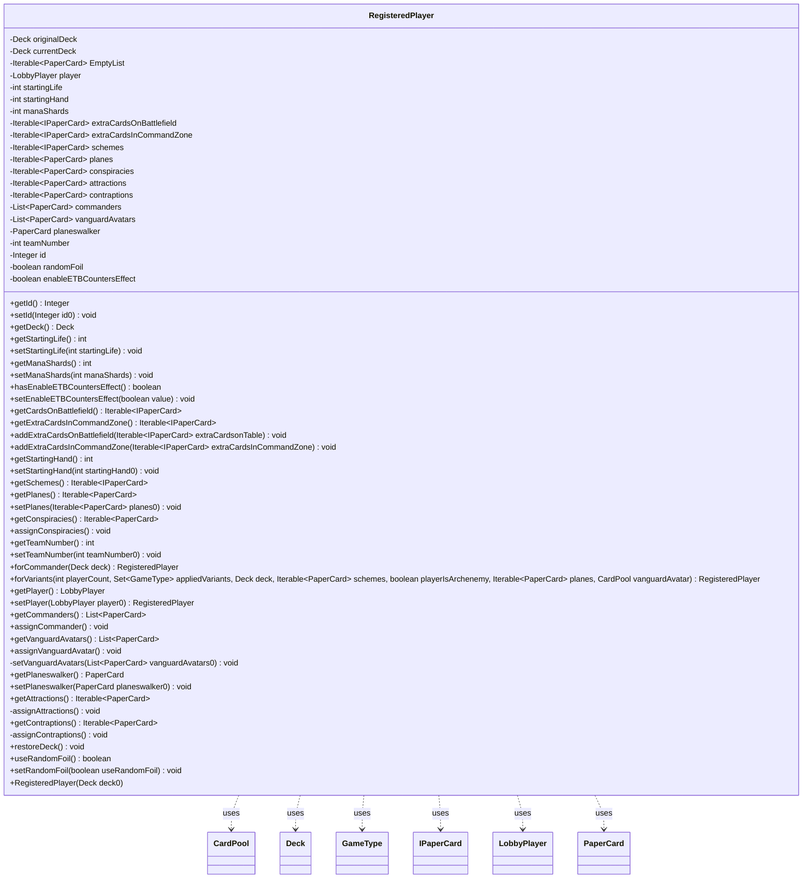

---
aliases:
  - RegisteredPlayer
tags:
  - java/class
  - module/forge-game
  - pkg/forge/game/player
fqn: forge.game.player.RegisteredPlayer
package: forge.game.player
module: forge-game
kind: Class
---

# RegisteredPlayer

**Package:** `forge.game.player`   **Module:** `forge-game`   **Kind:** Class



## Relationships
**Uses:**
- [[forge.LobbyPlayer|LobbyPlayer]]
- [[forge.deck.CardPool|CardPool]]
- [[forge.deck.Deck|Deck]]
- [[forge.game.GameType|GameType]]
- [[forge.item.IPaperCard|IPaperCard]]
- [[forge.item.PaperCard|PaperCard]]

## Design Description

RegisteredPlayer is a mutable configuration holder that captures everything needed to seat one player in a game before it begins: the player's deck, identity (`LobbyPlayer`), team assignment, starting life and hand size, and any variant-specific resources such as commanders, schemes, planes, conspiracies, vanguard avatars, attractions, and contraptions. As a plain data class with no supertype, it acts as a bridge between the deck-building/lobby layer and the game engine, collaborating chiefly with `Deck`, `CardPool`, `LobbyPlayer`, and the `PaperCard`/`IPaperCard` item types.

Its design intent centers on safe, variant-aware construction. The original deck is held immutably and always copied into a working `currentDeck` via `restoreDeck()`, protecting shared game resources from mutation. Static factories (`forCommander`, `forVariants`) encode MTG rules—adjusting life totals and assigning resources per `GameType`—keeping format-specific setup logic in one place, while null-collection getters defensively return a shared empty list and fluent setters aid chained configuration.

## Source
`forge-game/src/main/java/forge/game/player/RegisteredPlayer.java`

```java
package forge.game.player;

import com.google.common.collect.Iterables;
import com.google.common.collect.Lists;
import forge.LobbyPlayer;
import forge.deck.CardPool;
import forge.deck.Deck;
import forge.deck.DeckSection;
import forge.game.GameType;
import forge.item.IPaperCard;
import forge.item.PaperCard;

import java.util.Collections;
import java.util.List;
import java.util.Set;

public class RegisteredPlayer {
    private final Deck originalDeck; // never return or modify this instance (it's a reference to game resources)
    private Deck currentDeck;

    private static final Iterable<PaperCard> EmptyList = Collections.emptyList();

    private LobbyPlayer player = null;

    private int startingLife = 20;
    private int startingHand = 7;
    private int manaShards = 0;
    private Iterable<IPaperCard> extraCardsOnBattlefield = null;
    private Iterable<IPaperCard> extraCardsInCommandZone = null;
    private Iterable<? extends IPaperCard> schemes = null;
    private Iterable<PaperCard> planes = null;
    private Iterable<PaperCard> conspiracies = null;
    private Iterable<PaperCard> attractions = null;
    private Iterable<PaperCard> contraptions = null;
    private List<PaperCard> commanders = Lists.newArrayList();
    private List<PaperCard> vanguardAvatars = null;
    private PaperCard planeswalker = null;
    private int teamNumber = -1; // members of teams with negative id will play FFA.
    private Integer id = null;
    private boolean randomFoil = false;
    private boolean enableETBCountersEffect = false;

    public RegisteredPlayer(Deck deck0) {
        originalDeck = deck0;
        restoreDeck();
    }

    public final Integer getId() {
        return id;
    }
    public final void setId(Integer id0) {
        id = id0;
    }

    public final Deck getDeck() {
        return currentDeck;
    }

    public final int getStartingLife() {
        return startingLife;
    }
    public final void setStartingLife(int startingLife) {
        this.startingLife = startingLife;
    }

    public final int getManaShards() {
        return manaShards;
    }
    public final void setManaShards(int manaShards) {
        this.manaShards = manaShards;
    }

    public boolean hasEnableETBCountersEffect() {
        return enableETBCountersEffect;
    }
    public void setEnableETBCountersEffect(boolean value) {
        enableETBCountersEffect = value;
    }

    public final Iterable<? extends IPaperCard> getCardsOnBattlefield() {
        return extraCardsOnBattlefield == null ? EmptyList : extraCardsOnBattlefield;
    }
    public final Iterable<? extends IPaperCard> getExtraCardsInCommandZone() {
        return extraCardsInCommandZone == null ? EmptyList : extraCardsInCommandZone;
    }

    public final void addExtraCardsOnBattlefield(Iterable<IPaperCard> extraCardsonTable) {
        if (this.extraCardsOnBattlefield == null)
            this.extraCardsOnBattlefield = extraCardsonTable;
        else
            this.extraCardsOnBattlefield = Iterables.concat(this.extraCardsOnBattlefield, extraCardsonTable);
    }
    public final void addExtraCardsInCommandZone(Iterable<IPaperCard> extraCardsInCommandZone) {
        if (this.extraCardsInCommandZone == null)
            this.extraCardsInCommandZone = extraCardsInCommandZone;
        else
            this.extraCardsInCommandZone = Iterables.concat(this.extraCardsInCommandZone, extraCardsInCommandZone);
    }

    public int getStartingHand() {
        return startingHand;
    }
    public void setStartingHand(int startingHand0) {
        this.startingHand = startingHand0;
    }

    public Iterable<? extends IPaperCard> getSchemes() {
        return schemes == null ? EmptyList : schemes;
    }

    public Iterable<PaperCard> getPlanes() {
        return planes == null ? EmptyList : planes;
    }
    public void setPlanes(Iterable<PaperCard> planes0) {
        planes = planes0;
    }

    public Iterable<PaperCard> getConspiracies() {
        return conspiracies == null ? EmptyList : conspiracies;
    }
    public void assignConspiracies() {
        if (currentDeck.has(DeckSection.Conspiracy)) {
            conspiracies = currentDeck.get(DeckSection.Conspiracy).toFlatList();
        }
    }

    public int getTeamNumber() {
        return teamNumber;
    }
    public void setTeamNumber(int teamNumber0) {
        this.teamNumber = teamNumber0;
    }

    public static RegisteredPlayer forCommander(final Deck deck) {
        RegisteredPlayer start = new RegisteredPlayer(deck);
        start.commanders = deck.getCommanders();
        start.setStartingLife(40);
        return start;
    }

    public static RegisteredPlayer forVariants(final int playerCount,
    		final Set<GameType> appliedVariants, final Deck deck,	              //General vars
    		final Iterable<PaperCard> schemes, final boolean playerIsArchenemy,   //Archenemy specific vars
    		final Iterable<PaperCard> planes, final CardPool vanguardAvatar) {   //Planechase and Vanguard

    	RegisteredPlayer start = new RegisteredPlayer(deck);
    	if (appliedVariants.contains(GameType.Archenemy) && playerIsArchenemy) {
    		start.setStartingLife(40); // 904.5: The Archenemy has 40 life.
    		start.schemes = schemes;
    	}
    	if (appliedVariants.contains(GameType.ArchenemyRumble)) {
    		start.setStartingLife(40);
    		start.schemes = schemes;
    	}
    	if (appliedVariants.contains(GameType.Commander)) {
            start.commanders = deck.getCommanders();
            start.setStartingLife(start.getStartingLife() + 20); // 903.7: ...each player sets his or her life total to 40
		                                                         // Modified for layering of variants to life +20
    	}
        if (appliedVariants.contains(GameType.Oathbreaker)) {
            start.commanders = deck.getCommanders();
        }
    	if (appliedVariants.contains(GameType.TinyLeaders)) {
            start.commanders = deck.getCommanders();
            start.setStartingLife(start.getStartingLife() + 5);
        }
        if (appliedVariants.contains(GameType.Brawl)) {
            start.commanders = deck.getCommanders();
            start.setStartingLife(start.getStartingLife() + 10);
        }
    	if (appliedVariants.contains(GameType.Planechase)) {
            start.planes = planes;
    	}
        if (appliedVariants.contains(GameType.Vanguard) || appliedVariants.contains(GameType.MomirBasic)
                || appliedVariants.contains(GameType.MoJhoSto)) { //fix the crash, if somehow the avatar is null, get it directly from the deck
            start.setVanguardAvatars(vanguardAvatar == null ? deck.get(DeckSection.Avatar).toFlatList() : vanguardAvatar.toFlatList());
        }
    	return start;
    }

    public LobbyPlayer getPlayer() {
        return player;
    }
    public RegisteredPlayer setPlayer(LobbyPlayer player0) {
        this.player = player0;
        return this;
    }

    public List<PaperCard> getCommanders() {
        return commanders;
    }
    public void assignCommander() {
    	commanders = currentDeck.getCommanders();
    }

    public List<PaperCard> getVanguardAvatars() {
        return vanguardAvatars;
    }
    public void assignVanguardAvatar() {
        CardPool section = currentDeck.get(DeckSection.Avatar);
        setVanguardAvatars(section == null ? null : section.toFlatList());
    }
    private void setVanguardAvatars(List<PaperCard> vanguardAvatars0) {
        vanguardAvatars = vanguardAvatars0;
        if (vanguardAvatars == null) { return; }
        for (PaperCard avatar: vanguardAvatars) {
            setStartingLife(getStartingLife() + avatar.getRules().getLife());
            setStartingHand(getStartingHand() + avatar.getRules().getHand());
        }
    }

    public PaperCard getPlaneswalker() {
        return planeswalker;
    }
    public void setPlaneswalker(PaperCard planeswalker0) {
        planeswalker = planeswalker0;
        if (planeswalker != null) {
            currentDeck.getMain().remove(planeswalker); //ensure planeswalker removed from main deck
        }
    }

    public Iterable<PaperCard> getAttractions() {
        return attractions;
    }
    private void assignAttractions() {
        attractions = currentDeck.has(DeckSection.Attractions)
                ? currentDeck.get(DeckSection.Attractions).toFlatList()
                : EmptyList;
    }

    public Iterable<PaperCard> getContraptions() {
        return contraptions;
    }
    private void assignContraptions() {
        contraptions = currentDeck.has(DeckSection.Contraptions)
                ? currentDeck.get(DeckSection.Contraptions).toFlatList()
                : EmptyList;
    }

    public void restoreDeck() {
        currentDeck = (Deck) originalDeck.copyTo(originalDeck.getName());
        assignAttractions();
        assignContraptions();
    }

    public boolean useRandomFoil() {
        return randomFoil;
    }
    public void setRandomFoil(boolean useRandomFoil) {
        randomFoil = useRandomFoil;
    }
}
```

## Python
`forge/game/player/RegisteredPlayer.py`

```python
from forge.LobbyPlayer import LobbyPlayer
from forge.deck.CardPool import CardPool
from forge.deck.Deck import Deck
from forge.deck.DeckSection import DeckSection
from forge.game.GameType import GameType
from forge.item.IPaperCard import IPaperCard
from forge.item.PaperCard import PaperCard

import itertools


class RegisteredPlayer:
    EmptyList = []

    def __init__(self, deck0: Deck):
        self.originalDeck = deck0  # never return or modify this instance (it's a reference to game resources)
        self.currentDeck = None

        self.player = None

        self.startingLife = 20
        self.startingHand = 7
        self.manaShards = 0
        self.extraCardsOnBattlefield = None
        self.extraCardsInCommandZone = None
        self.schemes = None
        self.planes = None
        self.conspiracies = None
        self.attractions = None
        self.contraptions = None
        self.commanders = []
        self.vanguardAvatars = None
        self.planeswalker = None
        self.teamNumber = -1  # members of teams with negative id will play FFA.
        self.id = None
        self.randomFoil = False
        self.enableETBCountersEffect = False

        self.restoreDeck()

    def getId(self) -> int:
        return self.id

    def setId(self, id0: int) -> None:
        self.id = id0

    def getDeck(self) -> Deck:
        return self.currentDeck

    def getStartingLife(self) -> int:
        return self.startingLife

    def setStartingLife(self, startingLife: int) -> None:
        self.startingLife = startingLife

    def getManaShards(self) -> int:
        return self.manaShards

    def setManaShards(self, manaShards: int) -> None:
        self.manaShards = manaShards

    def hasEnableETBCountersEffect(self) -> bool:
        return self.enableETBCountersEffect

    def setEnableETBCountersEffect(self, value: bool) -> None:
        self.enableETBCountersEffect = value

    def getCardsOnBattlefield(self):
        return RegisteredPlayer.EmptyList if self.extraCardsOnBattlefield is None else self.extraCardsOnBattlefield

    def getExtraCardsInCommandZone(self):
        return RegisteredPlayer.EmptyList if self.extraCardsInCommandZone is None else self.extraCardsInCommandZone

    def addExtraCardsOnBattlefield(self, extraCardsonTable) -> None:
        if self.extraCardsOnBattlefield is None:
            self.extraCardsOnBattlefield = extraCardsonTable
        else:
            self.extraCardsOnBattlefield = itertools.chain(self.extraCardsOnBattlefield, extraCardsonTable)

    def addExtraCardsInCommandZone(self, extraCardsInCommandZone) -> None:
        if self.extraCardsInCommandZone is None:
            self.extraCardsInCommandZone = extraCardsInCommandZone
        else:
            self.extraCardsInCommandZone = itertools.chain(self.extraCardsInCommandZone, extraCardsInCommandZone)

    def getStartingHand(self) -> int:
        return self.startingHand

    def setStartingHand(self, startingHand0: int) -> None:
        self.startingHand = startingHand0

    def getSchemes(self):
        return RegisteredPlayer.EmptyList if self.schemes is None else self.schemes

    def getPlanes(self):
        return RegisteredPlayer.EmptyList if self.planes is None else self.planes

    def setPlanes(self, planes0) -> None:
        self.planes = planes0

    def getConspiracies(self):
        return RegisteredPlayer.EmptyList if self.conspiracies is None else self.conspiracies

    def assignConspiracies(self) -> None:
        if self.currentDeck.has(DeckSection.Conspiracy):
            self.conspiracies = self.currentDeck.get(DeckSection.Conspiracy).toFlatList()

    def getTeamNumber(self) -> int:
        return self.teamNumber

    def setTeamNumber(self, teamNumber0: int) -> None:
        self.teamNumber = teamNumber0

    @staticmethod
    def forCommander(deck: Deck) -> "RegisteredPlayer":
        start = RegisteredPlayer(deck)
        start.commanders = deck.getCommanders()
        start.setStartingLife(40)
        return start

    @staticmethod
    def forVariants(playerCount: int,
                    appliedVariants, deck: Deck,                       # General vars
                    schemes, playerIsArchenemy: bool,                  # Archenemy specific vars
                    planes, vanguardAvatar: CardPool) -> "RegisteredPlayer":  # Planechase and Vanguard

        start = RegisteredPlayer(deck)
        if GameType.Archenemy in appliedVariants and playerIsArchenemy:
            start.setStartingLife(40)  # 904.5: The Archenemy has 40 life.
            start.schemes = schemes
        if GameType.ArchenemyRumble in appliedVariants:
            start.setStartingLife(40)
            start.schemes = schemes
        if GameType.Commander in appliedVariants:
            start.commanders = deck.getCommanders()
            start.setStartingLife(start.getStartingLife() + 20)  # 903.7: ...each player sets his or her life total to 40
                                                                 # Modified for layering of variants to life +20
        if GameType.Oathbreaker in appliedVariants:
            start.commanders = deck.getCommanders()
        if GameType.TinyLeaders in appliedVariants:
            start.commanders = deck.getCommanders()
            start.setStartingLife(start.getStartingLife() + 5)
        if GameType.Brawl in appliedVariants:
            start.commanders = deck.getCommanders()
            start.setStartingLife(start.getStartingLife() + 10)
        if GameType.Planechase in appliedVariants:
            start.planes = planes
        if (GameType.Vanguard in appliedVariants or GameType.MomirBasic in appliedVariants
                or GameType.MoJhoSto in appliedVariants):  # fix the crash, if somehow the avatar is null, get it directly from the deck
            start.setVanguardAvatars(deck.get(DeckSection.Avatar).toFlatList() if vanguardAvatar is None else vanguardAvatar.toFlatList())
        return start

    def getPlayer(self) -> LobbyPlayer:
        return self.player

    def setPlayer(self, player0: LobbyPlayer) -> "RegisteredPlayer":
        self.player = player0
        return self

    def getCommanders(self) -> list[PaperCard]:
        return self.commanders

    def assignCommander(self) -> None:
        self.commanders = self.currentDeck.getCommanders()

    def getVanguardAvatars(self) -> list[PaperCard]:
        return self.vanguardAvatars

    def assignVanguardAvatar(self) -> None:
        section = self.currentDeck.get(DeckSection.Avatar)
        self.setVanguardAvatars(None if section is None else section.toFlatList())

    def setVanguardAvatars(self, vanguardAvatars0: list[PaperCard]) -> None:
        self.vanguardAvatars = vanguardAvatars0
        if self.vanguardAvatars is None:
            return
        for avatar in self.vanguardAvatars:
            self.setStartingLife(self.getStartingLife() + avatar.getRules().getLife())
            self.setStartingHand(self.getStartingHand() + avatar.getRules().getHand())

    def getPlaneswalker(self) -> PaperCard:
        return self.planeswalker

    def setPlaneswalker(self, planeswalker0: PaperCard) -> None:
        self.planeswalker = planeswalker0
        if self.planeswalker is not None:
            self.currentDeck.getMain().remove(self.planeswalker)  # ensure planeswalker removed from main deck

    def getAttractions(self):
        return self.attractions

    def assignAttractions(self) -> None:
        self.attractions = (self.currentDeck.get(DeckSection.Attractions).toFlatList()
                            if self.currentDeck.has(DeckSection.Attractions)
                            else RegisteredPlayer.EmptyList)

    def getContraptions(self):
        return self.contraptions

    def assignContraptions(self) -> None:
        self.contraptions = (self.currentDeck.get(DeckSection.Contraptions).toFlatList()
                             if self.currentDeck.has(DeckSection.Contraptions)
                             else RegisteredPlayer.EmptyList)

    def restoreDeck(self) -> None:
        self.currentDeck = self.originalDeck.copyTo(self.originalDeck.getName())
        self.assignAttractions()
        self.assignContraptions()

    def useRandomFoil(self) -> bool:
        return self.randomFoil

    def setRandomFoil(self, useRandomFoil: bool) -> None:
        self.randomFoil = useRandomFoil
```
