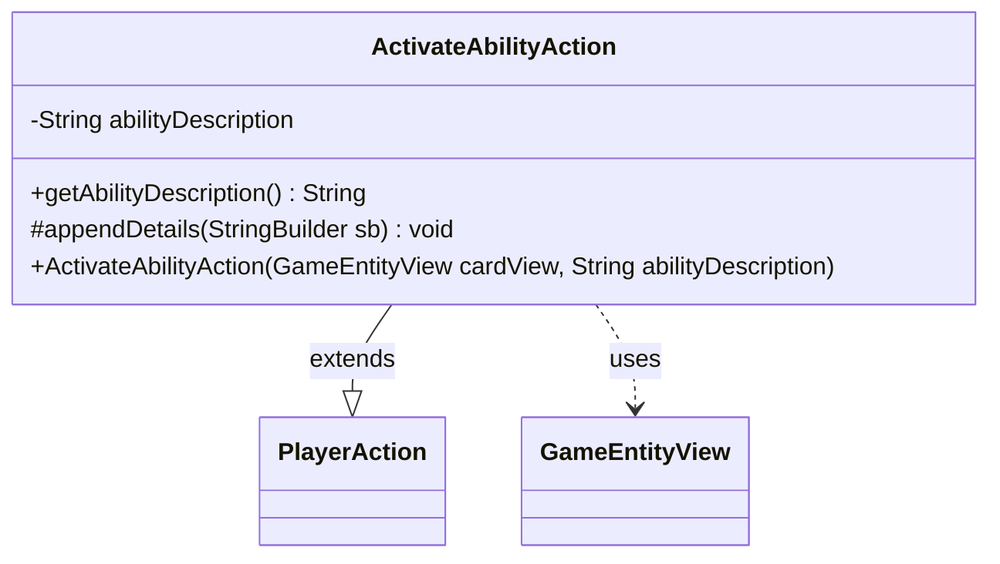

---
aliases:
  - ActivateAbilityAction
tags:
  - java/class
  - module/forge-game
  - pkg/forge/game/player/actions
fqn: forge.game.player.actions.ActivateAbilityAction
package: forge.game.player.actions
module: forge-game
kind: Class
---

# ActivateAbilityAction

**Package:** `forge.game.player.actions` &nbsp; **Module:** `forge-game` &nbsp; **Kind:** Class



## Relationships
**Extends:**
- [[forge.game.player.actions.PlayerAction|PlayerAction]]
**Uses:**
- [[forge.game.GameEntityView|GameEntityView]]

## Design Description

Activate ability action representing a player's choice to activate an ability within Forge's game engine. It extends `PlayerAction`, supplying the fixed label "Activate ability" to the supertype constructor while capturing the human-readable `abilityDescription` it exposes via a getter. Its sole collaborator is `GameEntityView`, the view of the source card passed to the parent action. The class follows the template-method pattern established by `PlayerAction`: it overrides the protected `appendDetails` hook to contribute its own `ability="..."` fragment to the action's serialized representation. The immutable `final` field and minimal surface reflect a lightweight, value-like record of a single player interaction.

## Source
`forge-game/src/main/java/forge/game/player/actions/ActivateAbilityAction.java`

```java
package forge.game.player.actions;

import forge.game.GameEntityView;

public class ActivateAbilityAction extends PlayerAction {
    private final String abilityDescription;

    public ActivateAbilityAction(GameEntityView cardView, String abilityDescription) {
        super(cardView, "Activate ability");
        this.abilityDescription = abilityDescription;
    }

    public String getAbilityDescription() {
        return abilityDescription;
    }

    @Override
    protected void appendDetails(final StringBuilder sb) {
        sb.append(" ability=\"").append(abilityDescription).append("\"");
    }
}
```

## Python
`forge/game/player/actions/ActivateAbilityAction.py`

```python
from forge.game.player.actions.PlayerAction import PlayerAction
from forge.game.GameEntityView import GameEntityView


class ActivateAbilityAction(PlayerAction):
    def __init__(self, cardView: GameEntityView, abilityDescription: str):
        super().__init__(cardView, "Activate ability")
        self.abilityDescription = abilityDescription

    def getAbilityDescription(self) -> str:
        return self.abilityDescription

    def appendDetails(self, sb) -> None:
        sb.append(" ability=\"").append(self.abilityDescription).append("\"")
```
