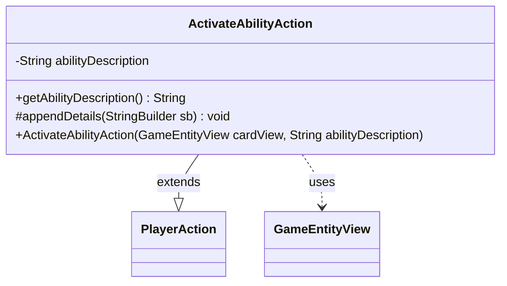

---
aliases:
  - ActivateAbilityAction
tags:
  - java/class
  - module/forge-game
  - pkg/forge/game/player/actions
fqn: forge.game.player.actions.ActivateAbilityAction
package: forge.game.player.actions
module: forge-game
kind: Class
---

# ActivateAbilityAction

**Package:** `forge.game.player.actions` &nbsp; **Module:** `forge-game` &nbsp; **Kind:** Class



## Relationships
**Extends:**
- [[forge.game.player.actions.PlayerAction|PlayerAction]]
**Uses:**
- [[forge.game.GameEntityView|GameEntityView]]

## Source
`forge-game/src/main/java/forge/game/player/actions/ActivateAbilityAction.java`

```java
package forge.game.player.actions;

import forge.game.GameEntityView;

public class ActivateAbilityAction extends PlayerAction {
    private final String abilityDescription;

    public ActivateAbilityAction(GameEntityView cardView, String abilityDescription) {
        super(cardView, "Activate ability");
        this.abilityDescription = abilityDescription;
    }

    public String getAbilityDescription() {
        return abilityDescription;
    }

    @Override
    protected void appendDetails(final StringBuilder sb) {
        sb.append(" ability=\"").append(abilityDescription).append("\"");
    }
}
```
