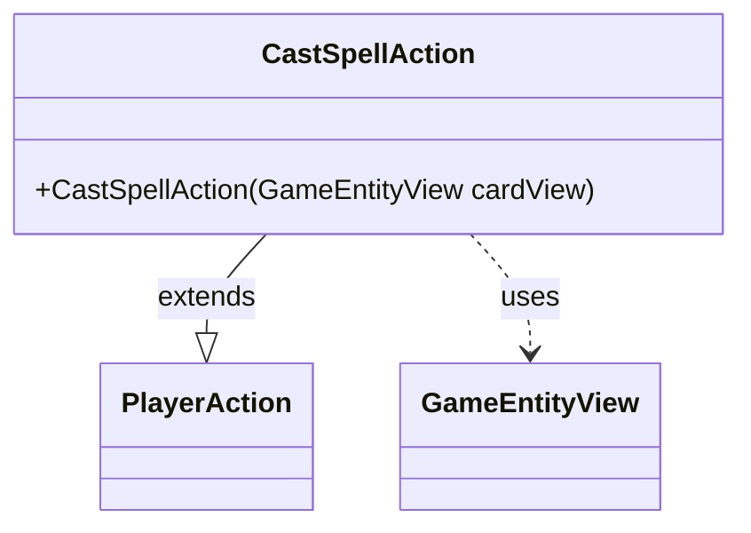

---
aliases:
  - CastSpellAction
tags:
  - java/class
  - module/forge-game
  - pkg/forge/game/player/actions
fqn: forge.game.player.actions.CastSpellAction
package: forge.game.player.actions
module: forge-game
kind: Class
---

# CastSpellAction

**Package:** `forge.game.player.actions` &nbsp; **Module:** `forge-game` &nbsp; **Kind:** Class



## Relationships
**Extends:**
- [[forge.game.player.actions.PlayerAction|PlayerAction]]
**Uses:**
- [[forge.game.GameEntityView|GameEntityView]]

## Design Description

CastSpellAction is a concrete player-action type representing a player's intent to cast a spell within Forge's game model. It extends PlayerAction, supplying the fixed label "Cast spell" and the relevant GameEntityView to the superclass constructor, so all action state and behavior are inherited rather than redefined. Its sole collaborator is GameEntityView, the view-layer reference to the card being cast, reflecting a deliberate separation between game actions and the engine's view abstractions. The class itself carries no additional state or logic; its design intent is to serve as a lightweight, semantically distinct subtype that distinguishes spell-casting from other player actions through type identity alone, enabling polymorphic handling across the action hierarchy.

## Source
`forge-game/src/main/java/forge/game/player/actions/CastSpellAction.java`

```java
package forge.game.player.actions;

import forge.game.GameEntityView;

public class CastSpellAction extends PlayerAction {
    public CastSpellAction(GameEntityView cardView) {
        super(cardView, "Cast spell");
    }
}
```

## Python
`forge/game/player/actions/CastSpellAction.py`

```python
from forge.game.GameEntityView import GameEntityView
from forge.game.player.actions.PlayerAction import PlayerAction


class CastSpellAction(PlayerAction):
    def __init__(self, cardView: GameEntityView):
        super().__init__(cardView, "Cast spell")
```
