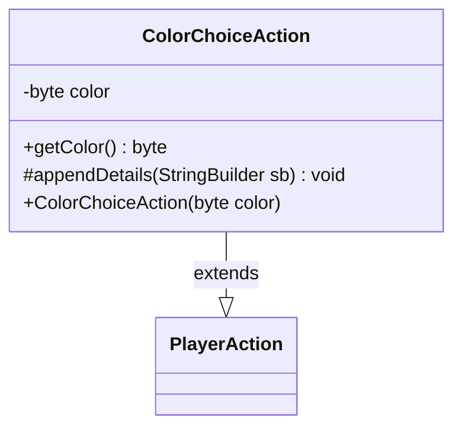

---
aliases:
  - ColorChoiceAction
tags:
  - java/class
  - module/forge-game
  - pkg/forge/game/player/actions
fqn: forge.game.player.actions.ColorChoiceAction
package: forge.game.player.actions
module: forge-game
kind: Class
---

# ColorChoiceAction

**Package:** `forge.game.player.actions` &nbsp; **Module:** `forge-game` &nbsp; **Kind:** Class



## Relationships
**Extends:**
- [[forge.game.player.actions.PlayerAction|PlayerAction]]

## Design Description

ColorChoiceAction is a lightweight, immutable command object that records a player's selection of a single Magic color during gameplay. It captures the chosen color as a compact `byte` (Forge's bitmask color encoding) supplied at construction, exposes it through `getColor()`, and fixes the human-readable label "Choose color" via its superclass constructor.

As a concrete subclass of `PlayerAction`, it fits into the engine's hierarchy of discrete, describable player decisions. It contributes its color-specific detail by overriding the protected `appendDetails` hook, delegating to `MagicColor.toShortString` so the action renders the color symbolically. This template-method arrangement lets `PlayerAction` own the common formatting flow while each action type augments only its own state, and the `final` field reflects the intent that a chosen color, once made, is immutable.

## Source
`forge-game/src/main/java/forge/game/player/actions/ColorChoiceAction.java`

```java
package forge.game.player.actions;

import forge.card.MagicColor;

public class ColorChoiceAction extends PlayerAction {
    private final byte color;

    public ColorChoiceAction(final byte color) {
        super(null, "Choose color");
        this.color = color;
    }

    public byte getColor() {
        return color;
    }

    @Override
    protected void appendDetails(final StringBuilder sb) {
        sb.append(" color=").append(MagicColor.toShortString(color));
    }
}
```

## Python
`forge/game/player/actions/ColorChoiceAction.py`

```python
from forge.game.player.actions.PlayerAction import PlayerAction
from forge.card.MagicColor import MagicColor


class ColorChoiceAction(PlayerAction):
    def __init__(self, color: int):
        super().__init__(None, "Choose color")
        self.color = color

    def getColor(self) -> int:
        return self.color

    def appendDetails(self, sb) -> None:
        sb.append(" color=").append(MagicColor.toShortString(self.color))
```
