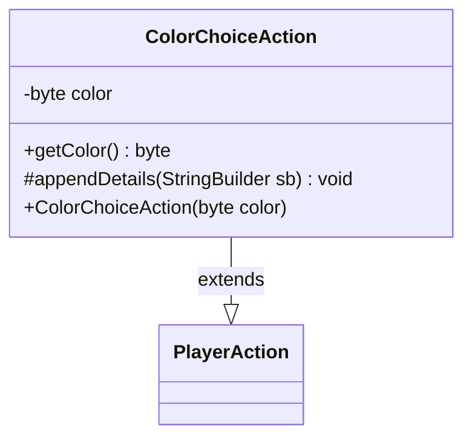

---
aliases:
  - ColorChoiceAction
tags:
  - java/class
  - module/forge-game
  - pkg/forge/game/player/actions
fqn: forge.game.player.actions.ColorChoiceAction
package: forge.game.player.actions
module: forge-game
kind: Class
---

# ColorChoiceAction

**Package:** `forge.game.player.actions` &nbsp; **Module:** `forge-game` &nbsp; **Kind:** Class



## Relationships
**Extends:**
- [[forge.game.player.actions.PlayerAction|PlayerAction]]

## Source
`forge-game/src/main/java/forge/game/player/actions/ColorChoiceAction.java`

```java
package forge.game.player.actions;

import forge.card.MagicColor;

public class ColorChoiceAction extends PlayerAction {
    private final byte color;

    public ColorChoiceAction(final byte color) {
        super(null, "Choose color");
        this.color = color;
    }

    public byte getColor() {
        return color;
    }

    @Override
    protected void appendDetails(final StringBuilder sb) {
        sb.append(" color=").append(MagicColor.toShortString(color));
    }
}
```
