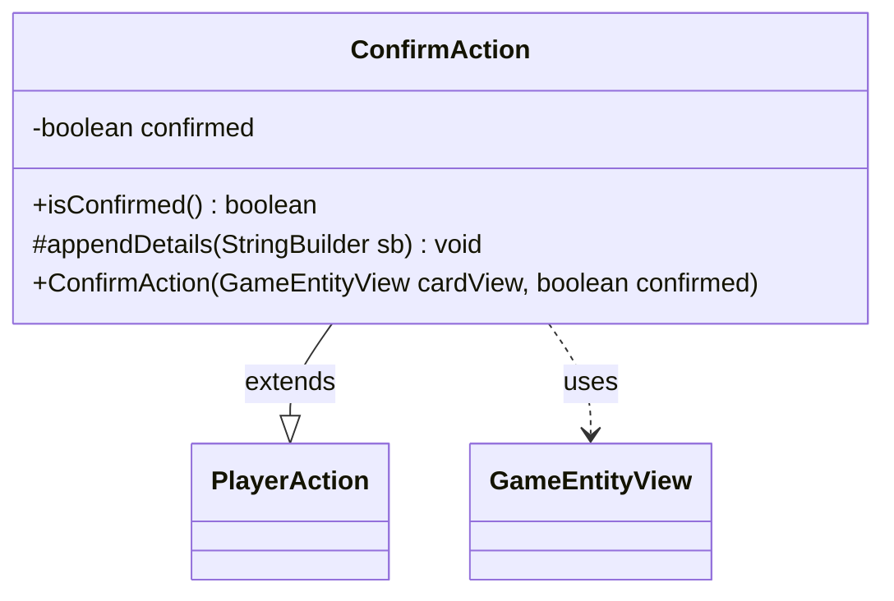

---
aliases:
  - ConfirmAction
tags:
  - java/class
  - module/forge-game
  - pkg/forge/game/player/actions
fqn: forge.game.player.actions.ConfirmAction
package: forge.game.player.actions
module: forge-game
kind: Class
---

# ConfirmAction

**Package:** `forge.game.player.actions` &nbsp; **Module:** `forge-game` &nbsp; **Kind:** Class



## Relationships
**Extends:**
- [[forge.game.player.actions.PlayerAction|PlayerAction]]
**Uses:**
- [[forge.game.GameEntityView|GameEntityView]]

## Source
`forge-game/src/main/java/forge/game/player/actions/ConfirmAction.java`

```java
package forge.game.player.actions;

import forge.game.GameEntityView;

public class ConfirmAction extends PlayerAction {
    private final boolean confirmed;

    public ConfirmAction(final GameEntityView cardView, final boolean confirmed) {
        super(cardView, confirmed ? "Confirm" : "Decline");
        this.confirmed = confirmed;
    }

    public boolean isConfirmed() {
        return confirmed;
    }

    @Override
    protected void appendDetails(final StringBuilder sb) {
        sb.append(" confirmed=").append(confirmed);
    }
}
```
