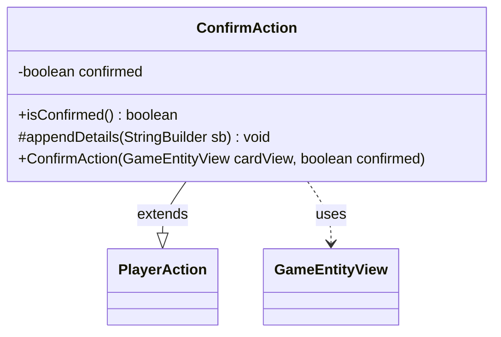

---
aliases:
  - ConfirmAction
tags:
  - java/class
  - module/forge-game
  - pkg/forge/game/player/actions
fqn: forge.game.player.actions.ConfirmAction
package: forge.game.player.actions
module: forge-game
kind: Class
---

# ConfirmAction

**Package:** `forge.game.player.actions` &nbsp; **Module:** `forge-game` &nbsp; **Kind:** Class



## Relationships
**Extends:**
- [[forge.game.player.actions.PlayerAction|PlayerAction]]
**Uses:**
- [[forge.game.GameEntityView|GameEntityView]]

## Design Description

ConfirmAction is a lightweight value object that captures a player's binary yes/no response to an in-game prompt. It records whether the player confirmed or declined and exposes that decision through `isConfirmed()`, while overriding `appendDetails` to include the boolean in the action's textual representation.

As a concrete subclass of `PlayerAction`, it specializes the general player-action abstraction for the confirmation case, deriving its parent's display label ("Confirm" or "Decline") from the boolean at construction. It collaborates with `GameEntityView`, the view-layer handle for the entity the prompt concerns, keeping the action decoupled from the underlying game model. The `final` field and absence of mutators make instances immutable, reflecting an intent that each action be a stable, self-describing record of a single decision.

## Source
`forge-game/src/main/java/forge/game/player/actions/ConfirmAction.java`

```java
package forge.game.player.actions;

import forge.game.GameEntityView;

public class ConfirmAction extends PlayerAction {
    private final boolean confirmed;

    public ConfirmAction(final GameEntityView cardView, final boolean confirmed) {
        super(cardView, confirmed ? "Confirm" : "Decline");
        this.confirmed = confirmed;
    }

    public boolean isConfirmed() {
        return confirmed;
    }

    @Override
    protected void appendDetails(final StringBuilder sb) {
        sb.append(" confirmed=").append(confirmed);
    }
}
```

## Python
`forge/game/player/actions/ConfirmAction.py`

```python
from forge.game.player.actions.PlayerAction import PlayerAction
from forge.game.GameEntityView import GameEntityView


class ConfirmAction(PlayerAction):
    def __init__(self, cardView: GameEntityView, confirmed: bool):
        super().__init__(cardView, "Confirm" if confirmed else "Decline")
        self.confirmed = confirmed

    def isConfirmed(self) -> bool:
        return self.confirmed

    def appendDetails(self, sb) -> None:
        sb.append(" confirmed=").append(self.confirmed)
```
