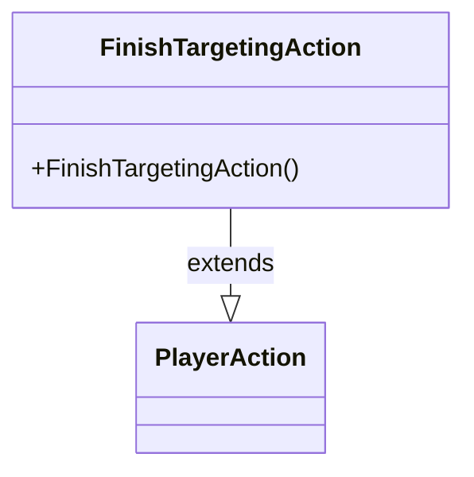

---
aliases:
  - FinishTargetingAction
tags:
  - java/class
  - module/forge-game
  - pkg/forge/game/player/actions
fqn: forge.game.player.actions.FinishTargetingAction
package: forge.game.player.actions
module: forge-game
kind: Class
---

# FinishTargetingAction

**Package:** `forge.game.player.actions` &nbsp; **Module:** `forge-game` &nbsp; **Kind:** Class



## Relationships
**Extends:**
- [[forge.game.player.actions.PlayerAction|PlayerAction]]

## Source
`forge-game/src/main/java/forge/game/player/actions/FinishTargetingAction.java`

```java
package forge.game.player.actions;

public class FinishTargetingAction extends PlayerAction{
    public FinishTargetingAction() {
        super(null, "Finish game entity");
    }
}
```
