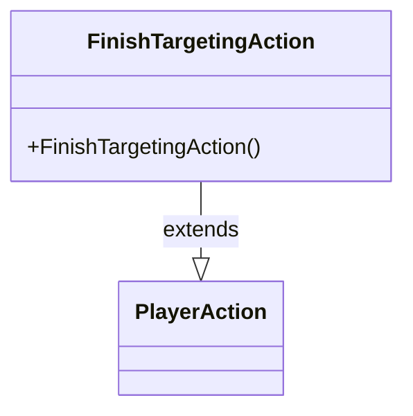

---
aliases:
  - FinishTargetingAction
tags:
  - java/class
  - module/forge-game
  - pkg/forge/game/player/actions
fqn: forge.game.player.actions.FinishTargetingAction
package: forge.game.player.actions
module: forge-game
kind: Class
---

# FinishTargetingAction

**Package:** `forge.game.player.actions` &nbsp; **Module:** `forge-game` &nbsp; **Kind:** Class



## Relationships
**Extends:**
- [[forge.game.player.actions.PlayerAction|PlayerAction]]

## Design Description

FinishTargetingAction is a concrete, parameterless command object representing a player's choice to conclude the targeting phase of an interaction. As a leaf subclass of PlayerAction, it carries no state or behavior of its own beyond construction: it delegates to the superclass constructor with a null game-entity reference and the fixed label "Finish game entity," signaling that this action is not bound to any specific target. The design intent is to model "done selecting targets" as a distinct, identifiable action type within the actions hierarchy, allowing the targeting and player-decision machinery to recognize and dispatch on it polymorphically alongside other PlayerAction variants rather than relying on a sentinel value or flag.

## Source
`forge-game/src/main/java/forge/game/player/actions/FinishTargetingAction.java`

```java
package forge.game.player.actions;

public class FinishTargetingAction extends PlayerAction{
    public FinishTargetingAction() {
        super(null, "Finish game entity");
    }
}
```

## Python
`forge/game/player/actions/FinishTargetingAction.py`

```python
from forge.game.player.actions.PlayerAction import PlayerAction


class FinishTargetingAction(PlayerAction):
    def __init__(self):
        super().__init__(None, "Finish game entity")
```
