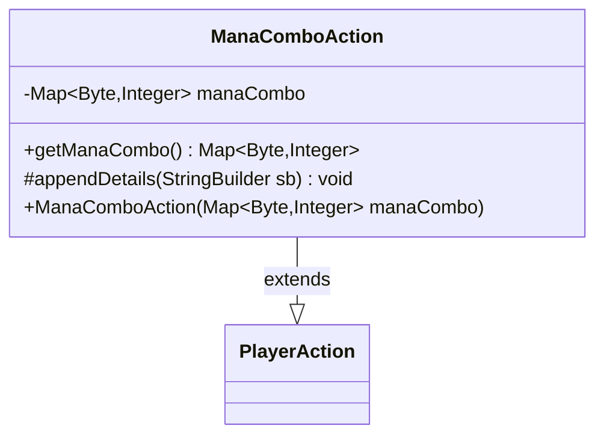

---
aliases:
  - ManaComboAction
tags:
  - java/class
  - module/forge-game
  - pkg/forge/game/player/actions
fqn: forge.game.player.actions.ManaComboAction
package: forge.game.player.actions
module: forge-game
kind: Class
---

# ManaComboAction

**Package:** `forge.game.player.actions` &nbsp; **Module:** `forge-game` &nbsp; **Kind:** Class



## Relationships
**Extends:**
- [[forge.game.player.actions.PlayerAction|PlayerAction]]

## Design Description

A class for the player action of choosing a mana combination, ManaComboAction extends PlayerAction and represents one concrete entry in Forge's player-action hierarchy. It captures an immutable mapping of mana color codes (`Byte`) to quantities (`Integer`), defensively copying the supplied map into a `LinkedHashMap` so the chosen combination's insertion order is preserved and the internal state cannot be mutated by callers.

The class invokes its superclass constructor with a fixed descriptive label ("Choose mana combination") and overrides the protected `appendDetails` hook to contribute its mana-combo state to the action's string representation, following the template-method pattern established by `PlayerAction`. Its accessor exposes the stored combination, making the type a lightweight, largely immutable value object that records a player's mana-payment decision within the game engine.

## Source
`forge-game/src/main/java/forge/game/player/actions/ManaComboAction.java`

```java
package forge.game.player.actions;

import java.util.LinkedHashMap;
import java.util.Map;

public class ManaComboAction extends PlayerAction {
    private final Map<Byte, Integer> manaCombo;

    public ManaComboAction(final Map<Byte, Integer> manaCombo) {
        super(null, "Choose mana combination");
        this.manaCombo = new LinkedHashMap<>(manaCombo);
    }

    public Map<Byte, Integer> getManaCombo() {
        return manaCombo;
    }

    @Override
    protected void appendDetails(final StringBuilder sb) {
        sb.append(" manaCombo=").append(manaCombo);
    }
}
```

## Python
`forge/game/player/actions/ManaComboAction.py`

```python
from forge.game.player.actions.PlayerAction import PlayerAction


class ManaComboAction(PlayerAction):
    def __init__(self, manaCombo: dict[int, int]):
        super().__init__(None, "Choose mana combination")
        self.manaCombo = dict(manaCombo)

    def getManaCombo(self) -> dict[int, int]:
        return self.manaCombo

    def appendDetails(self, sb) -> None:
        sb.append(" manaCombo=").append(self.manaCombo)
```
