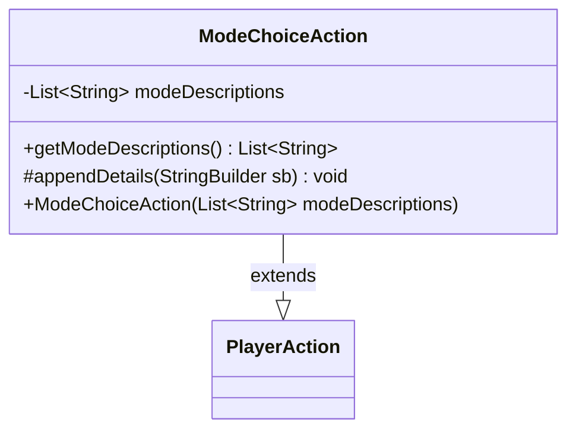

---
aliases:
  - ModeChoiceAction
tags:
  - java/class
  - module/forge-game
  - pkg/forge/game/player/actions
fqn: forge.game.player.actions.ModeChoiceAction
package: forge.game.player.actions
module: forge-game
kind: Class
---

# ModeChoiceAction

**Package:** `forge.game.player.actions` &nbsp; **Module:** `forge-game` &nbsp; **Kind:** Class



## Relationships
**Extends:**
- [[forge.game.player.actions.PlayerAction|PlayerAction]]

## Source
`forge-game/src/main/java/forge/game/player/actions/ModeChoiceAction.java`

```java
package forge.game.player.actions;

import java.util.List;

public class ModeChoiceAction extends PlayerAction {
    private final List<String> modeDescriptions;

    public ModeChoiceAction(final List<String> modeDescriptions) {
        super(null, "Choose mode");
        this.modeDescriptions = modeDescriptions;
    }

    public List<String> getModeDescriptions() {
        return modeDescriptions;
    }

    @Override
    protected void appendDetails(final StringBuilder sb) {
        sb.append(" modes=").append(modeDescriptions);
    }
}
```
