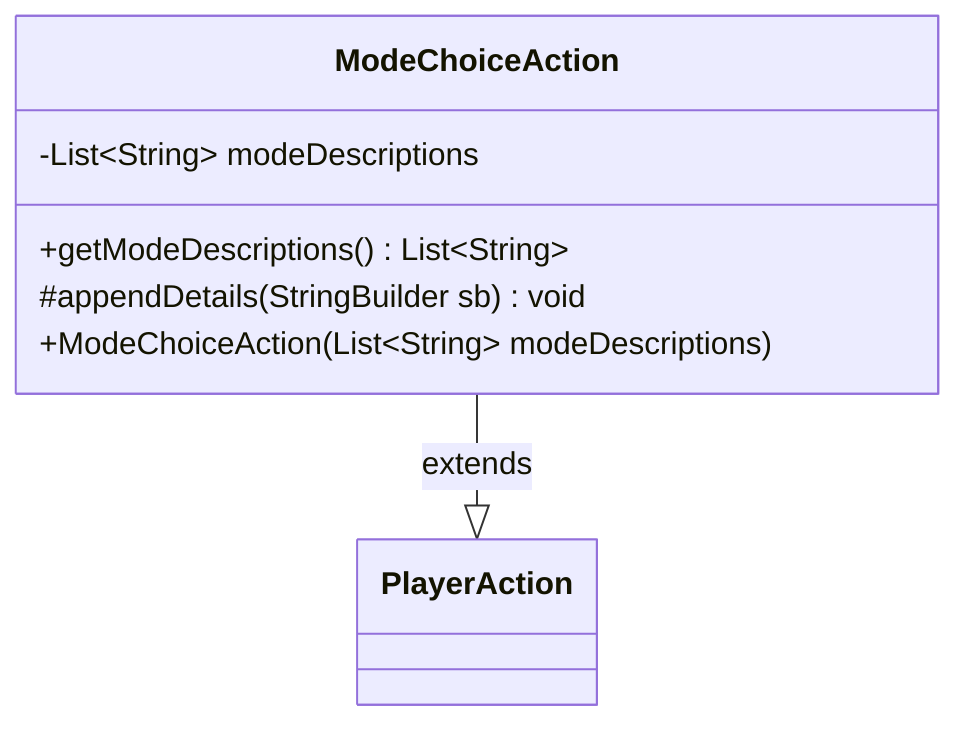

---
aliases:
  - ModeChoiceAction
tags:
  - java/class
  - module/forge-game
  - pkg/forge/game/player/actions
fqn: forge.game.player.actions.ModeChoiceAction
package: forge.game.player.actions
module: forge-game
kind: Class
---

# ModeChoiceAction

**Package:** `forge.game.player.actions` &nbsp; **Module:** `forge-game` &nbsp; **Kind:** Class



## Relationships
**Extends:**
- [[forge.game.player.actions.PlayerAction|PlayerAction]]

## Design Description

Inherits PlayerAction's identity by passing a null card and the fixed label "Choose mode" to its supertype constructor, while adding a single immutable field that records the human-readable descriptions of the modes presented to a player.

Concrete subclass of PlayerAction within forge.game.player.actions, ModeChoiceAction represents a player's mode-selection decision (for modal spells and abilities) as a logged or replayable game action. It collaborates with a List<String> of mode descriptions, exposed read-only via getModeDescriptions() and overrides the protected appendDetails hook to contribute its mode list to the inherited string-building machinery, ensuring the chosen modes appear in the action's textual representation without duplicating the base formatting logic.

## Source
`forge-game/src/main/java/forge/game/player/actions/ModeChoiceAction.java`

```java
package forge.game.player.actions;

import java.util.List;

public class ModeChoiceAction extends PlayerAction {
    private final List<String> modeDescriptions;

    public ModeChoiceAction(final List<String> modeDescriptions) {
        super(null, "Choose mode");
        this.modeDescriptions = modeDescriptions;
    }

    public List<String> getModeDescriptions() {
        return modeDescriptions;
    }

    @Override
    protected void appendDetails(final StringBuilder sb) {
        sb.append(" modes=").append(modeDescriptions);
    }
}
```

## Python
`forge/game/player/actions/ModeChoiceAction.py`

```python
package forge.game.player.actions;

from typing import List

from forge.game.player.actions.PlayerAction import PlayerAction


class ModeChoiceAction(PlayerAction):
    def __init__(self, modeDescriptions: List[str]):
        super().__init__(None, "Choose mode")
        self.modeDescriptions = modeDescriptions

    def getModeDescriptions(self) -> List[str]:
        return self.modeDescriptions

    def appendDetails(self, sb: StringBuilder) -> None:
        sb.append(" modes=").append(self.modeDescriptions)
```
