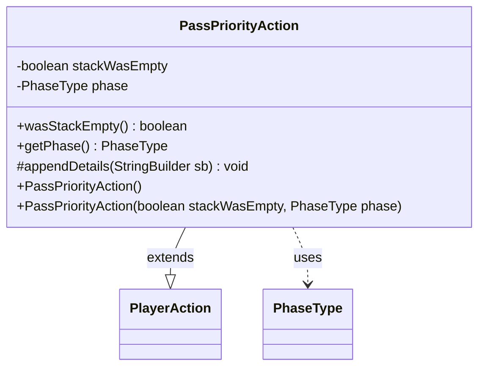

---
aliases:
  - PassPriorityAction
tags:
  - java/class
  - module/forge-game
  - pkg/forge/game/player/actions
fqn: forge.game.player.actions.PassPriorityAction
package: forge.game.player.actions
module: forge-game
kind: Class
---

# PassPriorityAction

**Package:** `forge.game.player.actions` &nbsp; **Module:** `forge-game` &nbsp; **Kind:** Class



## Relationships
**Extends:**
- [[forge.game.player.actions.PlayerAction|PlayerAction]]
**Uses:**
- [[forge.game.phase.PhaseType|PhaseType]]

## Source
`forge-game/src/main/java/forge/game/player/actions/PassPriorityAction.java`

```java
package forge.game.player.actions;

import forge.game.phase.PhaseType;

public class PassPriorityAction extends PlayerAction {
    private final boolean stackWasEmpty;
    private final PhaseType phase;

    public PassPriorityAction() {
        this(true, null);
    }

    public PassPriorityAction(final boolean stackWasEmpty, final PhaseType phase) {
        super(null, "Pass Priority");
        this.stackWasEmpty = stackWasEmpty;
        this.phase = phase;
    }

    public boolean wasStackEmpty() {
        return stackWasEmpty;
    }

    public PhaseType getPhase() {
        return phase;
    }

    @Override
    protected void appendDetails(final StringBuilder sb) {
        sb.append(" stackWasEmpty=").append(stackWasEmpty);
        if (phase != null) {
            sb.append(" phase=").append(phase);
        }
    }
}
```
