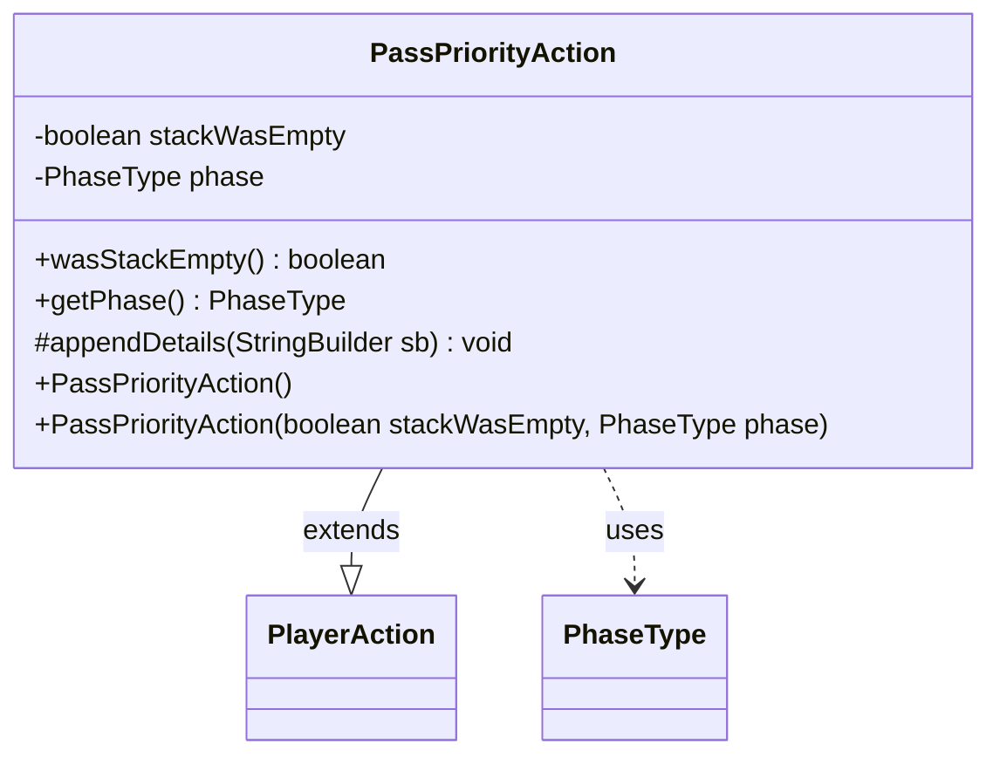

---
aliases:
  - PassPriorityAction
tags:
  - java/class
  - module/forge-game
  - pkg/forge/game/player/actions
fqn: forge.game.player.actions.PassPriorityAction
package: forge.game.player.actions
module: forge-game
kind: Class
---

# PassPriorityAction

**Package:** `forge.game.player.actions` &nbsp; **Module:** `forge-game` &nbsp; **Kind:** Class



## Relationships
**Extends:**
- [[forge.game.player.actions.PlayerAction|PlayerAction]]
**Uses:**
- [[forge.game.phase.PhaseType|PhaseType]]

## Design Description

PassPriorityAction is a concrete, immutable command-style record of a player's decision to pass priority, extending the abstract PlayerAction base to participate in Forge's player-action logging and replay framework. It captures two pieces of contextual state at construction time: whether the stack was empty when priority was passed and the PhaseType in which it occurred, both exposed through read-only accessors. The no-argument constructor supplies sensible defaults (an empty stack and no specific phase), while the full constructor records actual game context. By overriding the protected appendDetails hook, it contributes its own fields to the inherited string-formatting routine, collaborating with PhaseType to produce a descriptive, diagnostic representation of the pass event.

## Source
`forge-game/src/main/java/forge/game/player/actions/PassPriorityAction.java`

```java
package forge.game.player.actions;

import forge.game.phase.PhaseType;

public class PassPriorityAction extends PlayerAction {
    private final boolean stackWasEmpty;
    private final PhaseType phase;

    public PassPriorityAction() {
        this(true, null);
    }

    public PassPriorityAction(final boolean stackWasEmpty, final PhaseType phase) {
        super(null, "Pass Priority");
        this.stackWasEmpty = stackWasEmpty;
        this.phase = phase;
    }

    public boolean wasStackEmpty() {
        return stackWasEmpty;
    }

    public PhaseType getPhase() {
        return phase;
    }

    @Override
    protected void appendDetails(final StringBuilder sb) {
        sb.append(" stackWasEmpty=").append(stackWasEmpty);
        if (phase != null) {
            sb.append(" phase=").append(phase);
        }
    }
}
```

## Python
`forge/game/player/actions/PassPriorityAction.py`

```python
from forge.game.player.actions.PlayerAction import PlayerAction
from forge.game.phase.PhaseType import PhaseType


class PassPriorityAction(PlayerAction):
    def __init__(self, stackWasEmpty: bool = True, phase: PhaseType = None):
        super().__init__(None, "Pass Priority")
        self.stackWasEmpty = stackWasEmpty
        self.phase = phase

    def wasStackEmpty(self) -> bool:
        return self.stackWasEmpty

    def getPhase(self) -> PhaseType:
        return self.phase

    def appendDetails(self, sb) -> None:
        sb.append(" stackWasEmpty=").append(self.stackWasEmpty)
        if self.phase is not None:
            sb.append(" phase=").append(self.phase)
```
