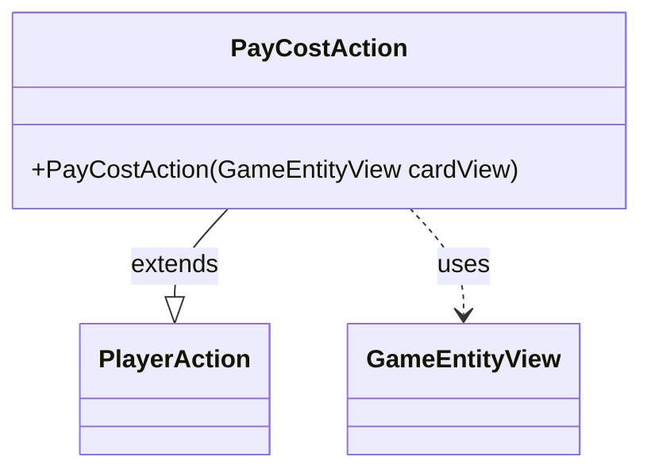

---
aliases:
  - PayCostAction
tags:
  - java/class
  - module/forge-game
  - pkg/forge/game/player/actions
fqn: forge.game.player.actions.PayCostAction
package: forge.game.player.actions
module: forge-game
kind: Class
---

# PayCostAction

**Package:** `forge.game.player.actions` &nbsp; **Module:** `forge-game` &nbsp; **Kind:** Class



## Relationships
**Extends:**
- [[forge.game.player.actions.PlayerAction|PlayerAction]]
**Uses:**
- [[forge.game.GameEntityView|GameEntityView]]

## Design Description

PayCostAction is a concrete player-action that represents a player choosing to pay a cost against a specific game object. Extending PlayerAction, it is a thin specialization that supplies a fixed "Pay cost" label to the supertype while carrying the targeted entity forward. It collaborates with GameEntityView, accepting that view-layer reference in its sole constructor and delegating all state and behavior to PlayerAction. The design intent is minimalism: the class adds no fields or logic of its own, instead participating in a family of lightweight, immutable action types distinguished only by their label and target, keeping player-decision modeling uniform and easy to extend.

## Source
`forge-game/src/main/java/forge/game/player/actions/PayCostAction.java`

```java
package forge.game.player.actions;

import forge.game.GameEntityView;

public class PayCostAction extends PlayerAction {
    public PayCostAction(GameEntityView cardView) {
        super(cardView, "Pay cost");
    }
}
```

## Python
`forge/game/player/actions/PayCostAction.py`

```python
from forge.game.player.actions.PlayerAction import PlayerAction
from forge.game.GameEntityView import GameEntityView


class PayCostAction(PlayerAction):
    def __init__(self, cardView: GameEntityView):
        super().__init__(cardView, "Pay cost")
```
