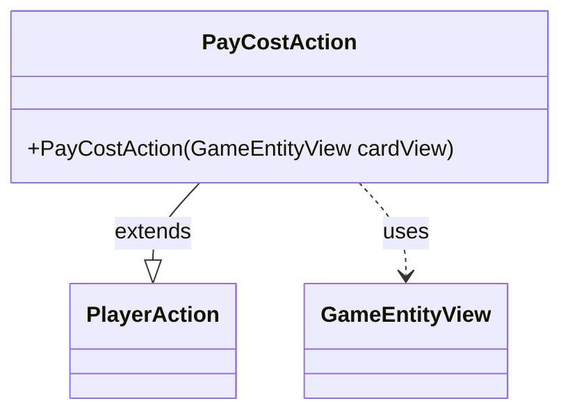

---
aliases:
  - PayCostAction
tags:
  - java/class
  - module/forge-game
  - pkg/forge/game/player/actions
fqn: forge.game.player.actions.PayCostAction
package: forge.game.player.actions
module: forge-game
kind: Class
---

# PayCostAction

**Package:** `forge.game.player.actions` &nbsp; **Module:** `forge-game` &nbsp; **Kind:** Class



## Relationships
**Extends:**
- [[forge.game.player.actions.PlayerAction|PlayerAction]]
**Uses:**
- [[forge.game.GameEntityView|GameEntityView]]

## Source
`forge-game/src/main/java/forge/game/player/actions/PayCostAction.java`

```java
package forge.game.player.actions;

import forge.game.GameEntityView;

public class PayCostAction extends PlayerAction {
    public PayCostAction(GameEntityView cardView) {
        super(cardView, "Pay cost");
    }
}
```
