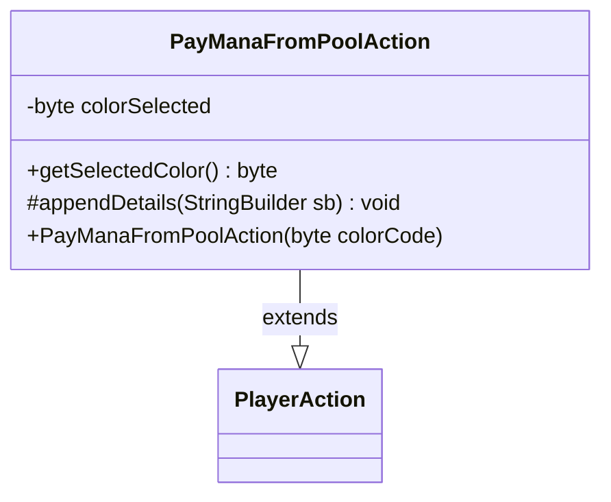

---
aliases:
  - PayManaFromPoolAction
tags:
  - java/class
  - module/forge-game
  - pkg/forge/game/player/actions
fqn: forge.game.player.actions.PayManaFromPoolAction
package: forge.game.player.actions
module: forge-game
kind: Class
---

# PayManaFromPoolAction

**Package:** `forge.game.player.actions` &nbsp; **Module:** `forge-game` &nbsp; **Kind:** Class



## Relationships
**Extends:**
- [[forge.game.player.actions.PlayerAction|PlayerAction]]

## Source
`forge-game/src/main/java/forge/game/player/actions/PayManaFromPoolAction.java`

```java
package forge.game.player.actions;


public class PayManaFromPoolAction extends PlayerAction{
    private byte colorSelected;
    public PayManaFromPoolAction(byte colorCode) {
        super(null, "Pay mana");
        colorSelected = colorCode;
    }

    public byte getSelectedColor() {
        return colorSelected;
    }

    @Override
    protected void appendDetails(final StringBuilder sb) {
        sb.append(" mana=").append(colorSelected);
    }
}
```
