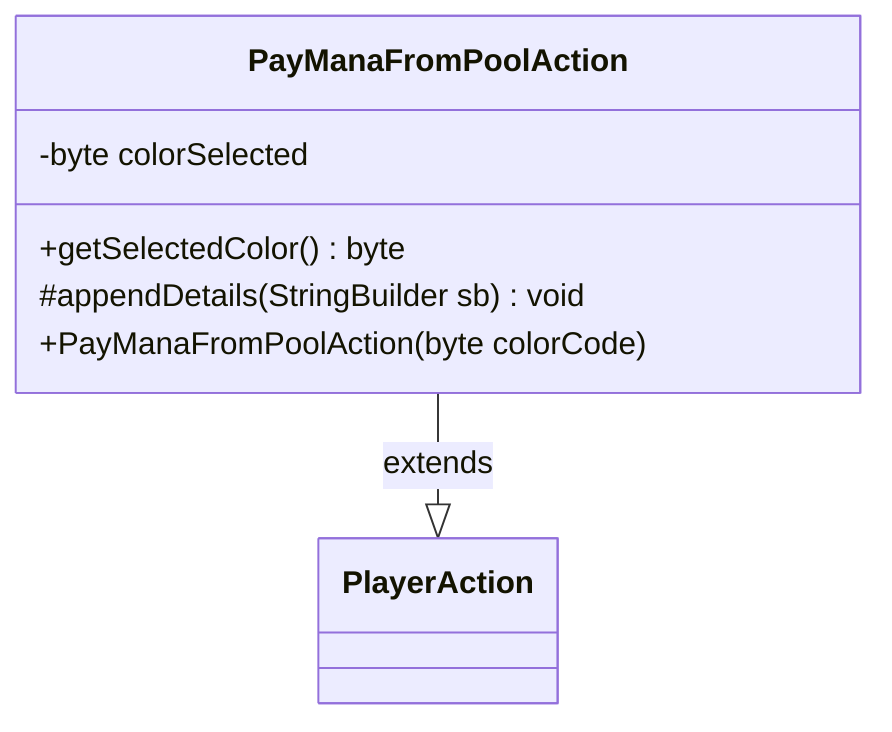

---
aliases:
  - PayManaFromPoolAction
tags:
  - java/class
  - module/forge-game
  - pkg/forge/game/player/actions
fqn: forge.game.player.actions.PayManaFromPoolAction
package: forge.game.player.actions
module: forge-game
kind: Class
---

# PayManaFromPoolAction

**Package:** `forge.game.player.actions`   **Module:** `forge-game`   **Kind:** Class



## Relationships
**Extends:**
- [[forge.game.player.actions.PlayerAction|PlayerAction]]

## Design Description

Pay-mana-from-pool variant of a player action that records the color of mana a player chooses to spend from their mana pool. It extends `PlayerAction`, invoking the supertype constructor with a null subject and the fixed label "Pay mana" while storing the selected color as a `byte` color code. The class exposes `getSelectedColor()` to retrieve that code and overrides the protected `appendDetails(StringBuilder)` hook to contribute its `mana=` fragment to the action's textual description, following the template-method pattern established by `PlayerAction`. Its narrow responsibility—carrying a single color value alongside the inherited action metadata—reflects a deliberately lightweight, immutable-by-convention design serving as a typed record of a mana-payment decision within the game's player-action framework.

## Source
`forge-game/src/main/java/forge/game/player/actions/PayManaFromPoolAction.java`

```java
package forge.game.player.actions;


public class PayManaFromPoolAction extends PlayerAction{
    private byte colorSelected;
    public PayManaFromPoolAction(byte colorCode) {
        super(null, "Pay mana");
        colorSelected = colorCode;
    }

    public byte getSelectedColor() {
        return colorSelected;
    }

    @Override
    protected void appendDetails(final StringBuilder sb) {
        sb.append(" mana=").append(colorSelected);
    }
}
```

## Python
`forge/game/player/actions/PayManaFromPoolAction.py`

```python
from forge.game.player.actions.PlayerAction import PlayerAction


class PayManaFromPoolAction(PlayerAction):
    def __init__(self, colorCode: int):
        super().__init__(None, "Pay mana")
        self.colorSelected = colorCode

    def getSelectedColor(self) -> int:
        return self.colorSelected

    def appendDetails(self, sb) -> None:
        sb.append(" mana=").append(self.colorSelected)
```
