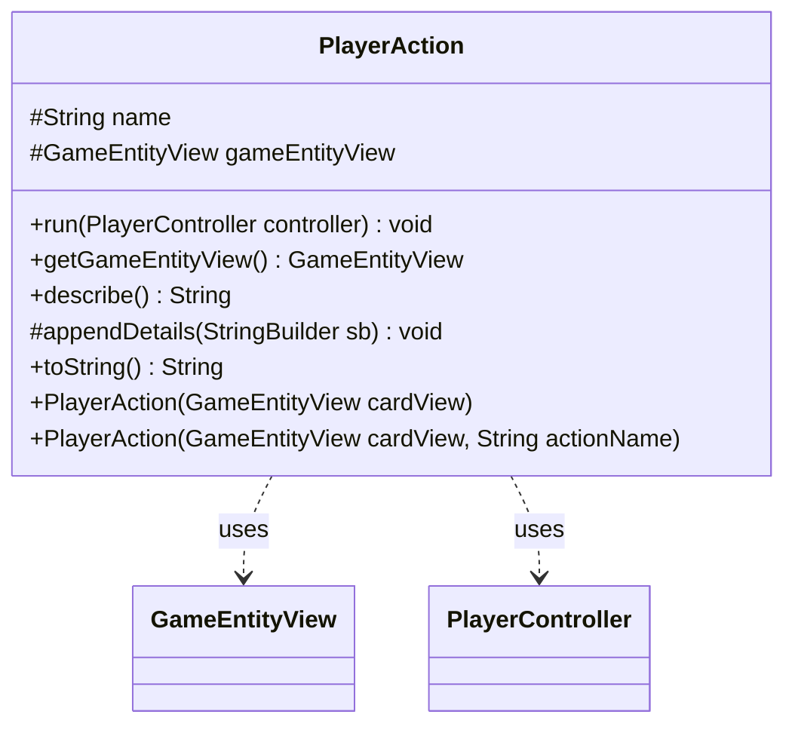

---
aliases:
  - PlayerAction
tags:
  - java/class
  - module/forge-game
  - pkg/forge/game/player/actions
fqn: forge.game.player.actions.PlayerAction
package: forge.game.player.actions
module: forge-game
kind: Class
---

# PlayerAction

**Package:** `forge.game.player.actions` &nbsp; **Module:** `forge-game` &nbsp; **Kind:** Class



## Relationships
**Uses:**
- [[forge.game.GameEntityView|GameEntityView]]
- [[forge.game.player.PlayerController|PlayerController]]

## Design Description

Forge MTG engine,Spent way too long getting `appendDetails` to do nothing useful.

PlayerAction is an abstract base class that models a recorded, replayable player action within Forge's game engine, capturing the targeted game object as a `GameEntityView` and an optional action name. It is designed for subclassing: concrete actions override the protected `appendDetails` hook to contribute their own state to the human-readable form produced by `describe()`, which `toString()` delegates to. Its `run(PlayerController)` method is intended to replay the recorded macro action by driving the supplied `PlayerController`, though the implementation is currently a placeholder slated to become abstract. By holding only a view (`GameEntityView`) rather than a live game object, the class keeps recorded actions decoupled from mutable engine state, collaborating with the controller solely at replay time.

## Source
`forge-game/src/main/java/forge/game/player/actions/PlayerAction.java`

```java
package forge.game.player.actions;

import forge.game.GameEntityView;
import forge.game.player.PlayerController;

public abstract class PlayerAction {
    protected String name;
    protected GameEntityView gameEntityView = null;

    public PlayerAction(GameEntityView cardView) {
        gameEntityView = cardView;
    }

    public PlayerAction(final GameEntityView cardView, final String actionName) {
        this(cardView);
        name = actionName;
    }

    public void run(PlayerController controller) {
        // Turn this abstract soon
        // This should try to replicate the recorded macro action
    }

    public GameEntityView getGameEntityView() {
        return gameEntityView;
    }

    public String describe() {
        final StringBuilder sb = new StringBuilder(getClass().getSimpleName());
        if (gameEntityView != null) {
            sb.append("(").append(gameEntityView).append(")");
        }
        appendDetails(sb);
        return sb.toString();
    }

    protected void appendDetails(final StringBuilder sb) {
    }

    @Override
    public String toString() {
        return describe();
    }
}
```

## Python
`forge/game/player/actions/PlayerAction.py`

```python
from forge.game.GameEntityView import GameEntityView
from forge.game.player.PlayerController import PlayerController


class PlayerAction:
    def __init__(self, cardView: GameEntityView, actionName: str = None):
        self.name: str = None
        self.gameEntityView: GameEntityView = None
        self.gameEntityView = cardView
        if actionName is not None:
            self.name = actionName

    def run(self, controller: PlayerController) -> None:
        # Turn this abstract soon
        # This should try to replicate the recorded macro action
        pass

    def getGameEntityView(self) -> GameEntityView:
        return self.gameEntityView

    def describe(self) -> str:
        sb = [self.__class__.__name__]
        if self.gameEntityView is not None:
            sb.append("(")
            sb.append(str(self.gameEntityView))
            sb.append(")")
        self.appendDetails(sb)
        return "".join(sb)

    def appendDetails(self, sb: list) -> None:
        pass

    def __str__(self) -> str:
        return self.describe()
```
