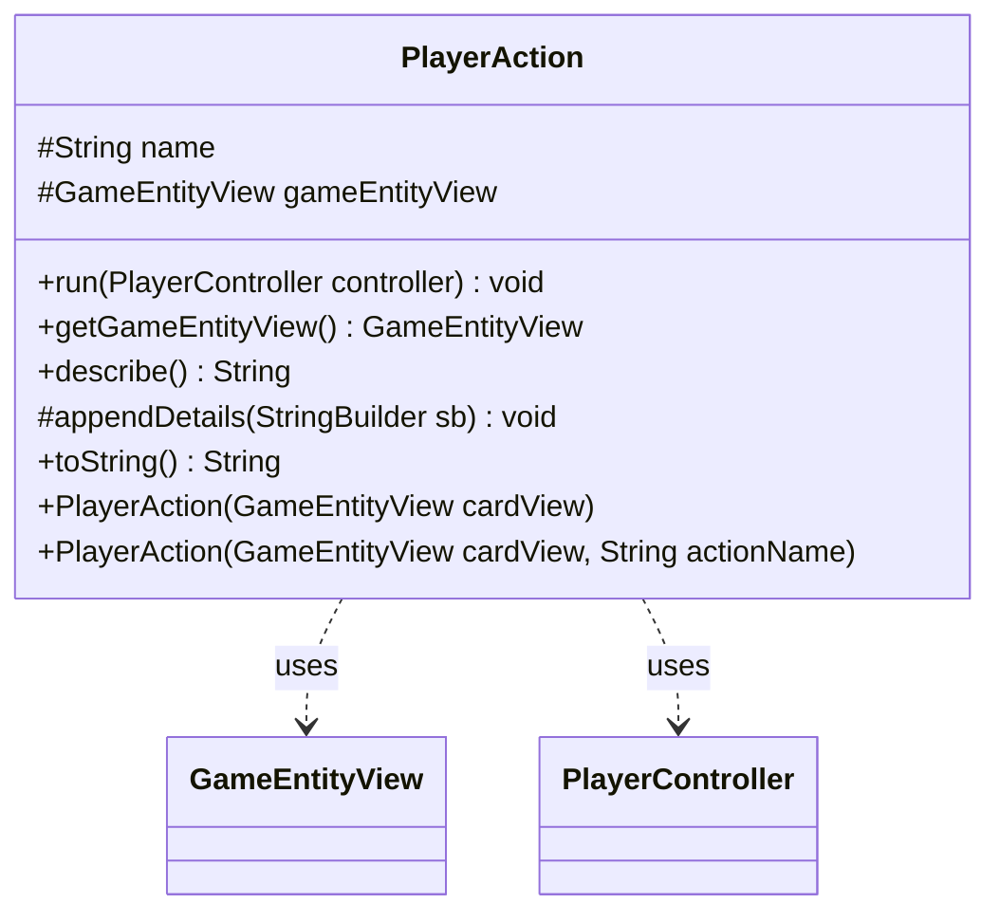

---
aliases:
  - PlayerAction
tags:
  - java/class
  - module/forge-game
  - pkg/forge/game/player/actions
fqn: forge.game.player.actions.PlayerAction
package: forge.game.player.actions
module: forge-game
kind: Class
---

# PlayerAction

**Package:** `forge.game.player.actions` &nbsp; **Module:** `forge-game` &nbsp; **Kind:** Class



## Relationships
**Uses:**
- [[forge.game.GameEntityView|GameEntityView]]
- [[forge.game.player.PlayerController|PlayerController]]

## Source
`forge-game/src/main/java/forge/game/player/actions/PlayerAction.java`

```java
package forge.game.player.actions;

import forge.game.GameEntityView;
import forge.game.player.PlayerController;

public abstract class PlayerAction {
    protected String name;
    protected GameEntityView gameEntityView = null;

    public PlayerAction(GameEntityView cardView) {
        gameEntityView = cardView;
    }

    public PlayerAction(final GameEntityView cardView, final String actionName) {
        this(cardView);
        name = actionName;
    }

    public void run(PlayerController controller) {
        // Turn this abstract soon
        // This should try to replicate the recorded macro action
    }

    public GameEntityView getGameEntityView() {
        return gameEntityView;
    }

    public String describe() {
        final StringBuilder sb = new StringBuilder(getClass().getSimpleName());
        if (gameEntityView != null) {
            sb.append("(").append(gameEntityView).append(")");
        }
        appendDetails(sb);
        return sb.toString();
    }

    protected void appendDetails(final StringBuilder sb) {
    }

    @Override
    public String toString() {
        return describe();
    }
}
```
