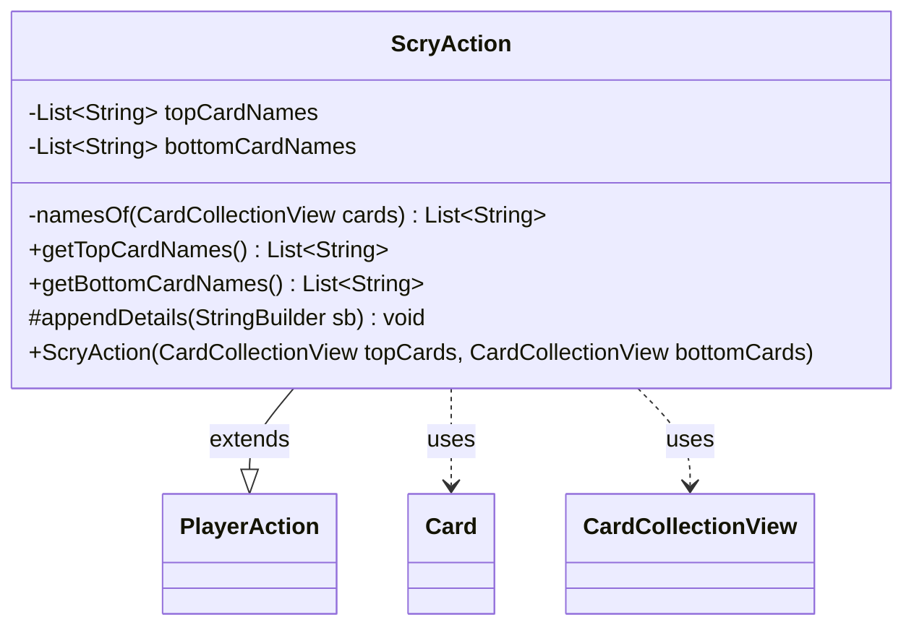

---
aliases:
  - ScryAction
tags:
  - java/class
  - module/forge-game
  - pkg/forge/game/player/actions
fqn: forge.game.player.actions.ScryAction
package: forge.game.player.actions
module: forge-game
kind: Class
---

# ScryAction

**Package:** `forge.game.player.actions`   **Module:** `forge-game`   **Kind:** Class



## Relationships
**Extends:**
- [[forge.game.player.actions.PlayerAction|PlayerAction]]
**Uses:**
- [[forge.game.card.Card|Card]]
- [[forge.game.card.CardCollectionView|CardCollectionView]]

## Design Description

Scry resolution by capturing the names of the cards a player chose to keep on top of their library versus move to the bottom. Constructed from the two `CardCollectionView` groups produced by a scry decision, it eagerly snapshots each card's name into immutable `topCardNames`/`bottomCardNames` lists via the private `namesOf` helper (which null-guards and returns an empty list when appropriate), decoupling the record from the live `Card` objects.

As a concrete subclass of `PlayerAction`, it supplies the "Scry" label through the superclass constructor and overrides `appendDetails` to contribute its top/bottom card names to the inherited string representation. Exposing only read accessors, it serves as an immutable, serializable-style record of a scry event—useful for logging, AI decision history, or replay—rather than participating in game mutation itself.

## Source
`forge-game/src/main/java/forge/game/player/actions/ScryAction.java`

```java
package forge.game.player.actions;

import forge.game.card.Card;
import forge.game.card.CardCollectionView;

import java.util.ArrayList;
import java.util.Collections;
import java.util.List;

public class ScryAction extends PlayerAction {
    private final List<String> topCardNames;
    private final List<String> bottomCardNames;

    public ScryAction(final CardCollectionView topCards, final CardCollectionView bottomCards) {
        super(null, "Scry");
        this.topCardNames = namesOf(topCards);
        this.bottomCardNames = namesOf(bottomCards);
    }

    private static List<String> namesOf(final CardCollectionView cards) {
        if (cards == null || cards.isEmpty()) {
            return Collections.emptyList();
        }
        final List<String> names = new ArrayList<>();
        for (final Card card : cards) {
            names.add(card.getName());
        }
        return names;
    }

    public List<String> getTopCardNames() {
        return topCardNames;
    }

    public List<String> getBottomCardNames() {
        return bottomCardNames;
    }

    @Override
    protected void appendDetails(final StringBuilder sb) {
        sb.append(" top=").append(topCardNames);
        sb.append(" bottom=").append(bottomCardNames);
    }
}
```

## Python
`forge/game/player/actions/ScryAction.py`

```python
from forge.game.player.actions.PlayerAction import PlayerAction
from forge.game.card.Card import Card
from forge.game.card.CardCollectionView import CardCollectionView


class ScryAction(PlayerAction):
    def __init__(self, topCards: CardCollectionView, bottomCards: CardCollectionView):
        super().__init__(None, "Scry")
        self.topCardNames = self.namesOf(topCards)
        self.bottomCardNames = self.namesOf(bottomCards)

    @staticmethod
    def namesOf(cards: CardCollectionView) -> list[str]:
        if cards is None or cards.isEmpty():
            return []
        names: list[str] = []
        for card in cards:
            names.append(card.getName())
        return names

    def getTopCardNames(self) -> list[str]:
        return self.topCardNames

    def getBottomCardNames(self) -> list[str]:
        return self.bottomCardNames

    def appendDetails(self, sb) -> None:
        sb.append(" top=").append(self.topCardNames)
        sb.append(" bottom=").append(self.bottomCardNames)
```
