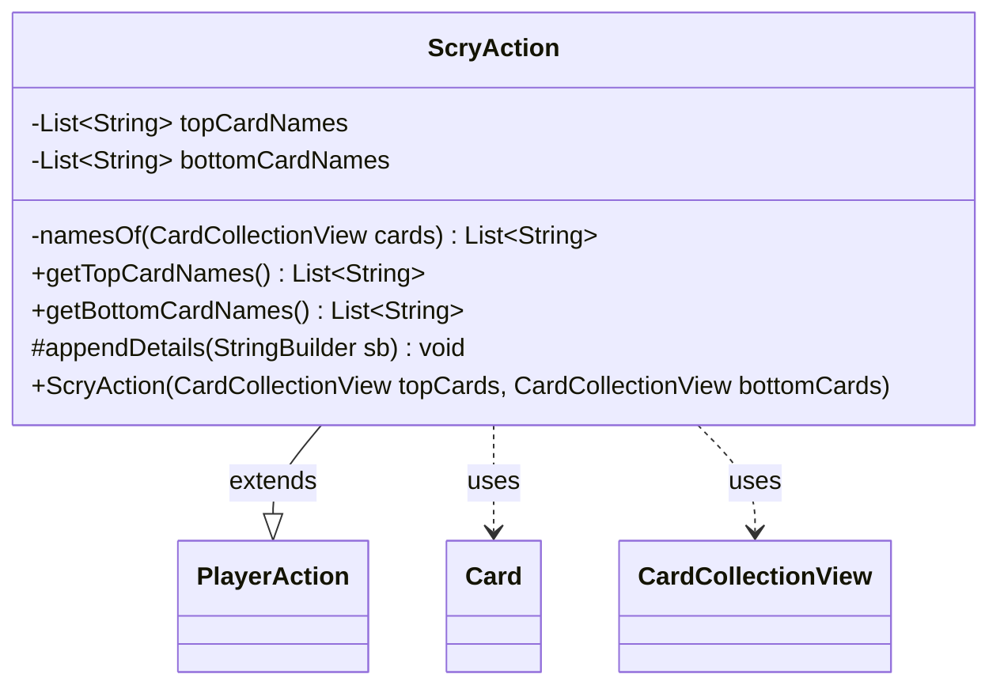

---
aliases:
  - ScryAction
tags:
  - java/class
  - module/forge-game
  - pkg/forge/game/player/actions
fqn: forge.game.player.actions.ScryAction
package: forge.game.player.actions
module: forge-game
kind: Class
---

# ScryAction

**Package:** `forge.game.player.actions` &nbsp; **Module:** `forge-game` &nbsp; **Kind:** Class



## Relationships
**Extends:**
- [[forge.game.player.actions.PlayerAction|PlayerAction]]
**Uses:**
- [[forge.game.card.Card|Card]]
- [[forge.game.card.CardCollectionView|CardCollectionView]]

## Source
`forge-game/src/main/java/forge/game/player/actions/ScryAction.java`

```java
package forge.game.player.actions;

import forge.game.card.Card;
import forge.game.card.CardCollectionView;

import java.util.ArrayList;
import java.util.Collections;
import java.util.List;

public class ScryAction extends PlayerAction {
    private final List<String> topCardNames;
    private final List<String> bottomCardNames;

    public ScryAction(final CardCollectionView topCards, final CardCollectionView bottomCards) {
        super(null, "Scry");
        this.topCardNames = namesOf(topCards);
        this.bottomCardNames = namesOf(bottomCards);
    }

    private static List<String> namesOf(final CardCollectionView cards) {
        if (cards == null || cards.isEmpty()) {
            return Collections.emptyList();
        }
        final List<String> names = new ArrayList<>();
        for (final Card card : cards) {
            names.add(card.getName());
        }
        return names;
    }

    public List<String> getTopCardNames() {
        return topCardNames;
    }

    public List<String> getBottomCardNames() {
        return bottomCardNames;
    }

    @Override
    protected void appendDetails(final StringBuilder sb) {
        sb.append(" top=").append(topCardNames);
        sb.append(" bottom=").append(bottomCardNames);
    }
}
```
