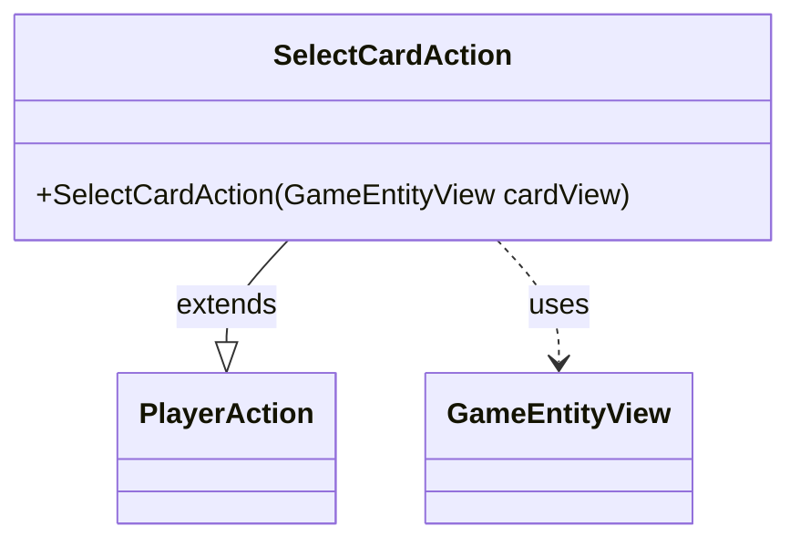

---
aliases:
  - SelectCardAction
tags:
  - java/class
  - module/forge-game
  - pkg/forge/game/player/actions
fqn: forge.game.player.actions.SelectCardAction
package: forge.game.player.actions
module: forge-game
kind: Class
---

# SelectCardAction

**Package:** `forge.game.player.actions` &nbsp; **Module:** `forge-game` &nbsp; **Kind:** Class



## Relationships
**Extends:**
- [[forge.game.player.actions.PlayerAction|PlayerAction]]
**Uses:**
- [[forge.game.GameEntityView|GameEntityView]]

## Design Description

SelectCardAction is a concrete player action representing a request for the player to select a card or game entity. As a subclass of PlayerAction, it inherits the shared action state and behavior, specializing it only by supplying a fixed "Select card" label to the superclass constructor along with the targeted entity. It collaborates with GameEntityView, the view-layer abstraction for a card or other game object, accepting one through its constructor to identify the selection target. The design intent is minimal: the class adds no new fields or logic, serving purely as a named, self-labeling specialization within the PlayerAction hierarchy so that select-card interactions can be modeled and dispatched as a distinct action type.

## Source
`forge-game/src/main/java/forge/game/player/actions/SelectCardAction.java`

```java
package forge.game.player.actions;

import forge.game.GameEntityView;

public class SelectCardAction extends PlayerAction{
    public SelectCardAction(GameEntityView cardView) {
        super(cardView, "Select card");
    }


}
```

## Python
`forge/game/player/actions/SelectCardAction.py`

```python
package SelectCardAction

from forge.game.player.actions.PlayerAction import PlayerAction
from forge.game.GameEntityView import GameEntityView


class SelectCardAction(PlayerAction):
    def __init__(self, cardView: GameEntityView):
        super().__init__(cardView, "Select card")
```
