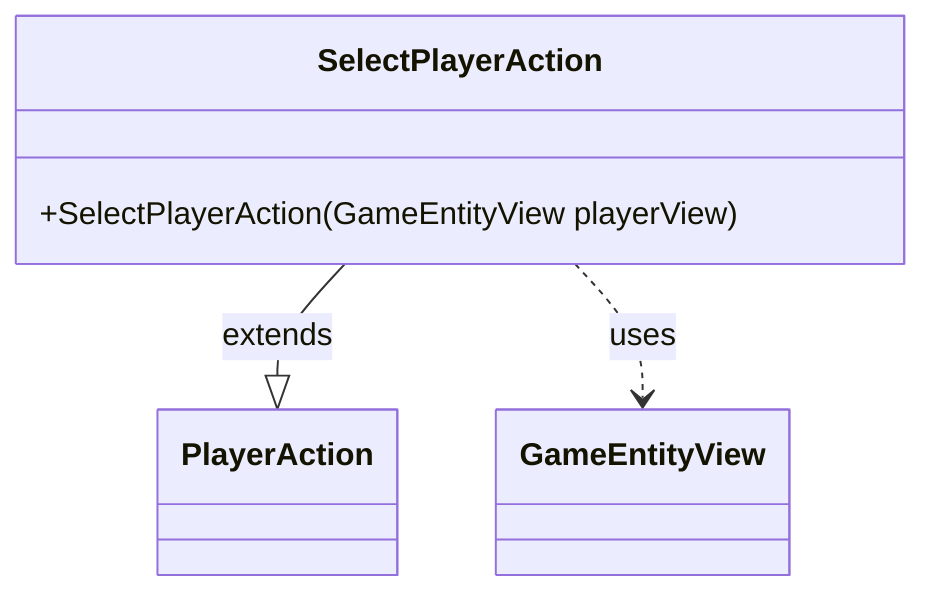

---
aliases:
  - SelectPlayerAction
tags:
  - java/class
  - module/forge-game
  - pkg/forge/game/player/actions
fqn: forge.game.player.actions.SelectPlayerAction
package: forge.game.player.actions
module: forge-game
kind: Class
---

# SelectPlayerAction

**Package:** `forge.game.player.actions`   **Module:** `forge-game`   **Kind:** Class



## Relationships
**Extends:**
- [[forge.game.player.actions.PlayerAction|PlayerAction]]
**Uses:**
- [[forge.game.GameEntityView|GameEntityView]]

## Design Description

SelectPlayerAction is a concrete command object representing the player's act of choosing a target player in the Forge game engine. It extends `PlayerAction`, supplying the fixed label "Select player" and the chosen entity to the superclass constructor, so it carries no behavior of its own beyond specialization.

The class collaborates with `GameEntityView`, the view-layer abstraction passed in at construction, keeping the action decoupled from the underlying game model and tied only to presentation-safe references. Its minimal, immutable design—a single constructor delegating entirely to the parent—reflects an intent to model distinct player interactions as lightweight, self-describing subtypes within a shared `PlayerAction` hierarchy.

## Source
`forge-game/src/main/java/forge/game/player/actions/SelectPlayerAction.java`

```java
package forge.game.player.actions;

import forge.game.GameEntityView;

public class SelectPlayerAction extends PlayerAction {
    public SelectPlayerAction(GameEntityView playerView) {
        super(playerView, "Select player");
    }

}
```

## Python
`forge/game/player/actions/SelectPlayerAction.py`

```python
from forge.game.GameEntityView import GameEntityView
from forge.game.player.actions.PlayerAction import PlayerAction


class SelectPlayerAction(PlayerAction):
    def __init__(self, playerView: GameEntityView):
        super().__init__(playerView, "Select player")
```
