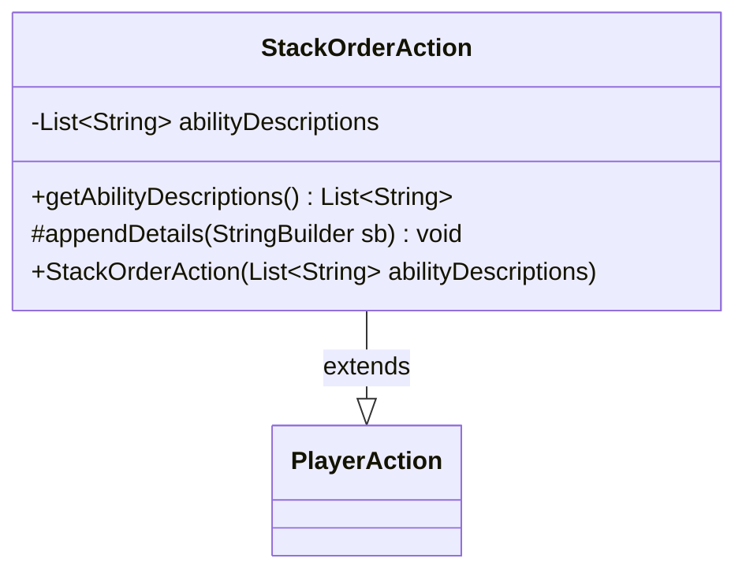

---
aliases:
  - StackOrderAction
tags:
  - java/class
  - module/forge-game
  - pkg/forge/game/player/actions
fqn: forge.game.player.actions.StackOrderAction
package: forge.game.player.actions
module: forge-game
kind: Class
---

# StackOrderAction

**Package:** `forge.game.player.actions`   **Module:** `forge-game`   **Kind:** Class



## Relationships
**Extends:**
- [[forge.game.player.actions.PlayerAction|PlayerAction]]

## Design Description

StackOrderAction is a concrete command/event object representing the player decision to order a set of simultaneously-triggered abilities on the stack. As a subclass of PlayerAction, it inherits the action's identity—initialized with a null source and the fixed label "Order simultaneous abilities"—while carrying the specific payload it adds: an immutable list of ability descriptions captured at construction and exposed read-only via getAbilityDescriptions(). It overrides the protected appendDetails hook to contribute its own state (the ordered descriptions) to the textual representation assembled by the parent, following a template-method pattern where PlayerAction controls the overall formatting and each subclass supplies its distinguishing details. The use of a final field and constructor-supplied data signals an intentionally lightweight, immutable value object describing one discrete player choice.

## Source
`forge-game/src/main/java/forge/game/player/actions/StackOrderAction.java`

```java
package forge.game.player.actions;

import java.util.List;

public class StackOrderAction extends PlayerAction {
    private final List<String> abilityDescriptions;

    public StackOrderAction(final List<String> abilityDescriptions) {
        super(null, "Order simultaneous abilities");
        this.abilityDescriptions = abilityDescriptions;
    }

    public List<String> getAbilityDescriptions() {
        return abilityDescriptions;
    }

    @Override
    protected void appendDetails(final StringBuilder sb) {
        sb.append(" order=").append(abilityDescriptions);
    }
}
```

## Python
`forge/game/player/actions/StackOrderAction.py`

```python
from forge.game.player.actions.PlayerAction import PlayerAction


class StackOrderAction(PlayerAction):
    def __init__(self, abilityDescriptions: list[str]):
        super().__init__(None, "Order simultaneous abilities")
        self.abilityDescriptions = abilityDescriptions

    def getAbilityDescriptions(self) -> list[str]:
        return self.abilityDescriptions

    def appendDetails(self, sb) -> None:
        sb.append(" order=").append(self.abilityDescriptions)
```
