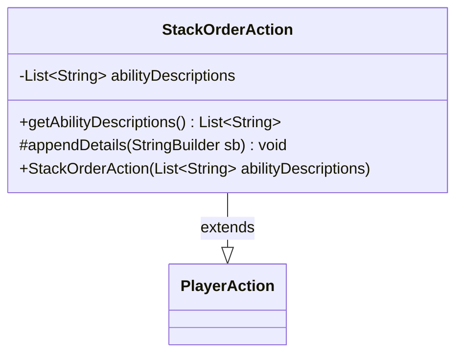

---
aliases:
  - StackOrderAction
tags:
  - java/class
  - module/forge-game
  - pkg/forge/game/player/actions
fqn: forge.game.player.actions.StackOrderAction
package: forge.game.player.actions
module: forge-game
kind: Class
---

# StackOrderAction

**Package:** `forge.game.player.actions` &nbsp; **Module:** `forge-game` &nbsp; **Kind:** Class



## Relationships
**Extends:**
- [[forge.game.player.actions.PlayerAction|PlayerAction]]

## Source
`forge-game/src/main/java/forge/game/player/actions/StackOrderAction.java`

```java
package forge.game.player.actions;

import java.util.List;

public class StackOrderAction extends PlayerAction {
    private final List<String> abilityDescriptions;

    public StackOrderAction(final List<String> abilityDescriptions) {
        super(null, "Order simultaneous abilities");
        this.abilityDescriptions = abilityDescriptions;
    }

    public List<String> getAbilityDescriptions() {
        return abilityDescriptions;
    }

    @Override
    protected void appendDetails(final StringBuilder sb) {
        sb.append(" order=").append(abilityDescriptions);
    }
}
```
