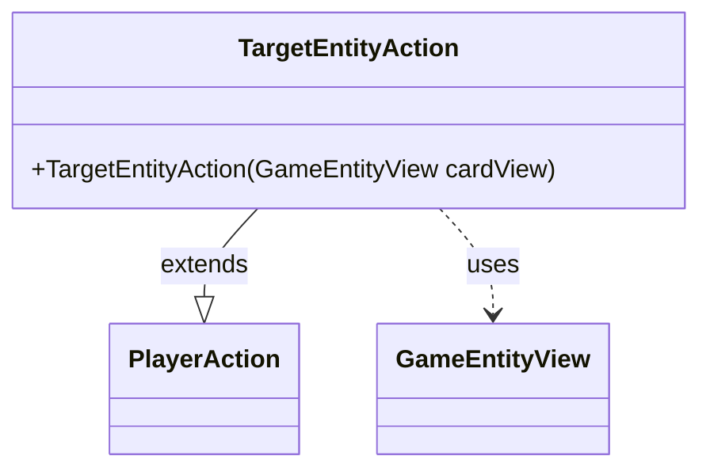

---
aliases:
  - TargetEntityAction
tags:
  - java/class
  - module/forge-game
  - pkg/forge/game/player/actions
fqn: forge.game.player.actions.TargetEntityAction
package: forge.game.player.actions
module: forge-game
kind: Class
---

# TargetEntityAction

**Package:** `forge.game.player.actions`   **Module:** `forge-game`   **Kind:** Class



## Relationships
**Extends:**
- [[forge.game.player.actions.PlayerAction|PlayerAction]]
**Uses:**
- [[forge.game.GameEntityView|GameEntityView]]

## Design Description

TargetEntityAction is a concrete command object that represents a player's choice to target a game entity—any card, player, or other targetable object—during gameplay. It extends PlayerAction, inheriting the common action structure and supplying the fixed label "Target game entity" along with the specific entity view to its superclass constructor. By collaborating with GameEntityView rather than the underlying game model, it operates on the view layer, keeping the action decoupled from core game state and suitable for UI-driven or serialized decision flows. Its sole responsibility is constructing this targeting action; the TODO note for distribution of damage and counters signals that finer-grained targeting semantics remain a planned extension, consistent with its current minimal, single-purpose design.

## Source
`forge-game/src/main/java/forge/game/player/actions/TargetEntityAction.java`

```java
package forge.game.player.actions;

import forge.game.GameEntityView;

public class TargetEntityAction extends PlayerAction {
    // TODO Add distribution damage/counters
    public TargetEntityAction(GameEntityView cardView) {
        super(cardView, "Target game entity");
    }
}
```

## Python
`forge/game/player/actions/TargetEntityAction.py`

```python
from forge.game.player.actions.PlayerAction import PlayerAction
from forge.game.GameEntityView import GameEntityView


class TargetEntityAction(PlayerAction):
    # TODO Add distribution damage/counters
    def __init__(self, cardView: GameEntityView):
        super().__init__(cardView, "Target game entity")
```
