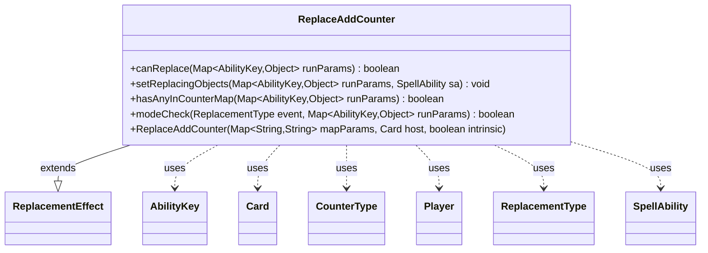

---
aliases:
  - ReplaceAddCounter
tags:
  - java/class
  - module/forge-game
  - pkg/forge/game/replacement
fqn: forge.game.replacement.ReplaceAddCounter
package: forge.game.replacement
module: forge-game
kind: Class
---

# ReplaceAddCounter

**Package:** `forge.game.replacement` &nbsp; **Module:** `forge-game` &nbsp; **Kind:** Class



## Relationships
**Extends:**
- [[forge.game.replacement.ReplacementEffect|ReplacementEffect]]
**Uses:**
- [[forge.game.ability.AbilityKey|AbilityKey]]
- [[forge.game.card.Card|Card]]
- [[forge.game.card.CounterType|CounterType]]
- [[forge.game.player.Player|Player]]
- [[forge.game.replacement.ReplacementType|ReplacementType]]
- [[forge.game.spellability.SpellAbility|SpellAbility]]

## Source
`forge-game/src/main/java/forge/game/replacement/ReplaceAddCounter.java`

```java
package forge.game.replacement;

import java.util.Map;
import java.util.Objects;
import java.util.Optional;

import forge.game.ability.AbilityKey;
import forge.game.card.Card;
import forge.game.card.CounterType;
import forge.game.player.Player;
import forge.game.spellability.SpellAbility;

/**
 * TODO: Write javadoc for this type.
 *
 */
public class ReplaceAddCounter extends ReplacementEffect {

    /**
     *
     * ReplaceProduceMana.
     * @param mapParams &emsp; HashMap<String, String>
     * @param host &emsp; Card
     */
    public ReplaceAddCounter(final Map<String, String> mapParams, final Card host, final boolean intrinsic) {
        super(mapParams, host, intrinsic);
    }

    /* (non-Javadoc)
     * @see forge.card.replacement.ReplacementEffect#canReplace(java.util.HashMap)
     */
    @Override
    public boolean canReplace(Map<AbilityKey, Object> runParams) {
        if (hasParam("EffectOnly")) {
            final Boolean effectOnly = (Boolean) runParams.get(AbilityKey.EffectOnly);
            if (!effectOnly) {
                return false;
            }
        }

        if (!matchesValidParam("ValidCard", runParams.get(AbilityKey.Affected))) {
            return false;
        }
        if (!matchesValidParam("ValidPlayer", runParams.get(AbilityKey.Affected))) {
            return false;
        }
        if (!matchesValidParam("ValidObject", runParams.get(AbilityKey.Affected))) {
            return false;
        }

        if (!matchesValidParam("ValidCause", runParams.get(AbilityKey.Cause))) {
            return false;
        }

        if (!hasAnyInCounterMap(runParams)) {
            return false;
        }

        if (runParams.containsKey(AbilityKey.Destination) && !canReplaceETB(runParams)) {
            return false;
        }

        return true;
    }

    /* (non-Javadoc)
     * @see forge.card.replacement.ReplacementEffect#setReplacingObjects(java.util.HashMap, forge.card.spellability.SpellAbility)
     */
    @Override
    public void setReplacingObjects(Map<AbilityKey, Object> runParams, SpellAbility sa) {
        sa.setReplacingObject(AbilityKey.CounterMap, runParams.get(AbilityKey.CounterMap));
        Object o = runParams.get(AbilityKey.Affected);
        if (o instanceof Card) {
            sa.setReplacingObject(AbilityKey.Card, o);
        } else if (o instanceof Player) {
            sa.setReplacingObject(AbilityKey.Player, o);
        }
        sa.setReplacingObject(AbilityKey.Object, o);
    }

    public boolean hasAnyInCounterMap(Map<AbilityKey, Object> runParams) {
        @SuppressWarnings("unchecked")
        Map<Optional<Player>, Map<CounterType, Integer>> counterMap = (Map<Optional<Player>, Map<CounterType, Integer>>) runParams.get(AbilityKey.CounterMap);

        for (Map.Entry<Optional<Player>, Map<CounterType, Integer>> e : counterMap.entrySet()) {
            if (!matchesValidParam("ValidSource", e.getKey().orElse(null))) {
                continue;
            }
            if (hasParam("ValidCounterType")) {
                CounterType ct = CounterType.getType(getParam("ValidCounterType"));
                if (!e.getValue().containsKey(ct)) {
                    continue;
                }
                if (0 >= Objects.requireNonNullElse(e.getValue().get(ct), 0)) {
                    continue;
                }
                return true;
            }
            for (int i : e.getValue().values()) {
                if (i > 0) {
                    return true;
                }
            }
        }

        return false;
    }

    @Override
    public boolean modeCheck(ReplacementType event, Map<AbilityKey, Object> runParams) {
        if (super.modeCheck(event, runParams)) {
            return true;
        }
        if (event.equals(ReplacementType.Moved) && runParams.containsKey(AbilityKey.CounterMap)) {
            return true;
        }
        return false;
    }
}
```
