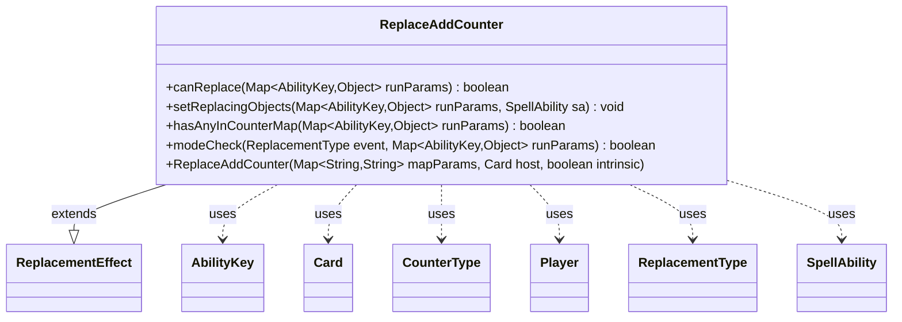

---
aliases:
  - ReplaceAddCounter
tags:
  - java/class
  - module/forge-game
  - pkg/forge/game/replacement
fqn: forge.game.replacement.ReplaceAddCounter
package: forge.game.replacement
module: forge-game
kind: Class
---

# ReplaceAddCounter

**Package:** `forge.game.replacement` &nbsp; **Module:** `forge-game` &nbsp; **Kind:** Class



## Relationships
**Extends:**
- [[forge.game.replacement.ReplacementEffect|ReplacementEffect]]
**Uses:**
- [[forge.game.ability.AbilityKey|AbilityKey]]
- [[forge.game.card.Card|Card]]
- [[forge.game.card.CounterType|CounterType]]
- [[forge.game.player.Player|Player]]
- [[forge.game.replacement.ReplacementType|ReplacementType]]
- [[forge.game.spellability.SpellAbility|SpellAbility]]

## Design Description

ReplaceAddCounter is a concrete replacement effect that intercepts attempts to place counters on cards or players, allowing card abilities to substitute or modify the counter-adding event. Extending `ReplacementEffect`, it overrides `canReplace` to gate firing on the standard valid-target parameters (`ValidCard`, `ValidPlayer`, `ValidObject`, `ValidCause`), an optional ETB destination check, and the presence of qualifying counters; `setReplacingObjects` then exposes the counter map and affected object (typed as `Card` or `Player`) to the triggered `SpellAbility`.

Its central design intent lives in `hasAnyInCounterMap`, which walks the nested `Map<Optional<Player>, Map<CounterType, Integer>>` counter map to confirm at least one positive counter matches the configured `ValidSource` and optional `ValidCounterType`. The overridden `modeCheck` additionally treats `Moved` events carrying a counter map as applicable, letting the effect catch counters added during zone changes. It collaborates closely with `AbilityKey`, `CounterType`, and `ReplacementType` to read and classify the game's runtime parameters.

## Source
`forge-game/src/main/java/forge/game/replacement/ReplaceAddCounter.java`

```java
package forge.game.replacement;

import java.util.Map;
import java.util.Objects;
import java.util.Optional;

import forge.game.ability.AbilityKey;
import forge.game.card.Card;
import forge.game.card.CounterType;
import forge.game.player.Player;
import forge.game.spellability.SpellAbility;

/**
 * TODO: Write javadoc for this type.
 *
 */
public class ReplaceAddCounter extends ReplacementEffect {

    /**
     *
     * ReplaceProduceMana.
     * @param mapParams &emsp; HashMap<String, String>
     * @param host &emsp; Card
     */
    public ReplaceAddCounter(final Map<String, String> mapParams, final Card host, final boolean intrinsic) {
        super(mapParams, host, intrinsic);
    }

    /* (non-Javadoc)
     * @see forge.card.replacement.ReplacementEffect#canReplace(java.util.HashMap)
     */
    @Override
    public boolean canReplace(Map<AbilityKey, Object> runParams) {
        if (hasParam("EffectOnly")) {
            final Boolean effectOnly = (Boolean) runParams.get(AbilityKey.EffectOnly);
            if (!effectOnly) {
                return false;
            }
        }

        if (!matchesValidParam("ValidCard", runParams.get(AbilityKey.Affected))) {
            return false;
        }
        if (!matchesValidParam("ValidPlayer", runParams.get(AbilityKey.Affected))) {
            return false;
        }
        if (!matchesValidParam("ValidObject", runParams.get(AbilityKey.Affected))) {
            return false;
        }

        if (!matchesValidParam("ValidCause", runParams.get(AbilityKey.Cause))) {
            return false;
        }

        if (!hasAnyInCounterMap(runParams)) {
            return false;
        }

        if (runParams.containsKey(AbilityKey.Destination) && !canReplaceETB(runParams)) {
            return false;
        }

        return true;
    }

    /* (non-Javadoc)
     * @see forge.card.replacement.ReplacementEffect#setReplacingObjects(java.util.HashMap, forge.card.spellability.SpellAbility)
     */
    @Override
    public void setReplacingObjects(Map<AbilityKey, Object> runParams, SpellAbility sa) {
        sa.setReplacingObject(AbilityKey.CounterMap, runParams.get(AbilityKey.CounterMap));
        Object o = runParams.get(AbilityKey.Affected);
        if (o instanceof Card) {
            sa.setReplacingObject(AbilityKey.Card, o);
        } else if (o instanceof Player) {
            sa.setReplacingObject(AbilityKey.Player, o);
        }
        sa.setReplacingObject(AbilityKey.Object, o);
    }

    public boolean hasAnyInCounterMap(Map<AbilityKey, Object> runParams) {
        @SuppressWarnings("unchecked")
        Map<Optional<Player>, Map<CounterType, Integer>> counterMap = (Map<Optional<Player>, Map<CounterType, Integer>>) runParams.get(AbilityKey.CounterMap);

        for (Map.Entry<Optional<Player>, Map<CounterType, Integer>> e : counterMap.entrySet()) {
            if (!matchesValidParam("ValidSource", e.getKey().orElse(null))) {
                continue;
            }
            if (hasParam("ValidCounterType")) {
                CounterType ct = CounterType.getType(getParam("ValidCounterType"));
                if (!e.getValue().containsKey(ct)) {
                    continue;
                }
                if (0 >= Objects.requireNonNullElse(e.getValue().get(ct), 0)) {
                    continue;
                }
                return true;
            }
            for (int i : e.getValue().values()) {
                if (i > 0) {
                    return true;
                }
            }
        }

        return false;
    }

    @Override
    public boolean modeCheck(ReplacementType event, Map<AbilityKey, Object> runParams) {
        if (super.modeCheck(event, runParams)) {
            return true;
        }
        if (event.equals(ReplacementType.Moved) && runParams.containsKey(AbilityKey.CounterMap)) {
            return true;
        }
        return false;
    }
}
```

## Python
`forge/game/replacement/ReplaceAddCounter.py`

```python
package forge.game.replacement;

from typing import Optional

from forge.game.ability.AbilityKey import AbilityKey
from forge.game.card.Card import Card
from forge.game.card.CounterType import CounterType
from forge.game.player.Player import Player
from forge.game.spellability.SpellAbility import SpellAbility
from forge.game.replacement.ReplacementEffect import ReplacementEffect
from forge.game.replacement.ReplacementType import ReplacementType


# TODO: Write javadoc for this type.
class ReplaceAddCounter(ReplacementEffect):

    #
    # ReplaceProduceMana.
    # @param mapParams &emsp; HashMap<String, String>
    # @param host &emsp; Card
    def __init__(self, mapParams: dict[str, str], host: Card, intrinsic: bool):
        super().__init__(mapParams, host, intrinsic)

    def canReplace(self, runParams: dict[AbilityKey, object]) -> bool:
        if self.hasParam("EffectOnly"):
            effectOnly = runParams.get(AbilityKey.EffectOnly)
            if not effectOnly:
                return False

        if not self.matchesValidParam("ValidCard", runParams.get(AbilityKey.Affected)):
            return False
        if not self.matchesValidParam("ValidPlayer", runParams.get(AbilityKey.Affected)):
            return False
        if not self.matchesValidParam("ValidObject", runParams.get(AbilityKey.Affected)):
            return False

        if not self.matchesValidParam("ValidCause", runParams.get(AbilityKey.Cause)):
            return False

        if not self.hasAnyInCounterMap(runParams):
            return False

        if AbilityKey.Destination in runParams and not self.canReplaceETB(runParams):
            return False

        return True

    def setReplacingObjects(self, runParams: dict[AbilityKey, object], sa: SpellAbility) -> None:
        sa.setReplacingObject(AbilityKey.CounterMap, runParams.get(AbilityKey.CounterMap))
        o = runParams.get(AbilityKey.Affected)
        if isinstance(o, Card):
            sa.setReplacingObject(AbilityKey.Card, o)
        elif isinstance(o, Player):
            sa.setReplacingObject(AbilityKey.Player, o)
        sa.setReplacingObject(AbilityKey.Object, o)

    def hasAnyInCounterMap(self, runParams: dict[AbilityKey, object]) -> bool:
        counterMap: dict[Optional[Player], dict[CounterType, int]] = runParams.get(AbilityKey.CounterMap)

        for key, value in counterMap.items():
            if not self.matchesValidParam("ValidSource", key if key is not None else None):
                continue
            if self.hasParam("ValidCounterType"):
                ct = CounterType.getType(self.getParam("ValidCounterType"))
                if ct not in value:
                    continue
                if 0 >= (value.get(ct) if value.get(ct) is not None else 0):
                    continue
                return True
            for i in value.values():
                if i > 0:
                    return True

        return False

    def modeCheck(self, event: ReplacementType, runParams: dict[AbilityKey, object]) -> bool:
        if super().modeCheck(event, runParams):
            return True
        if event == ReplacementType.Moved and AbilityKey.CounterMap in runParams:
            return True
        return False
```
