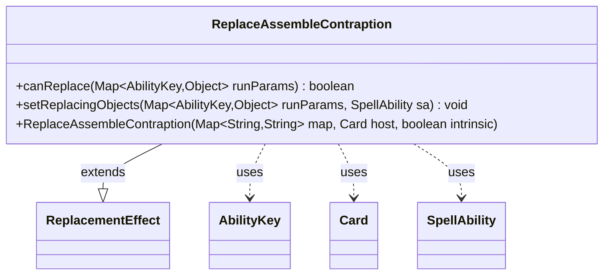

---
aliases:
  - ReplaceAssembleContraption
tags:
  - java/class
  - module/forge-game
  - pkg/forge/game/replacement
fqn: forge.game.replacement.ReplaceAssembleContraption
package: forge.game.replacement
module: forge-game
kind: Class
---

# ReplaceAssembleContraption

**Package:** `forge.game.replacement` &nbsp; **Module:** `forge-game` &nbsp; **Kind:** Class



## Relationships
**Extends:**
- [[forge.game.replacement.ReplacementEffect|ReplacementEffect]]
**Uses:**
- [[forge.game.ability.AbilityKey|AbilityKey]]
- [[forge.game.card.Card|Card]]
- [[forge.game.spellability.SpellAbility|SpellAbility]]

## Source
`forge-game/src/main/java/forge/game/replacement/ReplaceAssembleContraption.java`

```java
package forge.game.replacement;

import forge.game.ability.AbilityKey;
import forge.game.card.Card;
import forge.game.spellability.SpellAbility;

import java.util.Map;

public class ReplaceAssembleContraption extends ReplacementEffect {

    public ReplaceAssembleContraption(Map<String, String> map, Card host, boolean intrinsic) {
        super(map, host, intrinsic);
    }

    @Override
    public boolean canReplace(Map<AbilityKey, Object> runParams) {
        if (!matchesValidParam("ValidPlayer", runParams.get(AbilityKey.Player))) {
            return false;
        }
        if (!matchesValidParam("ValidCause", runParams.get(AbilityKey.Cause))) {
            return false;
        }

        return true;
    }

    @Override
    public void setReplacingObjects(Map<AbilityKey, Object> runParams, SpellAbility sa) {
        sa.setReplacingObject(AbilityKey.Player, runParams.get(AbilityKey.Player));
        sa.setReplacingObject(AbilityKey.Cause, runParams.get(AbilityKey.Cause));
    }
}
```
