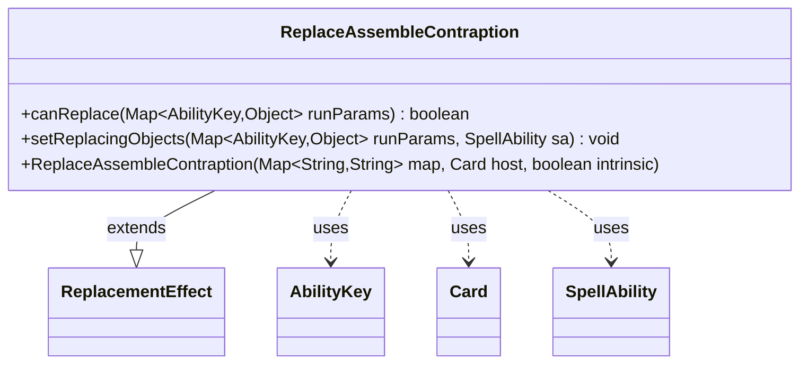

---
aliases:
  - ReplaceAssembleContraption
tags:
  - java/class
  - module/forge-game
  - pkg/forge/game/replacement
fqn: forge.game.replacement.ReplaceAssembleContraption
package: forge.game.replacement
module: forge-game
kind: Class
---

# ReplaceAssembleContraption

**Package:** `forge.game.replacement`   **Module:** `forge-game`   **Kind:** Class



## Relationships
**Extends:**
- [[forge.game.replacement.ReplacementEffect|ReplacementEffect]]
**Uses:**
- [[forge.game.ability.AbilityKey|AbilityKey]]
- [[forge.game.card.Card|Card]]
- [[forge.game.spellability.SpellAbility|SpellAbility]]

## Design Description

Assemble Contraption is a replacement effect that intercepts the "assemble a Contraption" game event so a card can substitute its own behavior. Subclassing `ReplacementEffect`, it is built from the standard XML parameter map, host `Card`, and intrinsic flag, then plugged into Forge's replacement pipeline.

Its `canReplace` gates the substitution by matching the triggering `Player` and `Cause` against the effect's `ValidPlayer` and `ValidCause` parameters via the inherited validation helper, and `setReplacingObjects` copies those `AbilityKey` entries onto the `SpellAbility` so the replacement script can reference them. The design keeps the class deliberately thin—delegating construction and matching to the superclass and merely declaring which run parameters are relevant—reflecting Forge's data-driven, key-based event model.

## Source
`forge-game/src/main/java/forge/game/replacement/ReplaceAssembleContraption.java`

```java
package forge.game.replacement;

import forge.game.ability.AbilityKey;
import forge.game.card.Card;
import forge.game.spellability.SpellAbility;

import java.util.Map;

public class ReplaceAssembleContraption extends ReplacementEffect {

    public ReplaceAssembleContraption(Map<String, String> map, Card host, boolean intrinsic) {
        super(map, host, intrinsic);
    }

    @Override
    public boolean canReplace(Map<AbilityKey, Object> runParams) {
        if (!matchesValidParam("ValidPlayer", runParams.get(AbilityKey.Player))) {
            return false;
        }
        if (!matchesValidParam("ValidCause", runParams.get(AbilityKey.Cause))) {
            return false;
        }

        return true;
    }

    @Override
    public void setReplacingObjects(Map<AbilityKey, Object> runParams, SpellAbility sa) {
        sa.setReplacingObject(AbilityKey.Player, runParams.get(AbilityKey.Player));
        sa.setReplacingObject(AbilityKey.Cause, runParams.get(AbilityKey.Cause));
    }
}
```

## Python
`forge/game/replacement/ReplaceAssembleContraption.py`

```python
from forge.game.replacement.ReplacementEffect import ReplacementEffect
from forge.game.ability.AbilityKey import AbilityKey
from forge.game.card.Card import Card
from forge.game.spellability.SpellAbility import SpellAbility


class ReplaceAssembleContraption(ReplacementEffect):

    def __init__(self, map: dict[str, str], host: Card, intrinsic: bool):
        super().__init__(map, host, intrinsic)

    def canReplace(self, runParams: dict[AbilityKey, object]) -> bool:
        if not self.matchesValidParam("ValidPlayer", runParams.get(AbilityKey.Player)):
            return False
        if not self.matchesValidParam("ValidCause", runParams.get(AbilityKey.Cause)):
            return False

        return True

    def setReplacingObjects(self, runParams: dict[AbilityKey, object], sa: SpellAbility) -> None:
        sa.setReplacingObject(AbilityKey.Player, runParams.get(AbilityKey.Player))
        sa.setReplacingObject(AbilityKey.Cause, runParams.get(AbilityKey.Cause))
```
