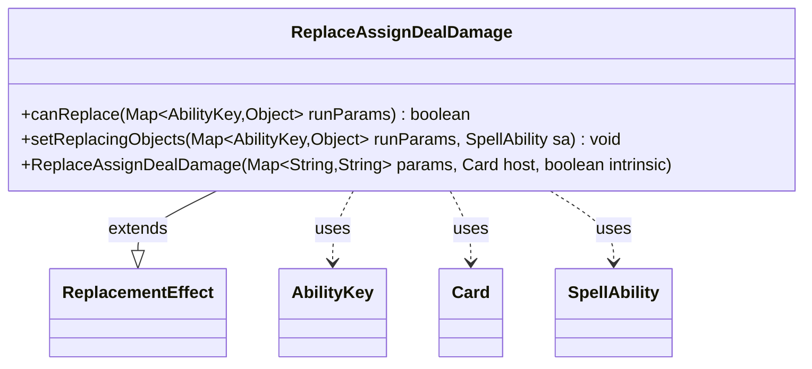

---
aliases:
  - ReplaceAssignDealDamage
tags:
  - java/class
  - module/forge-game
  - pkg/forge/game/replacement
fqn: forge.game.replacement.ReplaceAssignDealDamage
package: forge.game.replacement
module: forge-game
kind: Class
---

# ReplaceAssignDealDamage

**Package:** `forge.game.replacement` &nbsp; **Module:** `forge-game` &nbsp; **Kind:** Class



## Relationships
**Extends:**
- [[forge.game.replacement.ReplacementEffect|ReplacementEffect]]
**Uses:**
- [[forge.game.ability.AbilityKey|AbilityKey]]
- [[forge.game.card.Card|Card]]
- [[forge.game.spellability.SpellAbility|SpellAbility]]

## Design Description

ReplaceAssignDealDamage is a replacement effect that intercepts the assignment of combat or ability damage for a designated card, allowing the engine's rules system to redirect or substitute the damaged object during resolution. As a concrete subclass of `ReplacementEffect`, it overrides `canReplace` to gate activation on a `ValidCard` predicate matched against the affected card, and `setReplacingObjects` to expose the affected card under the `AbilityKey.Card` slot so dependent spell abilities can reference it.

It collaborates with `AbilityKey` to read and write the typed parameter map shared across the replacement pipeline, with `Card` as its host context, and with `SpellAbility` as the effect whose replacing object it populates. The design follows the framework's lightweight, declarative pattern: behavior is configured entirely through the inherited string-parameter map and validation helpers, keeping the class a thin, data-driven specialization rather than carrying custom replacement logic of its own.

## Source
`forge-game/src/main/java/forge/game/replacement/ReplaceAssignDealDamage.java`

```java
package forge.game.replacement;

import java.util.Map;

import forge.game.ability.AbilityKey;
import forge.game.card.Card;
import forge.game.spellability.SpellAbility;

/**
 * TODO: Write javadoc for this type.
 *
 */
public class ReplaceAssignDealDamage extends ReplacementEffect {

    /**
     * Instantiates a new replace tap.
     *
     * @param params the params
     * @param host the host
     */
    public ReplaceAssignDealDamage(final Map<String, String> params, final Card host, final boolean intrinsic) {
        super(params, host, intrinsic);
    }

    /* (non-Javadoc)
     * @see forge.card.replacement.ReplacementEffect#canReplace(java.util.HashMap)
     */
    @Override
    public boolean canReplace(Map<AbilityKey, Object> runParams) {
        if (!matchesValidParam("ValidCard", runParams.get(AbilityKey.Affected))) {
            return false;
        }

        return true;
    }

    /* (non-Javadoc)
     * @see forge.card.replacement.ReplacementEffect#setReplacingObjects(java.util.HashMap, forge.card.spellability.SpellAbility)
     */
    @Override
    public void setReplacingObjects(Map<AbilityKey, Object> runParams, SpellAbility sa) {
        sa.setReplacingObject(AbilityKey.Card, runParams.get(AbilityKey.Affected));
    }

}
```

## Python
`forge/game/replacement/ReplaceAssignDealDamage.py`

```python
from forge.game.replacement.ReplacementEffect import ReplacementEffect
from forge.game.ability.AbilityKey import AbilityKey
from forge.game.card.Card import Card
from forge.game.spellability.SpellAbility import SpellAbility


# TODO: Write javadoc for this type.
class ReplaceAssignDealDamage(ReplacementEffect):

    def __init__(self, params: dict[str, str], host: Card, intrinsic: bool):
        """Instantiates a new replace tap.

        :param params: the params
        :param host: the host
        """
        super().__init__(params, host, intrinsic)

    def canReplace(self, runParams: dict[AbilityKey, object]) -> bool:
        if not self.matchesValidParam("ValidCard", runParams.get(AbilityKey.Affected)):
            return False

        return True

    def setReplacingObjects(self, runParams: dict[AbilityKey, object], sa: SpellAbility) -> None:
        sa.setReplacingObject(AbilityKey.Card, runParams.get(AbilityKey.Affected))
```
