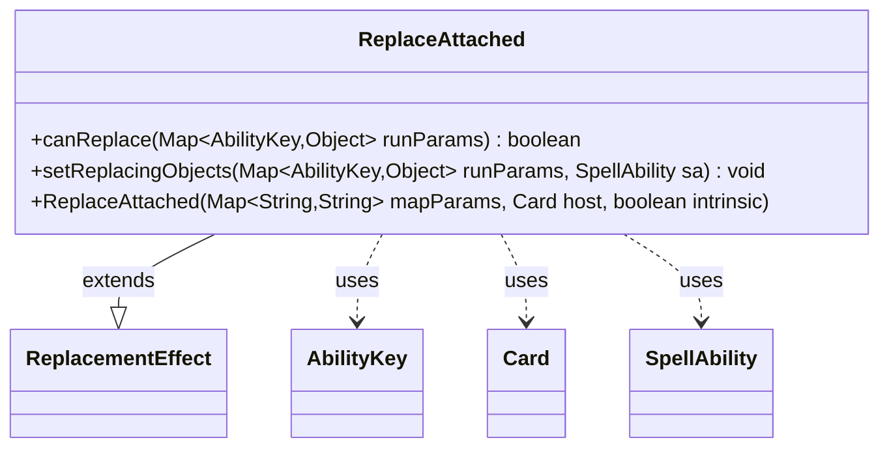

---
aliases:
  - ReplaceAttached
tags:
  - java/class
  - module/forge-game
  - pkg/forge/game/replacement
fqn: forge.game.replacement.ReplaceAttached
package: forge.game.replacement
module: forge-game
kind: Class
---

# ReplaceAttached

**Package:** `forge.game.replacement` &nbsp; **Module:** `forge-game` &nbsp; **Kind:** Class



## Relationships
**Extends:**
- [[forge.game.replacement.ReplacementEffect|ReplacementEffect]]
**Uses:**
- [[forge.game.ability.AbilityKey|AbilityKey]]
- [[forge.game.card.Card|Card]]
- [[forge.game.spellability.SpellAbility|SpellAbility]]

## Design Description

ReplaceAttached is a concrete replacement-effect handler that intercepts the attachment of one object to another, allowing the game engine to substitute the effect when an Aura, Equipment, or similar permanent becomes attached. As a subclass of `ReplacementEffect`, it specializes the framework's template methods: `canReplace` gates the effect by matching the configured `ValidCard` and `ValidTarget` parameters against the `Affected` and `AttachTarget` entries of the run-parameter map, while `setReplacingObjects` exposes the affected card under the `Card` key for downstream resolution.

Design intent is straightforward delegation: the constructor simply forwards parameters to its superclass, and all collaboration flows through `AbilityKey`-keyed maps rather than direct field access, keeping the effect data-driven and decoupled from any specific `SpellAbility` it ultimately populates.

## Source
`forge-game/src/main/java/forge/game/replacement/ReplaceAttached.java`

```java
package forge.game.replacement;

import java.util.Map;

import forge.game.ability.AbilityKey;
import forge.game.card.Card;
import forge.game.spellability.SpellAbility;

/**
 * TODO: Write javadoc for this type.
 *
 */
public class ReplaceAttached extends ReplacementEffect {

    /**
     *
     * TODO: Write javadoc for Constructor.
     * @param mapParams &emsp; HashMap<String, String>
     * @param host &emsp; Card
     */
    public ReplaceAttached(final Map<String, String> mapParams, final Card host, final boolean intrinsic) {
        super(mapParams, host, intrinsic);
    }

    /* (non-Javadoc)
     * @see forge.card.replacement.ReplacementEffect#canReplace(java.util.HashMap)
     */
    @Override
    public boolean canReplace(Map<AbilityKey, Object> runParams) {
        if (!matchesValidParam("ValidCard", runParams.get(AbilityKey.Affected))) {
            return false;
        }
        if (!matchesValidParam("ValidTarget", runParams.get(AbilityKey.AttachTarget))) {
            return false;
        }
        return true;
    }

    /* (non-Javadoc)
     * @see forge.card.replacement.ReplacementEffect#setReplacingObjects(java.util.HashMap, forge.card.spellability.SpellAbility)
     */
    @Override
    public void setReplacingObjects(Map<AbilityKey, Object> runParams, SpellAbility sa) {
        sa.setReplacingObject(AbilityKey.Card, runParams.get(AbilityKey.Affected));
    }

}
```

## Python
`forge/game/replacement/ReplaceAttached.py`

```python
from forge.game.ability.AbilityKey import AbilityKey
from forge.game.card.Card import Card
from forge.game.spellability.SpellAbility import SpellAbility
from forge.game.replacement.ReplacementEffect import ReplacementEffect


# TODO: Write javadoc for this type.
class ReplaceAttached(ReplacementEffect):

    # TODO: Write javadoc for Constructor.
    # @param mapParams &emsp; HashMap<String, String>
    # @param host &emsp; Card
    def __init__(self, mapParams: dict[str, str], host: Card, intrinsic: bool):
        super().__init__(mapParams, host, intrinsic)

    # @see forge.card.replacement.ReplacementEffect#canReplace(java.util.HashMap)
    def canReplace(self, runParams: dict[AbilityKey, object]) -> bool:
        if not self.matchesValidParam("ValidCard", runParams.get(AbilityKey.Affected)):
            return False
        if not self.matchesValidParam("ValidTarget", runParams.get(AbilityKey.AttachTarget)):
            return False
        return True

    # @see forge.card.replacement.ReplacementEffect#setReplacingObjects(java.util.HashMap, forge.card.spellability.SpellAbility)
    def setReplacingObjects(self, runParams: dict[AbilityKey, object], sa: SpellAbility) -> None:
        sa.setReplacingObject(AbilityKey.Card, runParams.get(AbilityKey.Affected))
```
