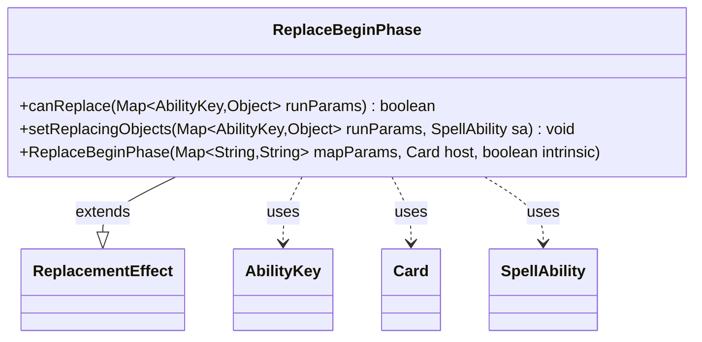

---
aliases:
  - ReplaceBeginPhase
tags:
  - java/class
  - module/forge-game
  - pkg/forge/game/replacement
fqn: forge.game.replacement.ReplaceBeginPhase
package: forge.game.replacement
module: forge-game
kind: Class
---

# ReplaceBeginPhase

**Package:** `forge.game.replacement` &nbsp; **Module:** `forge-game` &nbsp; **Kind:** Class



## Relationships
**Extends:**
- [[forge.game.replacement.ReplacementEffect|ReplacementEffect]]
**Uses:**
- [[forge.game.ability.AbilityKey|AbilityKey]]
- [[forge.game.card.Card|Card]]
- [[forge.game.spellability.SpellAbility|SpellAbility]]

## Source
`forge-game/src/main/java/forge/game/replacement/ReplaceBeginPhase.java`

```java
package forge.game.replacement;

import java.util.Map;

import forge.game.ability.AbilityKey;
import forge.game.card.Card;
import forge.game.phase.PhaseType;
import forge.game.spellability.SpellAbility;

public class ReplaceBeginPhase extends ReplacementEffect {

    public ReplaceBeginPhase(final Map<String, String> mapParams, final Card host, final boolean intrinsic) {
        super(mapParams, host, intrinsic);
        // set default layer to control
        if (!mapParams.containsKey("Layer")) {
            this.setLayer(ReplacementLayer.Control);
        }
    }

    @Override
    public boolean canReplace(Map<AbilityKey, Object> runParams) {
        if (!matchesValidParam("ValidPlayer", runParams.get(AbilityKey.Affected))) {
            return false;
        }

        if (hasParam("Phase") && !PhaseType.parseRange(getParam("Phase")).contains(runParams.get(AbilityKey.Phase))) {
            return false;
        }

        return true;
    }

    @Override
    public void setReplacingObjects(Map<AbilityKey, Object> runParams, SpellAbility sa) {
        sa.setReplacingObject(AbilityKey.Player, runParams.get(AbilityKey.Affected));
    }
}
```
