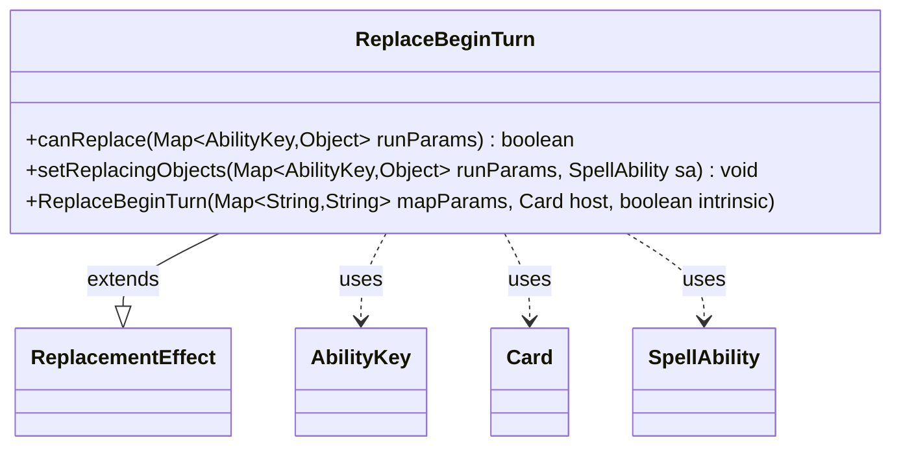

---
aliases:
  - ReplaceBeginTurn
tags:
  - java/class
  - module/forge-game
  - pkg/forge/game/replacement
fqn: forge.game.replacement.ReplaceBeginTurn
package: forge.game.replacement
module: forge-game
kind: Class
---

# ReplaceBeginTurn

**Package:** `forge.game.replacement` &nbsp; **Module:** `forge-game` &nbsp; **Kind:** Class



## Relationships
**Extends:**
- [[forge.game.replacement.ReplacementEffect|ReplacementEffect]]
**Uses:**
- [[forge.game.ability.AbilityKey|AbilityKey]]
- [[forge.game.card.Card|Card]]
- [[forge.game.spellability.SpellAbility|SpellAbility]]

## Design Description

ReplaceBeginTurn is a concrete replacement effect that intercepts the "begin turn" game event, allowing card abilities to substitute or modify what happens when a player's turn starts. As a subclass of `ReplacementEffect`, it supplies the two hooks the replacement framework requires: `canReplace`, which gates the effect against the triggering run parameters, and `setReplacingObjects`, which exposes the affected player to the resolving ability.

Its collaborators reflect this narrow role. It reads typed run parameters through `AbilityKey`, validating the `ValidPlayer` restriction and an optional `ExtraTurn` condition so the effect fires only for the intended player and, when configured, only on extra turns. On a match it binds the affected player onto the `SpellAbility` via `AbilityKey.Player`, making it available downstream. The constructor simply forwards its parameter map, host `Card`, and intrinsic flag to the superclass, keeping all general replacement bookkeeping centralized in the base class.

## Source
`forge-game/src/main/java/forge/game/replacement/ReplaceBeginTurn.java`

```java
package forge.game.replacement;

import java.util.Map;

import forge.game.ability.AbilityKey;
import forge.game.card.Card;
import forge.game.spellability.SpellAbility;

public class ReplaceBeginTurn extends ReplacementEffect {

    public ReplaceBeginTurn(final Map<String, String> mapParams, final Card host, final boolean intrinsic) {
        super(mapParams, host, intrinsic);
    }

    @Override
    public boolean canReplace(Map<AbilityKey, Object> runParams) {
        if (!matchesValidParam("ValidPlayer", runParams.get(AbilityKey.Affected))) {
            return false;
        }
        if (hasParam("ExtraTurn")) {
            if (!(boolean) runParams.get(AbilityKey.ExtraTurn)) {
                return false;
            }
        }
        return true;
    }

    @Override
    public void setReplacingObjects(Map<AbilityKey, Object> runParams, SpellAbility sa) {
        sa.setReplacingObject(AbilityKey.Player, runParams.get(AbilityKey.Affected));
    }
}
```

## Python
`forge/game/replacement/ReplaceBeginTurn.py`

```python
from typing import Any

from forge.game.replacement.ReplacementEffect import ReplacementEffect
from forge.game.ability.AbilityKey import AbilityKey
from forge.game.card.Card import Card
from forge.game.spellability.SpellAbility import SpellAbility


class ReplaceBeginTurn(ReplacementEffect):

    def __init__(self, mapParams: dict[str, str], host: Card, intrinsic: bool):
        super().__init__(mapParams, host, intrinsic)

    def canReplace(self, runParams: dict[AbilityKey, Any]) -> bool:
        if not self.matchesValidParam("ValidPlayer", runParams.get(AbilityKey.Affected)):
            return False
        if self.hasParam("ExtraTurn"):
            if not bool(runParams.get(AbilityKey.ExtraTurn)):
                return False
        return True

    def setReplacingObjects(self, runParams: dict[AbilityKey, Any], sa: SpellAbility) -> None:
        sa.setReplacingObject(AbilityKey.Player, runParams.get(AbilityKey.Affected))
```
