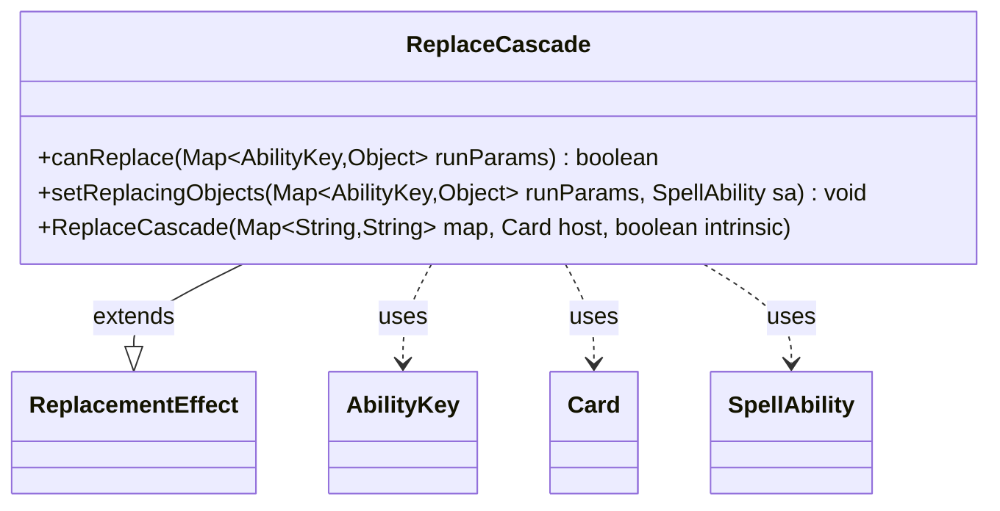

---
aliases:
  - ReplaceCascade
tags:
  - java/class
  - module/forge-game
  - pkg/forge/game/replacement
fqn: forge.game.replacement.ReplaceCascade
package: forge.game.replacement
module: forge-game
kind: Class
---

# ReplaceCascade

**Package:** `forge.game.replacement`   **Module:** `forge-game`   **Kind:** Class



## Relationships
**Extends:**
- [[forge.game.replacement.ReplacementEffect|ReplacementEffect]]
**Uses:**
- [[forge.game.ability.AbilityKey|AbilityKey]]
- [[forge.game.card.Card|Card]]
- [[forge.game.spellability.SpellAbility|SpellAbility]]

## Design Description

ReplaceCascade is a concrete replacement effect that intercepts the cascade game event, allowing Forge's data-driven card scripting to substitute custom behavior when a player would cascade. Extending ReplacementEffect, it overrides the framework's two key hooks: canReplace gates the effect by checking the affected player against the ValidPlayer parameter via the inherited matchesValidParam helper, and setReplacingObjects publishes the relevant objects—the affected Player and the cascaded Cards—onto the triggered SpellAbility so the replacement script can reference them.

Communicating through the AbilityKey-keyed runParams map rather than direct method calls, the class stays decoupled from the engine's event dispatcher and conforms to the same construction contract as its siblings, keeping cascade-specific logic minimal and delegating the heavy lifting to the ReplacementEffect base class.

## Source
`forge-game/src/main/java/forge/game/replacement/ReplaceCascade.java`

```java
package forge.game.replacement;

import java.util.Map;

import forge.game.ability.AbilityKey;
import forge.game.card.Card;
import forge.game.spellability.SpellAbility;

public class ReplaceCascade extends ReplacementEffect {

    public ReplaceCascade(Map<String, String> map, Card host, boolean intrinsic) {
        super(map, host, intrinsic);
    }

    @Override
    public boolean canReplace(Map<AbilityKey, Object> runParams) {
        if (!matchesValidParam("ValidPlayer", runParams.get(AbilityKey.Affected))) {
            return false;
        }
        return true;
    }

    @Override
    public void setReplacingObjects(Map<AbilityKey, Object> runParams, SpellAbility sa) {
        sa.setReplacingObject(AbilityKey.Player, runParams.get(AbilityKey.Affected));
        sa.setReplacingObjectsFrom(runParams, AbilityKey.Cards);
    }
}
```

## Python
`forge/game/replacement/ReplaceCascade.py`

```python
from typing import Map

from forge.game.replacement.ReplacementEffect import ReplacementEffect
from forge.game.ability.AbilityKey import AbilityKey
from forge.game.card.Card import Card
from forge.game.spellability.SpellAbility import SpellAbility


class ReplaceCascade(ReplacementEffect):

    def __init__(self, map: dict[str, str], host: Card, intrinsic: bool):
        super().__init__(map, host, intrinsic)

    def canReplace(self, runParams: dict[AbilityKey, object]) -> bool:
        if not self.matchesValidParam("ValidPlayer", runParams.get(AbilityKey.Affected)):
            return False
        return True

    def setReplacingObjects(self, runParams: dict[AbilityKey, object], sa: SpellAbility) -> None:
        sa.setReplacingObject(AbilityKey.Player, runParams.get(AbilityKey.Affected))
        sa.setReplacingObjectsFrom(runParams, AbilityKey.Cards)
```
