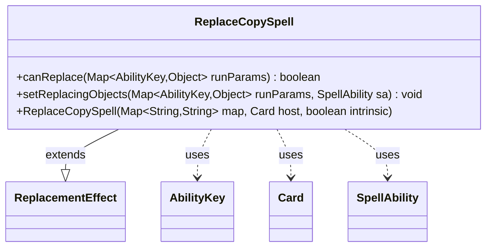

---
aliases:
  - ReplaceCopySpell
tags:
  - java/class
  - module/forge-game
  - pkg/forge/game/replacement
fqn: forge.game.replacement.ReplaceCopySpell
package: forge.game.replacement
module: forge-game
kind: Class
---

# ReplaceCopySpell

**Package:** `forge.game.replacement`   **Module:** `forge-game`   **Kind:** Class



## Relationships
**Extends:**
- [[forge.game.replacement.ReplacementEffect|ReplacementEffect]]
**Uses:**
- [[forge.game.ability.AbilityKey|AbilityKey]]
- [[forge.game.card.Card|Card]]
- [[forge.game.spellability.SpellAbility|SpellAbility]]

## Design Description

ReplaceCopySpell is a concrete replacement effect that intercepts spell-copying events, ensuring that a copy is only produced when the triggering parameters warrant it. Extending `ReplacementEffect`, it overrides the framework's two extension points: `canReplace`, which gates the effect by requiring a positive copy `Amount` and validating the affected player and spell against the `ValidPlayer`/`ValidSpell` script parameters, and `setReplacingObjects`, which exposes the copy `Amount` to the resulting `SpellAbility` for downstream resolution.

It collaborates with `AbilityKey` as the typed keys into the runtime parameter map, `Card` as its host, and `SpellAbility` as both the spell being matched and the ability it configures. The design keeps the class deliberately thin—delegating construction and validation helpers like `matchesValidParam` to its supertype—so all behavior is expressed declaratively through card-script parameters rather than hardcoded logic.

## Source
`forge-game/src/main/java/forge/game/replacement/ReplaceCopySpell.java`

```java
package forge.game.replacement;

import java.util.Map;

import forge.game.ability.AbilityKey;
import forge.game.card.Card;
import forge.game.spellability.SpellAbility;

public class ReplaceCopySpell extends ReplacementEffect {

    public ReplaceCopySpell(Map<String, String> map, Card host, boolean intrinsic) {
        super(map, host, intrinsic);
    }

    /* (non-Javadoc)
     * @see forge.card.replacement.ReplacementEffect#canReplace(java.util.Map)
     */
    @Override
    public boolean canReplace(Map<AbilityKey, Object> runParams) {
        if (((int) runParams.get(AbilityKey.Amount)) <= 0) {
            return false;
        }
        if (!matchesValidParam("ValidPlayer", runParams.get(AbilityKey.Affected))) {
            return false;
        }
        if (!matchesValidParam("ValidSpell", runParams.get(AbilityKey.SpellAbility))) {
            return false;
        }
        return true;
    }

    /* (non-Javadoc)
     * @see forge.card.replacement.ReplacementEffect#setReplacingObjects(java.util.HashMap, forge.card.spellability.SpellAbility)
     */
    @Override
    public void setReplacingObjects(Map<AbilityKey, Object> runParams, SpellAbility sa) {
        sa.setReplacingObject(AbilityKey.Amount, runParams.get(AbilityKey.Amount));
    }
}
```

## Python
`forge/game/replacement/ReplaceCopySpell.py`

```python
from typing import Map  # placeholder to be removed
from forge.game.replacement.ReplacementEffect import ReplacementEffect
from forge.game.ability.AbilityKey import AbilityKey
from forge.game.card.Card import Card
from forge.game.spellability.SpellAbility import SpellAbility


class ReplaceCopySpell(ReplacementEffect):

    def __init__(self, map: dict[str, str], host: Card, intrinsic: bool):
        super().__init__(map, host, intrinsic)

    # (non-Javadoc)
    # @see forge.card.replacement.ReplacementEffect#canReplace(java.util.Map)
    def canReplace(self, runParams: dict[AbilityKey, object]) -> bool:
        if int(runParams.get(AbilityKey.Amount)) <= 0:
            return False
        if not self.matchesValidParam("ValidPlayer", runParams.get(AbilityKey.Affected)):
            return False
        if not self.matchesValidParam("ValidSpell", runParams.get(AbilityKey.SpellAbility)):
            return False
        return True

    # (non-Javadoc)
    # @see forge.card.replacement.ReplacementEffect#setReplacingObjects(java.util.HashMap, forge.card.spellability.SpellAbility)
    def setReplacingObjects(self, runParams: dict[AbilityKey, object], sa: SpellAbility) -> None:
        sa.setReplacingObject(AbilityKey.Amount, runParams.get(AbilityKey.Amount))
```
