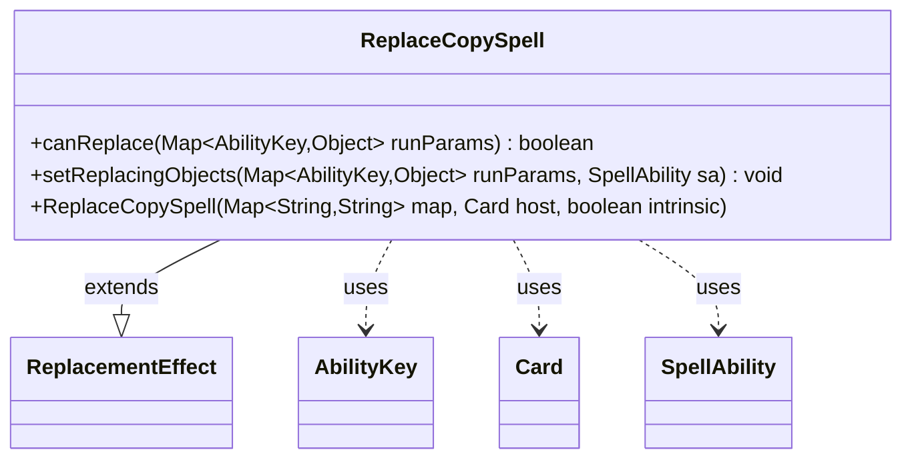

---
aliases:
  - ReplaceCopySpell
tags:
  - java/class
  - module/forge-game
  - pkg/forge/game/replacement
fqn: forge.game.replacement.ReplaceCopySpell
package: forge.game.replacement
module: forge-game
kind: Class
---

# ReplaceCopySpell

**Package:** `forge.game.replacement` &nbsp; **Module:** `forge-game` &nbsp; **Kind:** Class



## Relationships
**Extends:**
- [[forge.game.replacement.ReplacementEffect|ReplacementEffect]]
**Uses:**
- [[forge.game.ability.AbilityKey|AbilityKey]]
- [[forge.game.card.Card|Card]]
- [[forge.game.spellability.SpellAbility|SpellAbility]]

## Source
`forge-game/src/main/java/forge/game/replacement/ReplaceCopySpell.java`

```java
package forge.game.replacement;

import java.util.Map;

import forge.game.ability.AbilityKey;
import forge.game.card.Card;
import forge.game.spellability.SpellAbility;

public class ReplaceCopySpell extends ReplacementEffect {

    public ReplaceCopySpell(Map<String, String> map, Card host, boolean intrinsic) {
        super(map, host, intrinsic);
    }

    /* (non-Javadoc)
     * @see forge.card.replacement.ReplacementEffect#canReplace(java.util.Map)
     */
    @Override
    public boolean canReplace(Map<AbilityKey, Object> runParams) {
        if (((int) runParams.get(AbilityKey.Amount)) <= 0) {
            return false;
        }
        if (!matchesValidParam("ValidPlayer", runParams.get(AbilityKey.Affected))) {
            return false;
        }
        if (!matchesValidParam("ValidSpell", runParams.get(AbilityKey.SpellAbility))) {
            return false;
        }
        return true;
    }

    /* (non-Javadoc)
     * @see forge.card.replacement.ReplacementEffect#setReplacingObjects(java.util.HashMap, forge.card.spellability.SpellAbility)
     */
    @Override
    public void setReplacingObjects(Map<AbilityKey, Object> runParams, SpellAbility sa) {
        sa.setReplacingObject(AbilityKey.Amount, runParams.get(AbilityKey.Amount));
    }
}
```
